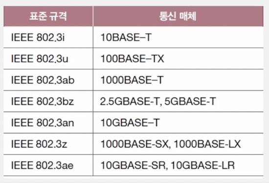
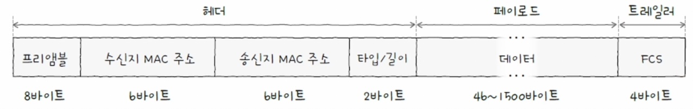

### 02-1 이더넷

# 이더넷

- 현대 LAN, 특히 유선 LAN 환경에서 개중적으로 사용되는 기술
- 다양한 **통신 매체**의 규격, 송수신되는 **프레임**의 형태, 프레임을 주고받는 방법 등이 정의된 기술
    - **물리 계층**에서 사용되는 케이블 → 이더넷 규격을 따름
    - **데이터링크 계층**에서 주고받는 프레임(PDU) → 이더넷 프레임 형식 따름
- 물리 계층과 데이터링크 계층의 장비 모두 특정 이더넷 표준을 이해하고 따른다고 봐도 무방
- IEEE 802.3
    - 이더넷 관련 다양한 국제 표준들의 모음
        - 표준 = 여러 버전들의 모음
        - 802.3u, 802.3ab처럼 뒤에 알파벳으로 버전 표현
    - **이더넷 표준에 따라 지원되는 네트워크 장비, 통신 매체 종류, 전송 속도 등이 달라짐**

### 물리 계층 관련 이더넷 기술(통신 매체)

- 통신 매체 표기 형태
    - IEEE 802.3i 케이블, IEEE 802.3u 케이블처럼 표기하지 않음
    - 통신 매체의 속도와 특성을 파악하기 쉽도록 다음과 같이 표기
        
        <aside>
        
        전송속도BASE-추가특성
        
        </aside>
        
        - ex) 1000BASE-SX, 2.5GBASE-T
        1. 전송 속도
            - 지원하는 최대 속도 표기
            - 숫자만 표기되어 있으면 Mbps 속도, G가 붙어 있으면 Gbps 속도.
        2. BASE
            - BASEband의 약자로, 변조 타입을 의미한다.
            - 대부분의 이더넷 통신 매체는 BASE 사용
        3. 추가 특성
            - 전송 가능한 최대 거리, 물리 계층 인코딩 방식, 레인 수 등 다양한 특성을 표기하는데, **가장 중요한건 통신매체의 종류**
            
            ### 통신 매체 종류
            
            | 추가 특성 표기(통신 매체 종류) | 케이블 종류 |
            | --- | --- |
            | C | 동축 케이블 |
            | T | 트위스티드 페어 케이
            케이블 |
            | S | 단파장 광섬유 케이블 |
            | L | 장파장 광섬유 케이블 |
            - 트위스티드 페어 케이블 - 구리 선을 이용
            - 광섬유 케이블 - 빛을 이용
- 예시
    - 10BASE-T 케이블 : 10Mbps 속도를 지원하는 트위스티드 페어 케이블
    - 1000BASE-SX 케이블 : 1000Mbps 속도를 지원하는 단파장 광섬유 케이블
    - 1000BASE-LX 케이블 : 1000Mbps 속도를 지원하는 장파장 광섬유 케이블
    
    
    

### 데이터링크 계층 관련 이더넷 기술(이더넷 프레임 형식)

- 현대 유선 LAN 환경은 대부분 이더넷을 기반으로 구성되므로 호스트가 데이터링크 계층에서 주고받는 프레임 형식도 정해져 있다.
- 즉, 이더넷 네트워크에서 주고받는 프레임인 **이더넷 프레임** 형식은 정해져 있다.

### 이더넷 프레임

- 캡슐화를 거쳐 송신
    - 상위 계층 정보(데이터) + 헤더 + 트레일러
- 역캡슐화를 거쳐 수신
    - 헤더, 트레일러 제거 후 상위 계층으로 올려 보냄

- 헤더
    - 프리앰블
        - 이더넷 프레임의 시작을 알리는 8바이트 크기 정보
        - 수신지는 이를 통해 이더넷 프레임이 온다고 알 수 있음
    - **수신지 MAC 주소와 송신지 MAC 주소**
        - MAC주소
            - 물리적 주소
            - 일반적으로 고유하고 변경되지 않아, LAN 내의 송수신지를 특정할 수 있다.
            - 네트워크 인터페이스(NIC)마다 부여되는 6바이트(48비트)길이 주소
            - 한 컴퓨터에 NIC가 여러 개 있다면 MAC 주소도 여러 개 있을 수 있다.
- 페이로드(데이터)
    - 상위 계층에서 전달받거나 상위 계층으로 전달해야 할 내용
    - 최대 크기 1500바이트
    - 최소 크기 46바이트
        - 46바이트 이하의 데이터라면 크기를 맞추기 위해 패딩(0)이 채워진다.
- 트레일러
    - FCS
        - 수신한 이더넷 프레임에 오류가 있는지 확인하기 위한 필드
        - CRC라는 오류 검출용 값이 들어있다.
        - 송신지에서 프리앰블을 제외한 나머지 필드 값을 바탕으로 CRC를 계산하고, FCS필드에 명시한다.
        - 수신지에서 프리앰블을 제외한 나머지 필드 값을 바탕으로 CRC를 계산하고, FCS필드값과 비교한다.
            - 비교값이 일치하지 않으면 프레임에 오류가 있다고 판단하고 프레임을 폐기한다.
    

이더넷 이외 다른 LAN 기술?

- 토큰이 있어야만 정보를 전달할 수 있는 **토큰링** 기술