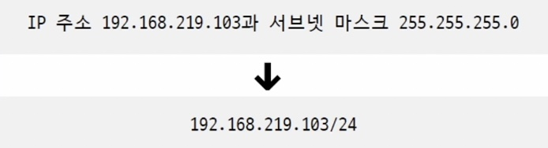

### 03-1 LAN을 넘어서는 네트워크 계층

- 물리 계층, 데이터링크 계층의 기술만으로는 LAN을 넘어서 다른 네트워크 통신하는데 한계가 있다.
    - 다른 네트워크까지의 경로 파악 어려움
        
        → 네트워크 계층의 라우팅으로 해결
        
    - MAC 주소 만으로 모든 네트워크의 모든 호스트 위치를 특정하기 어렵다.
        
        → 네트워크 계층의 IP 주소 체계로 해결
        
        - MAC주소는 NIC에 고정 할당되는 물리주소
        - IP주소는 논리주소
            - DHCP라는 특정 프로토콜로 IP주소를 자동 할당받거나 사용자가 직접 할당할 수 있다.

### 인터넷 프로토콜 (IP)

- IP의 주요 기능 두 가지
    1. IP 주소 지정
        
        : IP 주소로 송수신 대상 지정
        
    2. IP 단편화
        
        : 전송하고자 하는 패킷 크기가 MTU라는 최대 전송 단위보다 클 경우 이를 MTU 크기 이하의 패킷으로 나누는 것
        
        - MTU
            - 일반적으로 최대 1500 바이트(2계층 데이터링크 계층의 페이로드 최대 크기)
            - IP 헤더도 MTU 크기에 포함된다. MTU = IP헤더 + IP페이로드
            - MTU이하로 나눠진 패킷은 수신지에서 재조합된다.
- IPv4
    
    
    
    - 8비트로 표현된 옥텟 4개(10진수)로 구성(총 32비트, 즉 2의 32승 개의 주소 표현 가능)
    - **헤더의 주요 필드**
        1. **식별자**
            - 재조합할때 어떤 메시지인지 식별하기 위한 필드
        2. **플래그**
            
            
            
            - **DF**(Don’t Fragment)
                - 단편화 허용/금지 여부
            - **MF**(More Fragment)
                - 뒤에 더 단편화된 패킷이 오는지 알림
                - 1이면 전송될 패킷이 더 있고, 0이면 마지막 패킷이라는 뜻
        3. **단편화 오프셋**
            
            
            
            - 처음 단편화된 패킷으로부터 얼마나 떨어져있는지 알림
            - 패킷이 무작위 순서로 수신지에 도착하므로, 수신지에서 이 단편화오프셋을 토대로 순서를 맞춰 재조합한다.
        4. **TTL**(Time to live)
            
            
            
            - 패킷의 수명
            - 홉마다 TTL이 1씩 감소하고 0이되면 패킷 폐기됨
                - 홉 : 패킷이 라우터 또는 호스트에 한 번 전달 되는 것
            - 네트워크 상 무의미한 패킷이 떠다니는것을 방지하기 위함
        5. **프로토콜**
            - 상위 계층이 어떤 프로토콜인지 알림
            - TCP:6, UDP:17
        6. **송신지 IP주소**
            - 패킷을 **보낸 노드의 IPv6 주소**
        7. **수신지 IP주소**
            - 패킷을 **받을 최종 목적지 노드의 IPv6 주소**
- IPv6
    - IPv4의 주소 개수 한계를 보완하고, 효율성과 확장성을 고려해 설계됨.
        
        
        
    - **128비트 주소 체계**로, `:`(콜론)으로 구분된 8개 그룹의 **16진수**로 표현됨
        - **2^128 개의 주소**(약 3.4 x 10^38개) 사용 가능
    - 헤더의 주요 비트
        
        
        
        1. **다음 헤더**
            
            
            
            
            
            - 다음 헤더는 **기본 헤더 뒤에 추가적인 확장 헤더** 또는 **최종 프로토콜(TCP/UDP 등)** 을 가리킴
            - IPv6는 추가적인 헤더가 필요할 경우, **기본헤더와 페이로드 사이에 확장헤더라는 추가**
            - 확장 헤더는 여러개 꼬리를 물듯 추가될 수 있다. 
            (확장 헤더마다 다음 헤더 필드 포함)
                - 홉 간 옵션 확장 헤더
                - 수신지 옵션 확장 헤더
                - 단편화 확장 헤더
                    
                    
                    
                    - **다음 헤더** (이후 헤더 지정)
                    - **단편화 오프셋**(IPv4와 기능 동일)
                    - **식별자**(IPv4와 기능 동일)
                    - **M 비트**(IPv4의 MF필드와 기능 동일)
                        
                        → 마지막 조각인지 표시
                        
        2. **홉 제한**
            - IPv4의 TTL 필드와 기능 동일
            - **패킷이 거칠 수 있는 최대 라우터 수 지정** (라우터를 지날 때마다 1씩 감소)
            - 0이 되면 패킷 폐기
        3. **송신지 IP주소**
            - 패킷을 **보낸 노드의 IPv6 주소**
        4. **수신지 IP주소**
            - 패킷을 **받을 최종 목적지 노드의 IPv6 주소**

<aside>

**IPv4 헤더는 가변, IPv6 헤더는 고정인 이유**

✅ **IPv4 헤더가 가변적인 이유**

IPv4는 **기본 헤더(20바이트)** 외에도 **옵션 필드(최대 40바이트)** 를 추가할 수 있어 **헤더 크기가 20~60바이트로 변동**될 수 있음.

- 옵션 필드는 특정 기능(예: 보안, 경로 기록 등)이 필요할 때만 추가됨
- 따라서 **패킷마다 헤더 크기가 달라질 수 있음**
- 라우터가 패킷을 처리할 때, **헤더 크기를 확인하고 분석해야 하므로 성능 저하** 가능성 있음

✅ **IPv6 헤더가 고정적인 이유**

IPv6는 **기본 헤더 크기를 40바이트로 고정**하여 **일관된 성능과 빠른 패킷 처리**를 목표로 함.

- IPv4처럼 **옵션 필드를 기본 헤더에 포함하는 대신, 확장 헤더(Extension Header)로 분리**
- 필요할 때만 확장 헤더를 추가하므로 **기본적인 네트워크 성능을 저하시키지 않음**
- **라우터는 고정 크기의 헤더만 읽고, 확장 헤더는 목적지에서 처리** → **라우터 부담 감소 & 성능 향상**

**📌 결론:**

- **IPv4**: 헤더에 옵션 필드가 포함될 수 있어 **가변 크기(20~60바이트)**
- **IPv6**: **기본 헤더는 항상 40바이트로 고정** + 추가 기능은 **확장 헤더로 분리**하여 네트워크 성능 최적화 🚀
</aside>

### ARP

: **동일 네트워크 내**에 있는 호스트 **IP 주소(논리)를 통해** **MAC 주소(물리)를 알아내기 위한 프로토콜**

1. **ARP 요청**
    
    
    
    - **브로드캐스트**(네트워크 내 모든 호스트에게) 메시지 전송
2. **ARP 응답**
    
    
    
    - **유니캐스트(1:1 통신)**
    - ARP 요청 메시지가 자기 IP와 다르면 무시, 일치하면 **ARP 응답**을 전송
3. **ARP 테이블 갱신**
    
    
    
    - ARP를 활용할 수 있는 모든 호스트는 **ARP 테이블**이라는 정보를 유지한다.

<aside>

- **ARP 패킷**
    - ARP 요청과 응답 과정에서는 ARP 패킷이 전송된다.
    - 프레임의 페이로드에 포함된다.
    - ARP 패킷 형식
        - 오퍼레이션 코드
            - ARP 요청 - 1
            - ARP 응답 - 2
        - 송신지 하드웨어(MAC) 주소
        - 수신지 하드웨어(MAC) 주소
        - 송신지 프로토콜(IP) 주소
        - 수신지 프로토콜(IP) 주소
        
- **다른 네트워크간의 ARP**
    - ARP는 기본적으로 동일 네트워크에서 사용하는 프로토콜
    - 그래서 각 네트워크마다 ARP 요청과 응답을 주고받으며 다른 네트워크의 MAC 주소를 알아내야한다.
    
    
    
    
    
</aside>

<aside>

☝️ **IP 단편화는 적게 하는 게 좋다.**

- 적게 해야하는 이유
    - 데이터가 여러 패킷으로 쪼개지면 헤더도 많아지고, 트래픽 증가와 대역폭 낭비로 이어진다.
    - 수신지에서 재조합도 부하를 키운다.
- **IP 단편화를 피하는 방법**
    
    
    
    - 경로 MTU 크기 만큼의 데이터를 전송하면 된다.
    - **경로 MTU :** IP 단편화 없이 주고 받을 수 있는 최대 패킷 크기
    - **경로 MTU 발견** : 경로 MTU 찾는 기술
        - 패킷의 DF(Don’t Fragment, 단편화 금지) 플래그를 활성화한다.
        - 만약 어떤 호스트가 처리 불가능한 크기라면 특정 오류 메시지를 전달, 그렇게 데이터 크기를 점차 줄임
</aside>

### 03-2 IP 주소

### IP 주소의 구조

: 크게 **네트워크 주소**와 **호스트 주소**로 구성

- 네트워크 주소(네트워크 ID)
    - 호스트가 속한 특정 네트워크를 식별
- 호스트 주소(호스트 ID)
    - 특정 호스트를 식별

### 클래스풀 주소 체계

- 클래스를 기반으로 IP 주소를 관리하는 주소 체계
- 네트워크 크기와 호스트 개수에 따라 IP 주소를 분류
- 필요에 따라 클래스를 달리 선택 - 네트워크 크기 조정 가능
    
    
    
- A클래스
    
    
    
    - 네트워크 주소는 비트 ‘0’으로 시작하는 1옥텟
        - 가장 처음 옥텟이 **0~127**일 경우 **A 클래스** 주소임을 짐작할 수 있음.
    - 호스트 주소는 3옥텟으로 구성
    - 2^7개의 네트워크, 2^24개의 호스트 주소 할당 가능
- B클래스
    
    
    
    - 네트워크 주소는 비트 ‘10’으로 시작하는 2옥텟
        - 가장 처음 옥텟이 **128~191**일 경우 **B 클래스** 주소임을 짐작할 수 있음.
    - 호스트 주소는 2옥텟으로 구성
    - 2^14개의 네트워크, 2^16개의 호스트 주소 할당 가능
- C클래스
    
    
    
    - 네트워크 주소는 비트 ‘110’으로 시작하는 3옥텟
        - 가장 처음 옥텟이 **192~223**일 경우 **C 클래스** 주소임을 짐작할 수 있음.
    - 호스트 주소는 1옥텟으로 구성
    - 2^21개의 네트워크, 2^8개의 호스트 주소 할당 가능
- D, E 클래스는 각각 멀티캐스트를 위한 클래스, 특수 목적을 위해 예약된 클래스

<aside>

**잠깐❗️** 호스트의 주소 공간을 모두 사용할 수 없다!

- 호스트 주소가 전부 0인 IP 주소
    - 해당 네트워크 자체를 의미하는 네트워크 주소로 사용
- 호스트 주소가 전부 1인 IP 주소
    - 브로드캐스트 주소로 사용

</aside>

### 클래스리스 주소 체계

- 클래스풀 주소 체계도 낭비되는 IP 주소가 여전히 많다는 한계가 있다.
    - ex) 구축하려는 네트워크의 호스트 개수가 300개인데, C클래스 주소체계의 최대 호스트 수는 254개. 그렇다고 B클래스를 쓴다면 65,000개의 호스트 주소 공간이 낭비된다.
- 오늘날에는 클래스에 구애받지 않고 네트워크 영역을 나누는 **클래스리스 주소체계**를 많이 쓴다.

### 서브넷 마스크

- 네트워크와 호스트를 구분짓는 수단
- 네트워크 주소는 1, 호스트 주소는 0으로 표기한 비트열
    
    
    
- 서브네팅
    - 서브넷 마스크를 이용해 클래스를 원하는 크기로 더 잘개 쪼개어 사용하는 것
    - 네트워크 주소와 호스트 주소 구분
        
        
        
        - IP 주소와 서브넷 마스크를 비트 AND 연산하면 네트워크 주소가 나온다
- 서브넷 마스크 표기
    - CIDR표기법(사이다 표기법)
        - 서브넷 마스크 1의 개수를 `/개수` 로 표현
        - ex
            
            
            
            
            
        

### 공인 IP 주소와 사설 IP 주소

- 공인 IP 주소
    - 전 세계에서 고유한 IP 주소
    - 네트워크 간 통신, 인터넷 이용할 때 사용하는 IP 주소
    - ISP나 공인 IP 주소 할당기관에서 할당
- 사설 IP 주소
    - 사설 네트워크 : 외부 네트워크에 공개되지 않은 네트워크
    - IP 주소 공간 중 사설 IP 주소로 사용하도록 예약된 주소공간이 있다.
    - 일반적으로 라우터가 사설 IP 주소를 할당한다.
    - 사설 IP 주소를 사용하는 호스트가 외부 네트워크와 통신하려면? ⇒ **NAT** 기술 사용
- NAT
    
    
    
    - 네트워크 내부에서 사용되는 사설 IP 주소와 네트워크 외부에서 사용되는 공인 IP 주소를 변환하는 데 사용
    - NAT을 통해 사설 IP 주소를 사용하는 여러 호스트는 적은 수의 공인 IP 주소를 공유할 수 있다.
        
        
        
        
        
    - 대부분의 라우터와 공유기는 NAT기능을 내장하고 있다.
        - **공유기** - NAT, DHCP, 방화벽 등 많은 기능을 수행한다. **네트워크 내에서 많은 역할을 수행하는 장치**라고 알아두는게 적절하다.

### 정적 IP 주소와 동적 IP 주소(DHCP)

> 호스트에 IP 주소를 할당하는 방법
> 

### 정적 할당

- 수작업으로 IP 주소를 부여하는 방식
- 운영체제의 네트워크 설정에서 설정 가능
    - IP 주소
    - 서브넷 마스크
    - 게이트웨이(라우터) 주소
        - 게이트웨이
            
            : 서로 다른 네트워크를 연결하는 하드웨어적 / 소프트에어적 수단
            
        - 기본 게이트웨이
            
            : 네트워크 외부로 나가기 위한 기본적인 첫 경로(첫 번째 홉)
            
            - 일반적으로 공유기
    - DNS 주소(도메인 네임)
- 호스트의 수가 많아지면 관리가 곤란해지고 실수가 생긴다.

### 동적 할당

- 정적 할당의 한계 보완.
- **DHCP 서버 라는 동적 IP 주소를 관리하는 특별한 노드**에 의해 할당이 이루어짐
- 클라이언트 : IP 주소를 할당받고자 하는 호스트
- **DHCP 서버** : 호스트에게 IP 주소를 제공하는 호스트
    - DHCP 서버의 역할은 일반적으로 라우터(공유기)가 수행
    - 특정 호스트에 DHCP 서버 기능을 추가할 수 있음
- DHCP로 할당받은 **동적 IP 주소는 사용 기간이 정해짐**
    - 일반적으로 수 시간 ~ 수 일
    - **임대기간이 끝난 IP 주소는 다시 DHCP 서버로 반납**
- 클라와 DHCP가 주고받는 메시지
    
    
    
    1. **DHCP Discover(클라 → 서버)**
        - DHCP 서버 찾는 메시지(브로드캐스트)
        - 클라는 아직 IP 주소를 할당 받지 못해 송신지 IP 주소는 0.0.0.0
    2. **DHCP Offer(서버 → 클라)**
        - 클라에게 할당 가능한 IP 주소 정보 제안
    3. **DCHP Request(클라 → 서버)**
        - DHCP Offer에 대한 응답
        - 브로드캐스트 전송
    4. **DHCP ACK(서버 → 클라)**
        - 최종 승인
        - ACK 메시지를 받은 클라는 임대 기간 동안 IP 주소 사용
            - 임대 기간이 끝나기 전 임대 기간을 연장할 수 있다.
            - 임대 기간이 끝나기 전 두 번 정도 자동 수행

<aside>

**❗️예약 주소**

- 사설 IP 주소들
    - 10.0.0.0/8
    - 172.16.0.0/12
    - 192.168.0.0/16
- **0.0.0.0/8**
    - IP 주소를 할당받기 전 임시로 사용하는 주소(DHCP Discover 메시지에서 송신지 주소)
    - 모든 임의의 IP 주소
        - 디폴트 라우트 : 라우터가 패킷을 어떤 IP 주소로 전달할지 명확하지 않을 경우 이곳으로 이동시키라고 표기하는 셈
- **127.0.0.1/8**
    - **루프백 주소, 로컬호스트 (자기 자신)**
    - 자기 자신을 마치 다른 호스트인 양 간주해 패킷을 전송할 수 있다. 테스트, 디버깅 용으로 사용
</aside>

### 03-3 라우팅

### 라우터

- **라우팅** : 패킷이 이동할 최적의 경로를 설정하고 패킷을 이동시키는 것
- **라우터** : 라우팅을 수행하는 장비
- 네트워크 계층이 있어야 네트워크 간 라우팅이 가능하다.
- 라우터는 **라우팅 테이블을** 토대로 라우팅을 수행한다.
- 라우팅 분류
    - 라우팅 테이블이 만들어 지는 방법(수동 / 자동)
    - 라우팅 프로토콜(범위)
    
    
    
    
    

### 라우팅 테이블

- 특정 수신지까지 도달하기 위한 정보를 명시한 표
- 라우터가 저장하고 관리
- 라우터 테이블에 포함된 정보
    - 수신지 IP 주소와 서브넷 마스크
    - 다음 홉(게이트웨이)
        - 다음으로 거쳐야할 호스트의 IP주소나 인터페이스
    - 네트워크 인터페이스
        - 패킷을 내보낼 통로
    - 메트릭
        - 해당 경로로 이동하는데 드는 비용
    - ex
        
        
        
        - 192.168.2.0/24 범위인 패킷은
        - eth0인터페이스를 통해
        - 192.168.2.1로 전송하라
        - 이때 드는 비용은 30이다.
    - **디폴트 라우트**
        - 호스트의 라우터 테이블에 수신지에 이르는 경로가 없을 때
        - 기본 게이트웨이(호스트가 속한 네트워크의 외부로 나아가기 위한 첫 번째 경로. 일반적으로 라우터)로 패킷을 전달해야한다.
        - 라우터 주소인 기본 게이트웨이를 디폴트 라우트로 삼는다.
        
        ⇒ 수신지 경로가 등록되어 있지 않은 패킷을 라우터로 전달하기 위함
        

### 정적 라우팅 과 동적 라우팅

- IP의 정적/동적 주소 할당과 유사
- 정적 라우팅
    - 명령어로 라우팅 테이블 항목을 수동으로 다룬다.
- **동적 라우팅**
    - 라우팅 프로토콜을 통해 자동으로 채워진 라우팅 테이블 항목을 토대로 라우팅 되는 방식
- **AS**
    
    
    
    - 라우터들의 집단 네트워크
    - 한 AS 내에는 다수의 라우터가 있고
    - 라우터들은 AS내부에서만 통신할 수도 있고 외부와 통신할 수도 있음
    - 외부와 통신할 경우 **AS 경계 라우터**라는 특별한 라우터를 이용

### 라우팅 프로토콜(동적 라우팅)

- 라우터끼리 자신들의 정보를 교환하며 패킷이 이동할 최적의 경로를 찾기 위한 프로토콜
- 라우팅의 범위에 따라 **IGP(AS내부), EGP(AS외부)**로 나뉜다.

- IGP
    - RIP
        - 거리 벡터
        - **최적의 경로 : 홉 수가 가장 적은 경로**
        - 라우팅 테이블 **갱신** : 라우터 간에 경로 정보를 주기적으로 교환
    - OSPF
        - 링크 상태(그래프 자료구조)
        - **최적의 경로 : 대역폭이 높은 링크**일수록 **메트릭이 낮은 경로**로 인식
        - 라우팅 테이블 **갱신** : 네트워크의 구성이 변경되었을 때
            - AS를 에어리어라는 단위로 나누고, 구분된 에어리어 내에서만 링크 상태를 공유.
- EGP
    
    
    
    - BGP라우터가 AS에 하나 이상 있어야하고, 또 다른 AS의 BGP라우터와 연결되어야한다.
    - 피어 : BGP메시지를 주고받을 수 있도록 연결된 BGP라우터
    - 피어링 : 피어 관계가 되도록 연결되는 과정
    - EGP는 IGP에 비해 과정이 복잡하다.
    - 경로에 대한 속성과 정책이 고려된다.
        - 속성 : 경로에 대한 부가 정보
        1. AS-PATH
        2. NEXT-HOP
        3. LOCAL-PREF