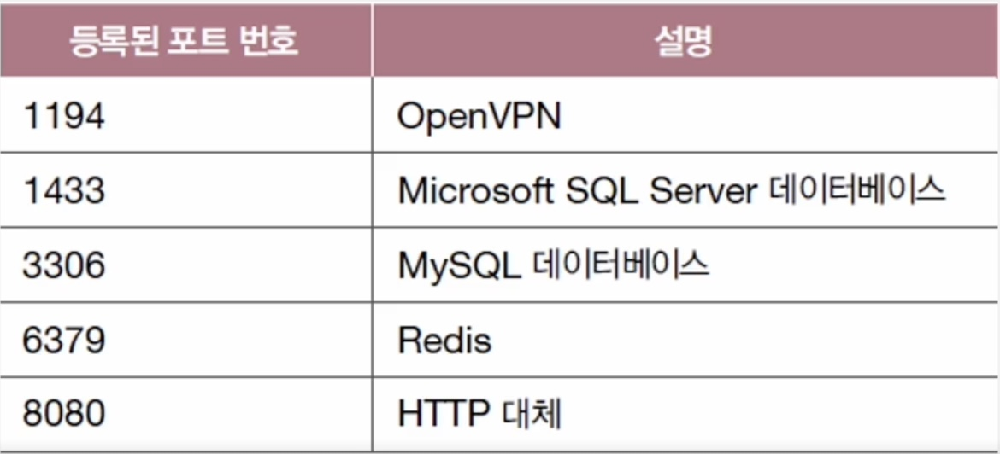
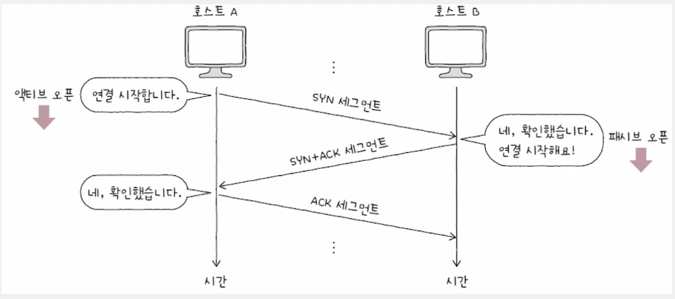

### 4-1 전송 계층 개요 : IP의 특징과 포트

### IP의 특징(한계)을 보완하는 전송 계층

- IP의 특징(한계)
    - 주소 지정, 단편화
    - **신뢰할 수 없는 통신(프로토콜)**
        - 패킷이 수신지까지 제대로 전송되었다는 보장을 하지 않음
        - 패킷이 손상됐는지, 순서대로 갔는지 확인하지 않고 재전송도 하지 않음 = **최선형 전달**이라고 부름
    - **비연결형 통신(프로토콜)**
        - 송수신 호스트간에 사전 연결 작업을 거치지 않음
        - 그저 수신지를 향해 패킷을 보내기만 할뿐
    
    ⇒ 신뢰할 수 없는 통신, 비연결형 통신 하는 이유 : **성능.** 사전 연결하고 전송 잘 됐나 다 확인하면 너무 오래 걸림
    
- IP의 한계를 보완한 전송 계층, **TCP**
    1. 연결형 통신 가능
        - 1장에서 본 회선 교환 네트워크와 유사하게 정보를 주고받기 전에 가상의 회선을 설정하듯이 연결을 수립
        - 송수신하는 동안 연결 유지, 끝나면 연결 종료
    2. 신뢰성 있는 통신 가능
        - **패킷이 수신지까지 올바른 순서로 확실히 전달됐는지 보장**하기 위해 재전송을 통한 다양한 제어 기능 제공
- 여전히 신뢰할 수 없는, 비연결형 통신이 필요할 때, **UDP**
    
    
    

### 응용 계층과의 연결 다리, 포트

### 포트

: 응용 계층의 애플리케이션 프로세스를 식별하는 정보

- 호스트에 전달이 끝이 아니라, 호스트의 프로세스까지 식별해서 전달되어야함

### 포트의 분류

- 패킷 내 송수신지 포트 번호를 통해 프로세스를 식별
- TCP, UDP 모두 포트 번호 필드를 포함
- 16비트로 표현(2^16개 포트 존재)
    
    
    
    - 잘 알려진 포트(well known port, system port)
        - 0~1023번 사용
        - ex)
            
            
            
    - 등록된 포트(registered port)
        - 1024~49151번 사용
        - ex)
            
            
            
    - 동적 포트(사설 포트, 임시 포트)
        - 49152~65535번 사용
        - 보통 클라이언트가 동적 포트 사용. (서버는 잘 알려진 포트와 등록된 포트)
        - ex) 웹 브라우저
        
        
        
- `IP 주소:포트 번호` 형식으로 자주 표기
    
    
    
    - 특정 호스트에서 실행 중인 특정 애플리케이션 프로세스를 식별할 수 있다.
    
    <aside>
    
    포트 번호 관찰하고 해석하기
    
    
    
    </aside>
    

### 포트 기반의 NAT, NAPT


- NAPT테이블은 변환될 IP주소에 더불어 포트 번호도 함께 기록한다.
- 공인 IP 주소 수 부족 문제를 개선

<aside>

**포트 포워딩**

- 네트워크 내 특정 호스트에 IP 주소와 포트 번호를 미리 할당하여
- 외부에서 처음 통신을 시작하고자 할때 사용하는 기능
- 공유기에서 직접 설정 가능

**📌 포트 포워딩 vs VPN 차이점 정리**

| 구분 | 포트 포워딩 | VPN |
| --- | --- | --- |
| **접속 방식** | 특정 포트만 열어 외부에서 접근 가능하게 함 | 내부 네트워크 전체에 안전하게 접속 가능 |
| **보안** | 보안 취약 (포트가 열려 있으면 해킹 위험) | 암호화된 터널로 안전한 접속 |
| **사용 예시** | 웹 서버, 게임 서버, CCTV, 원격 데스크톱 | 회사 네트워크 접속, 해외 IP 우회, 보안 강화 |
| **설정 난이도** | 비교적 간단 (공유기에서 설정 가능) | VPN 서버 구축이 필요할 수도 있음 |
</aside>

<aside>

**ICMP**

- IP의 신뢰할 수 없는, 비연결형 특성을 보완하기 위한 **네트워크 계층의 프로토콜**
- **IP 패킷 전송 과정에 대한 피드백 메시지(ICMP 메시지)**를 얻는다.
- **ICMP메시지**
    - 타입 번호 + 코드 번호로 이루어져 있다.
        
        
        
- 공식문서(RFC 792)에 따르면 **ICMP는** IP의 한계를 완전히 보완하지 않고, 다만 **전송 과정 오류 피드백과 네트워크 진단 정보 피드백**을 제공하려는 목적일 뿐이다.
    - IP의 한계를 보완하려면 전송 계층의 TCP를 이용해야한다.
</aside>

### 4-2 TCP와 UDP

### TCP 통신 단계와 세그먼트 구조

- 통신 단계
    1. 연결 수립
    2. 데이터 송수신
        - 재전송을 통한 오류 제어, 흐름 제어, 혼잡 제어
    3. 연결 종료
- 세그먼트 구조
    
    
    
    - **MSS**
        - **TCP로 전송할 수 있는 최대 페이로드 크기**
        - IP헤더를 포함하는 MTU와 달리 **MSS는 TCP 헤더를 포함하지 않는다.**
    - **TCP 헤더**
        
        
        
        - 송신지 포트와 수신지 포트
            
            : 송수신지 애플리케이션 식별 포트 번호
            
        - **순서 번호**
            
            : 송수신되는 **세그먼트의 올바른 순서를 보장**하기 위한 번호
            
        - **확인 응답 번호**
            
            : 상대 호스트가 보낸 세그먼트에 대한 응답. **다음으로 수신하기를 기대하는 순서 번호가 명시됨**
            
        - **제어 비트**
            
            : 현재 세그먼트에 대한 부가 정보
            
            - **ACK** : 세그먼트의 승인을 나타내는 비트
            - **SYN** : 연결을 수립하기 위한 비트
            - **FIN** : 연결을 종료하기 위한 비트
        - 윈도우
            
            : **한 번에 수신하고자 하는 데이터의 양(수신 윈도우)**
            

### TCP 연결 수립과 종료

### 연결 수립: **3-Way Handshake 과정**



- 상황 : 클라이언트 A, 서버 B의 통신
    - A의 초기 순서 번호 100, B의 초기 순서 번호 2000 가정

### **1️⃣ A → B (SYN) : 액티브 오픈**

```python
SN = 100, ACK = -, SYN = 1, ACK = 0
```

📌 **올바른 패킷 정보 (A → B)**

| 필드 | 값 |
| --- | --- |
| **순서번호 (SN)** | `100` (랜덤한 ISN) |
| **확인응답번호 (ACK)** | `-` (의미 없음) |
| **SYN** | `1` |
| **ACK** | `0` |

### **2️⃣ B → A (SYN + ACK) : 패시브 오픈**

```python
SN = 2000, ACK = 101, SYN = 1, ACK = 1
```

📌 **올바른 패킷 정보 (B → A)**

| 필드 | 값 |
| --- | --- |
| **순서번호 (SN)** | `2000` (B의 랜덤 ISN_B) |
| **확인응답번호 (ACK)** | `101` (A의 100 + 1) |
| **SYN** | `1` |
| **ACK** | `1` |

### **3️⃣ A → B (ACK) : 연결 수립 완료**

```python
SN = 101, ACK = 2001, SYN = 0, ACK = 1

, 데이터 500바이트
```

📌 **올바른 패킷 정보 (A → B)**

| 필드 | 값 |
| --- | --- |
| **순서번호 (SN)** | `101` (A의 ISN + 1) |
| **확인응답번호 (ACK)** | `2001` (B의 ISN_B + 1) |
| **SYN** | `0` |
| **ACK** | `1` |

👉 **이제 연결 수립 완료!** 🚀

### 연결 종료: 4-Way Handshake


TCP 연결 종료 과정에서 **FIN 패킷을 보낼 때도 ACK 비트는 1로 유지됨.**

| 단계 | 송신자 | 순서번호 | 확인응답번호 | FIN | ACK |
| --- | --- | --- | --- | --- | --- |
| **1** | A → B | X | Y | 1 | **1** |
| **2** | B → A | Y | X+1 | 0 | **1** |
| **3** | B → A | Y | X+1 | 1 | **1** |
| **4** | A → B | X+1 | Y+1 | 0 | **1** |

**🔥 즉, 연결 수립 이후 ACK는 항상 1이다!**

📌 **ACK 비트는 "응답을 한다"는 의미이므로 연결 수립 이후에는 0이 되지 않는다.**

📌 **연결을 종료하는 과정에서도 확인 응답(ACK)이 필요하기 때문에 계속 1로 유지된다.**

### TCP 상태

- **TCP**는 Closed, Established, Listen등 **다양한** **상태를** 통해 현재 어떤 통신 과정에 있는지를 나타내는 **스테이트풀 프로토콜**이다.


1. 연결이 수립되지 않은 상태
    - CLOSED : 아무런 연결이 없음
    - LISTEN : 연결 대기 상태. 일반적으로 서버는 LISTEN상태를 유지하며 클라의 액티브 오픈, SYN 세그먼트를 기다린다. 클라가 보내면 3-way handshake시작
2. 연결 수립 상태
    - Established : 연결이 확립되었음을 나타내는 상태
3. 연결 종료 상태
    - Time-wait : 액티브 클로즈 호스트가 마지막 ACK세그먼트를 보내고 잠시 대기하는 상태.
        - 이렇게 대기해야 패시브 클로즈 호스트가 잘 못 받아서 재전송할지 어쩔지 기다릴 수 있다. 또한 다른 연결의 패킷들의 혼란을 방지한다.

### UDP

- 비연결형 통신, 신뢰할 수 없는 통신
- 상태 없음 - 스테이트리스 프로토콜
- 적은 오버헤드로 패킷을 빠르게 처리
- 스트리밍, 인터넷 전화처럼 실시간성이 중요한 상황에 쓰임
- 구조
    
    
    
    - 길이 : 헤더를 포함 UDP 데이터그램의 바이트
    - 체크섬
        - 데이터그램 전송 과정에서 오류가 발생했는지 검사하기 위한 필드.
        - 수신지는 이 값으로 정보가 훼손되었는지(잘 도달했는지는 상관 없음) 판단하고 문제가 있다면 데이터그램 폐기.
    

<aside>

### TCP vs UDP


</aside>