### 05-1 DNS와 자원

### 도메인 네임과 네임 서버

- 도메인 네임
    - IP 주소와 대응되는 문자열 형태의 호스트 정보
    - [www.naver.com](http://www.naver.com) , [git.kernel.org](http://git.kernel.org) etc
    - 기억하기도 쉽고 IP 주소가 바뀌어도 도메인네임에 다시 대응하면 되므로 간편하다.
- 네임 서버
    - 도메인 네임과 IP주소는 네임 서버에서 관리한다.
- 도메인 네임 구조
    - 점을 기준으로 계층적으로 분류
        - **최상단에 루트 도메인(root domain)**
            - **.**
        - **최상위 도메인(TLD; Top-Level Domain)**
            - **com, kr, net, org 등**
        - 2, 3, 4단계 도메인 …
            - naver, google(2단계)
            - www(3단계)
- 전체 주소 도메인 네임(FQDN)
    
    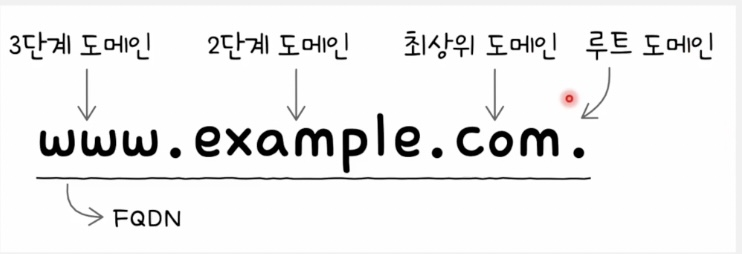
    
    - 도메인 네임을 모두 포함하는 도메인 네임
        - com으로 끝나는 도메인 네임은 많다.
            - [api.ex.com](http://api.ex.com), [mail.ex.com](http://mail.ex.com), [www.ex.com](http://www.ex.com) 등
        - 하지만 첫번째 부분까지 고려한 도메인 네임은 하나뿐
            - [www.ex.com](http://www.ex.com)
        - 이런 점에서 FQDN의 첫 번째 부분(www)을 **호스트 네임**이라 부른다.

<aside>

❓서브 도메인이란?

- 다른 도메인이 포함된 도메인
- google.com의 서브 도메인
    - mail.google.com
    - www.google.com
    - drive.google.com

google.com은 com을 포함하고 있기에 com의 서브도메인이다.

</aside>

- **DNS는 전세계에 분산되어 위치한다**

### 계층적 네임 서버

- 도메인 네임으로 IP 주소 알아내는법(리졸빙 하는 법)
    1. 클라와 가장 맞닿아있는 **로컬 네임 서버에 먼저**
        - 주로 ISP가 할당해주며, 공개 DNS 로컬네임서버로는 `8.8.8.8`  `8.8.4.4` 가 있다(구글).
    2. 루트 네임 → TLD 네임 → 책임 네임 순차적으로 
        - 해당 도메인을 관리하는 곳으로 안내받다가 책임 네임 서버가 최종 알아냄
            
            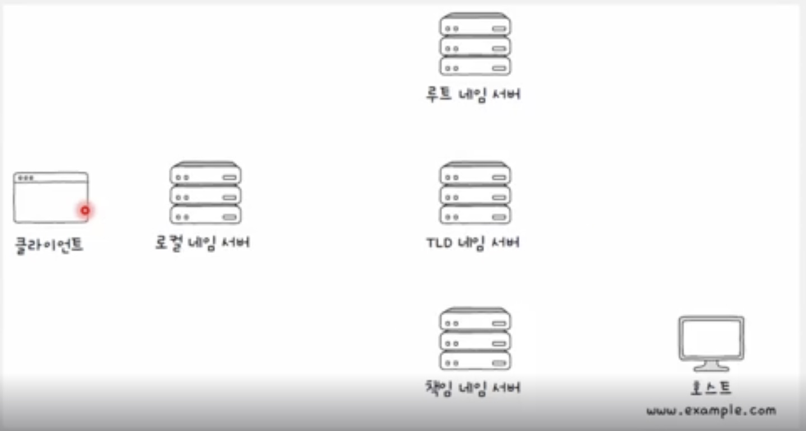
            
        - 재귀적 질의와 반복적 질의 형태가 있다.
            - 재귀적 질의
                
                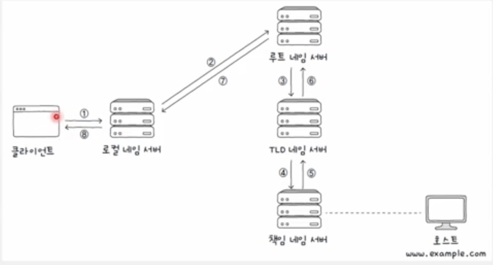
                
                - 최종 응답 결과를 역순으로 전달
            - 반복적 질의
                
                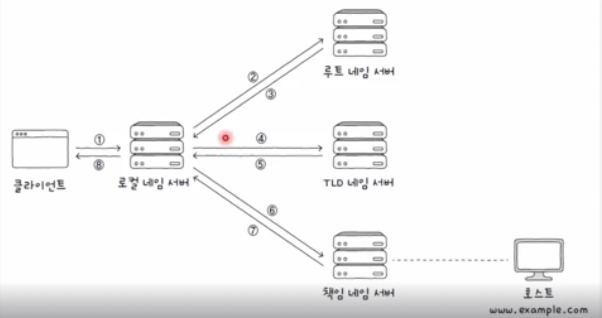
                
                - 로컬 네임 서버가 네임 서버에 일일이 질의 응답 반복
        - 한계점 : 이런 질의는 8단계를 거치므로 전 세계적인 트래픽을 고려하면 과부하가 일어날 수 있다.
        - 보완 - **DNS 캐시** : 그래서 실제로는 네임 서버들이 기존에 응답받은 결과를 임시로 저장했다가 추후 같은 질의에 이를 활용하는 경우가 많다.
            - DNS 캐시를 활용하면 짧은 시간 안에 원하는 IP주소를 얻어낼 수 있다.
            - TTL이 있어 영원히 존재하지는 않는다.

### 자원을 식별하는 URI

- 자원(Resource) : 네트워크상의 메시지를 통해 주고받는 대상
- URI(Uniform Resource Identifier) : 자원을 식별할 수 있는 통일된 방식
    - URL(Uniform Resource Locator) : 위치를 이용해 자원을 식별
    - URN(Uniform Resource Name) : 이름을 이용해 자원을 식별
        - 잘 안씀

---

URL 형식


1. scheme
    - 자원에 접근하는 방법
    - 일반적으로 사용하는 프로토콜 명시
    - `http://` `https://`
2. authority
    - 호스트를 특정할 수 있는 정보
    - IP주소, 도메인 네임
    - 콜론(:) 뒤에 포트 번호를 덧붙일수도 있다.
3. path
    - 자원이 위치한 경로
    - `/` 가 최상위 경로
4. query
    - HTTP는 요청과 응답 기반의 프로토콜인데, 요청할때 특정 조건을 붙일 수 있음 = 쿼리
5. fragment
    - 자원의 한 조각을 가리키기 위한 정보

### 05-2 HTTP

# HTTP

> **응용 계층에서 정보를 주고받는 데 사용되는 프로토콜**
사용자와 밀접하게 맞닿아 있는 프로토콜로, 오늘날 웹 세상의 기반을 이루는 중요한 역할
> 

### HTTP의 4가지 특성

### 1. 요청-응답 기반 프로토콜

- HTTP는 클라이언트와 서버가 각각 HTTP 요청 메시지와 HTTP 응답 메시지를 주고받는 구조로 동작한다.
- 개발자도구 네트워크 탭에서 자원을 클릭해보면, 요청(Request)과 응답(Response) 헤더를 확인해 볼 수 있다.

### 2. 미디어 독립적 프로토콜

<aside>

HTTP를 정의한 공식문서(RFC 9110)

*HTTP가 요청하는 대상을 자원이라고 한다. **HTTP는 자원의 특성을 제한하지 않으며, 단지 자원과 상호작용하는 데 사용할 수 있는 인터페이스(통로)를 정의할 뿐이다.** 대부분의 자원은 URI로 식별된다.*

</aside>

- HTTP는 자원의 특성과 무관하게 그저 자원을 주고받을 수단(인터페이스)의 역할만 수행한다.
- **미디어 타입(MIME타입)**
    - HTTP에서 메시지로 주고받는 자원의 종류
    - 구조
        
        ```python
        타입(type)/서브타입(subtype)
        ```
        
    - ex) `text/html` , `text/css` , `text/javascript` , `image/png` , `image/gif`
        
             `video/mp4` , `audio/midi` , `application/pdf` , `application/xml` , `application/json` , `multipart/form-data` , `multipart/encrypted`
        
        - `application` : 바이너리 형식의 데이터
        - `multipart` : 각기 다른 미디어타입을 가질 수 있는 여러 요소로 구성된 데이터(입력폼 데이터, 암호화 데이터 등)
    - `*` 별표는 여러 미디어 타입을 통칭하기 위해 사용된다.
    - 또 미디어타입은, 부가적인 설명을 위해 매개변수가 포함될 수 있다.
        
        ```python
        type/subtype;parameter=value
        ```
        
        - ex) `type/html;charset-UTF-8` : HTML문서타입이며, 문자는 UTF-8로 인코딩

### 3. 스테이트리스 프로토콜

- 상태를 유지하지 않는다. = **서버가 HTTP 요청을 보낸 클라이언트의 상태를 기억하지 않는다.**
- 모든 HTTP 요청은 기본적으로 독립적인 요청이다.
- HTTP의 가장 중요한 설계 목표는 처음부터 지금까지 **확장성**과 **견고성**이다.
    - 스테이트리스 특성 덕분에 클라와 서버가 종속되지 않아 언제든 쉽게 서버를 추가할 수 있어 **확장성**이 높고,
    - 서버 중 하나에 문제가 생겨도 쉽게 다른 서버로 대체가 가능해 **견고성**이 높다.

### 4. 지속 연결 프로토콜

- HTTP는 지속해서 발전 중인 프로토콜인 만큼 여러 버전이 있다.
- 기본적으로 HTTP는 TCP상에서 동작하는데, HTTP는 비연결형 프로토콜이지만 TCP는 연결형이다.
- 최근 대중적으로 사용되는 HTTP(v1.1 이상)는 **지속 연결**이라는 기술을 제공한다. **킵 얼라이브**라고도 부른다.
- **하나의 TCP 연결상에서 여러 개의 요청-응답을 주고받을 수 있는 기술**
    
    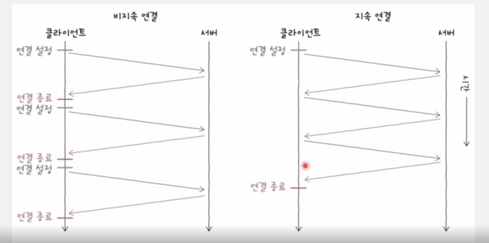
    
- 계속 연결을 수립하고 종료하는 비지속 연결에 비해 **지속 연결은 빠르고 여러 요청-응답을 처리할 수 있다.**

### HTTP 메시지 구조

<aside>

시작 라인(줄바꿈)

필드 라인(줄바꿈)

(줄바꿈)

메시지 본문

</aside>

### 시작 라인

- **요청 메시지면 요청 라인**
    
    ```python
    GET /hello?q=world HTTP/1.1
    ```
    
    <aside>
    
    요청 라인 = **메서드(공백)요청 대상(공백)HTTP 버전(줄바꿈)**
    
    </aside>
    
    - **메서드**
        - 클라이언트가 서버의 자원(요청 대상)에 대해 수행할 작업의 종류
        - 대표적으로 `GET, POST, PUT, DELETE` 등
    - **요청 대상**
        - HTTP 요청을 보낼 서버의 자원
        - 보통 쿼리가 포함된 URI 경로 명시
            - ex) `http://www.ex.com**/hello?q=world**`로 요청 → **요청 대상은** **`/hello?q=world`**
        - 만약 하위 경로가 없더라도 요청 대상은 슬래시 `/` 로 표기
            - ex) `http://www.ex.com` 으로 요청 → **요청 대상은 `/`**
    - **HTTP 버전**
        - 사용된 HTTP 버전
            - ex) `HTTP/1.1`
- **응답 메시지면 상태 라인**
    
    ```python
    HTTP/1.1 200 OK
    ```
    
    <aside>
    
    상태 라인 = **HTTP 버전(공백)상태 코드(공백)이유 구문(줄바꿈)**
    
    </aside>
    
    - **상태 코드**
        - 요청에 대한 결과를 나타내는 세 자리 정수
        - ex) `200`, `404`
    - **이유 구문** (옵션)
        - 상태 코드에 대한 문자열 형태의 설명
        - ex) `OK` , `Not Found`

### 필드 라인 (헤더 라인)

- 0개 이상의 HTTP헤더 명시
- HTTP 헤더 : HTTP 통신에 필요한 부가 정보
- 콜론(:)을 기준으로 헤더 이름과 하나 이상의 헤더값으로 구성

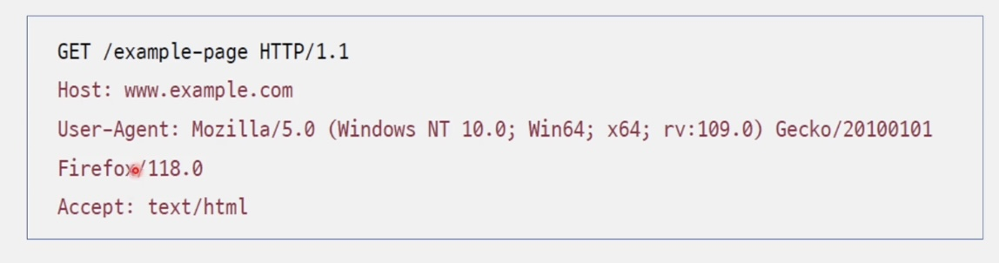

### 메시지 본문

- HTTP 요청/응답 메시지에서 본문이 필요할 경우 선택적으로 명시
- 다양한 콘텐츠 타입이 사용 가능(JSON, HTML, etc)

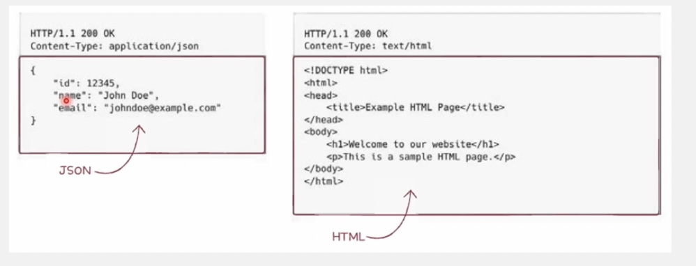

### HTTP 메서드

- HTTP 요청 메시지에서 사용될 수 있는 메서드들
    
    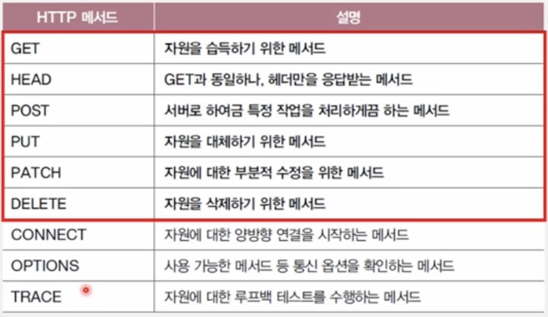
    
- **GET - 가져다주세요**
    - 특정 자원을 조회할 때 사용되는 메서드
        - ex) 웹브라우저 URL 입력
        - **클라가 서버에게 자원(다양한 타입)을 요청 보내는 것**
    1. **GET 요청 메시지 예시**
        - 메시지 본문보다 **쿼리 문자열이 사용**되는 경우가 많다.
        
        ```python
        GET /index.html?name=value1&n2=v2 HTTP/1.1
        Host: www.ex.com
        Accept: *
        ```
        
    2. **GET 응답 메시지 예시**
        - GET 요청메시지가 **성공적**으로 처리되었다면 이에 대한 응답으로서 **요청한 자원을 전달받는다.**
        
        ```python
        HTTP/1.1 200 OK
        Content-Type: text/html
        Content-Length: 1234
        
        <!DOCTYPE html>
        <html>
        	...
        </html>
        ```
        
- HEAD - 헤더만 가져다주세요
    - GET메서드와 사실상 동일하지만 응답메시지에 메시지 본문이 포함되지 않는다.
    - 즉, HEAD 메서드를 사용하면 서버는 요청에 대한 응답 메시지의 **헤더만을 반환한다.**
- **POST - 처리해주세요**
    - 서버로 하여금 특정 작업을 처리하도록 요청하는 메서드
    - **처리할 대상**은 흔히 **메시지 본문**으로 명시(글 게시하기)
        
        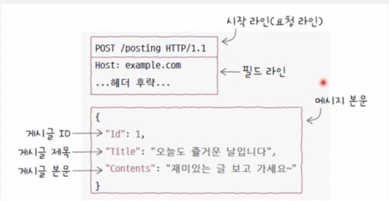
        
    - 많은 경우 **클라이언트가 서버에 새로운 자원을 생성하고자 할 때** 사용
        - **새로운 자원이 생성시 서버는 응답메시지의 Location 헤더를 통해 새로 생성된 자원의 위치를 알려줌**
            
            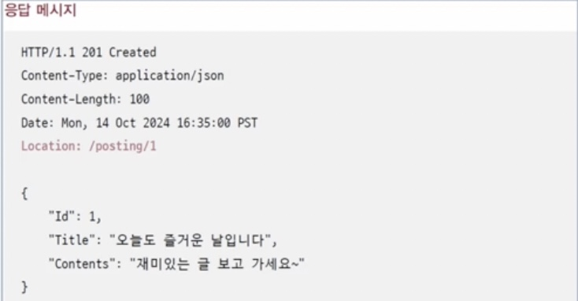
            
- **PUT - 덮어써 주세요**
    - 요청 자원이 없다면 메시지 본문으로 자원을 새롭게 생성
    - 요청 자원이 존재한다면 메시지 본문으로 자원을 완전히 대체
        
        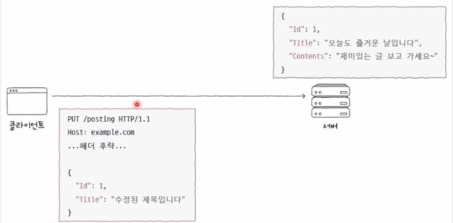
        
        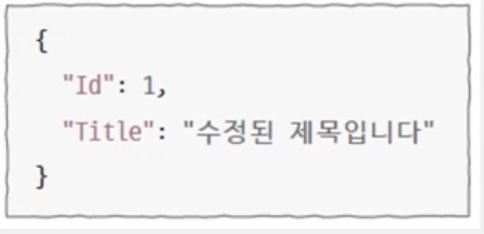
        
- **PATCH - 일부 수정해 주세요**
    - PUT 메서드는 덮어쓰기/ 대체,
    - **PATCH 메서드는 부분적 수정**
        - 앞선 예제의 요청 메서드를 PATCH 메서드로 바꿔 보낸 결과 → 메시지 본문에 맞게 자원 일부 수정
            
            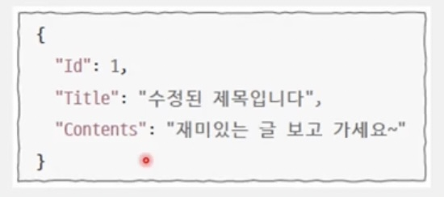
            
- DELETE - 삭제해 주세요
    - 특정 자원을 삭제하고 싶을 때 사용
        
        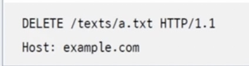
        

<aside>

### **✅ 개발자 입장에서 생각해보는 HTTP 메서드**

- 어떤 URI에 어떤 메서드로 요청받았을 때 서버는 어떻게 행동해야할지
    - 이 설계는 오로지 개발자의 몫
    - 같은 URL에 대해 메서드별 동작을 여러 개 구현할 수도 있음
- **API 문서**
    
    **: 어떤 URL로 어떤 메서드 요청을 받았을 때 서버는 어떻게 응답할 것인가? 를 잘 정리한 문서**
    
</aside>