### 05-1 DNS와 자원

### 도메인 네임과 네임 서버

- 도메인 네임
    - IP 주소와 대응되는 문자열 형태의 호스트 정보
    - [www.naver.com](http://www.naver.com) , [git.kernel.org](http://git.kernel.org) etc
    - 기억하기도 쉽고 IP 주소가 바뀌어도 도메인네임에 다시 대응하면 되므로 간편하다.
- 네임 서버
    - 도메인 네임과 IP주소는 네임 서버에서 관리한다.
- 도메인 네임 구조
    - 점을 기준으로 계층적으로 분류
        - **최상단에 루트 도메인(root domain)**
            - **.**
        - **최상위 도메인(TLD; Top-Level Domain)**
            - **com, kr, net, org 등**
        - 2, 3, 4단계 도메인 …
            - naver, google(2단계)
            - www(3단계)
- 전체 주소 도메인 네임(FQDN)
    
    
    
    - 도메인 네임을 모두 포함하는 도메인 네임
        - com으로 끝나는 도메인 네임은 많다.
            - [api.ex.com](http://api.ex.com), [mail.ex.com](http://mail.ex.com), [www.ex.com](http://www.ex.com) 등
        - 하지만 첫번째 부분까지 고려한 도메인 네임은 하나뿐
            - [www.ex.com](http://www.ex.com)
        - 이런 점에서 FQDN의 첫 번째 부분(www)을 **호스트 네임**이라 부른다.

<aside>

❓서브 도메인이란?

- 다른 도메인이 포함된 도메인
- google.com의 서브 도메인
    - mail.google.com
    - www.google.com
    - drive.google.com

google.com은 com을 포함하고 있기에 com의 서브도메인이다.

</aside>

- **DNS는 전세계에 분산되어 위치한다**

### 계층적 네임 서버

- 도메인 네임으로 IP 주소 알아내는법(리졸빙 하는 법)
    1. 클라와 가장 맞닿아있는 **로컬 네임 서버에 먼저**
        - 주로 ISP가 할당해주며, 공개 DNS 로컬네임서버로는 `8.8.8.8`  `8.8.4.4` 가 있다(구글).
    2. 루트 네임 → TLD 네임 → 책임 네임 순차적으로 
        - 해당 도메인을 관리하는 곳으로 안내받다가 책임 네임 서버가 최종 알아냄
            
            
            
        - 재귀적 질의와 반복적 질의 형태가 있다.
            - 재귀적 질의
                
                
                
                - 최종 응답 결과를 역순으로 전달
            - 반복적 질의
                
                
                
                - 로컬 네임 서버가 네임 서버에 일일이 질의 응답 반복
        - 한계점 : 이런 질의는 8단계를 거치므로 전 세계적인 트래픽을 고려하면 과부하가 일어날 수 있다.
        - 보완 - **DNS 캐시** : 그래서 실제로는 네임 서버들이 기존에 응답받은 결과를 임시로 저장했다가 추후 같은 질의에 이를 활용하는 경우가 많다.
            - DNS 캐시를 활용하면 짧은 시간 안에 원하는 IP주소를 얻어낼 수 있다.
            - TTL이 있어 영원히 존재하지는 않는다.

### 자원을 식별하는 URI

- 자원(Resource) : 네트워크상의 메시지를 통해 주고받는 대상
- URI(Uniform Resource Identifier) : 자원을 식별할 수 있는 통일된 방식
    - URL(Uniform Resource Locator) : 위치를 이용해 자원을 식별
    - URN(Uniform Resource Name) : 이름을 이용해 자원을 식별
        - 잘 안씀

---

URL 형식


1. scheme
    - 자원에 접근하는 방법
    - 일반적으로 사용하는 프로토콜 명시
    - `http://` `https://`
2. authority
    - 호스트를 특정할 수 있는 정보
    - IP주소, 도메인 네임
    - 콜론(:) 뒤에 포트 번호를 덧붙일수도 있다.
3. path
    - 자원이 위치한 경로
    - `/` 가 최상위 경로
4. query
    - HTTP는 요청과 응답 기반의 프로토콜인데, 요청할때 특정 조건을 붙일 수 있음 = 쿼리
5. fragment
    - 자원의 한 조각을 가리키기 위한 정보

### 05-2 HTTP

# HTTP

> **응용 계층에서 정보를 주고받는 데 사용되는 프로토콜**
사용자와 밀접하게 맞닿아 있는 프로토콜로, 오늘날 웹 세상의 기반을 이루는 중요한 역할
> 

### HTTP의 4가지 특성

### 1. 요청-응답 기반 프로토콜

- HTTP는 클라이언트와 서버가 각각 HTTP 요청 메시지와 HTTP 응답 메시지를 주고받는 구조로 동작한다.
- 개발자도구 네트워크 탭에서 자원을 클릭해보면, 요청(Request)과 응답(Response) 헤더를 확인해 볼 수 있다.

### 2. 미디어 독립적 프로토콜

<aside>

HTTP를 정의한 공식문서(RFC 9110)

*HTTP가 요청하는 대상을 자원이라고 한다. **HTTP는 자원의 특성을 제한하지 않으며, 단지 자원과 상호작용하는 데 사용할 수 있는 인터페이스(통로)를 정의할 뿐이다.** 대부분의 자원은 URI로 식별된다.*

</aside>

- HTTP는 자원의 특성과 무관하게 그저 자원을 주고받을 수단(인터페이스)의 역할만 수행한다.
- **미디어 타입(MIME타입)**
    - HTTP에서 메시지로 주고받는 자원의 종류
    - 구조
        
        ```python
        타입(type)/서브타입(subtype)
        ```
        
    - ex) `text/html` , `text/css` , `text/javascript` , `image/png` , `image/gif`
        
             `video/mp4` , `audio/midi` , `application/pdf` , `application/xml` , `application/json` , `multipart/form-data` , `multipart/encrypted`
        
        - `application` : 바이너리 형식의 데이터
        - `multipart` : 각기 다른 미디어타입을 가질 수 있는 여러 요소로 구성된 데이터(입력폼 데이터, 암호화 데이터 등)
    - `*` 별표는 여러 미디어 타입을 통칭하기 위해 사용된다.
    - 또 미디어타입은, 부가적인 설명을 위해 매개변수가 포함될 수 있다.
        
        ```python
        type/subtype;parameter=value
        ```
        
        - ex) `type/html;charset-UTF-8` : HTML문서타입이며, 문자는 UTF-8로 인코딩

### 3. 스테이트리스 프로토콜

- 상태를 유지하지 않는다. = **서버가 HTTP 요청을 보낸 클라이언트의 상태를 기억하지 않는다.**
- 모든 HTTP 요청은 기본적으로 독립적인 요청이다.
- HTTP의 가장 중요한 설계 목표는 처음부터 지금까지 **확장성**과 **견고성**이다.
    - 스테이트리스 특성 덕분에 클라와 서버가 종속되지 않아 언제든 쉽게 서버를 추가할 수 있어 **확장성**이 높고,
    - 서버 중 하나에 문제가 생겨도 쉽게 다른 서버로 대체가 가능해 **견고성**이 높다.

### 4. 지속 연결 프로토콜

- HTTP는 지속해서 발전 중인 프로토콜인 만큼 여러 버전이 있다.
- 기본적으로 HTTP는 TCP상에서 동작하는데, HTTP는 비연결형 프로토콜이지만 TCP는 연결형이다.
- 최근 대중적으로 사용되는 HTTP(v1.1 이상)는 **지속 연결**이라는 기술을 제공한다. **킵 얼라이브**라고도 부른다.
- **하나의 TCP 연결상에서 여러 개의 요청-응답을 주고받을 수 있는 기술**
    
    
    
- 계속 연결을 수립하고 종료하는 비지속 연결에 비해 **지속 연결은 빠르고 여러 요청-응답을 처리할 수 있다.**

### HTTP 메시지 구조

<aside>

시작 라인(줄바꿈)

필드 라인(줄바꿈)

(줄바꿈)

메시지 본문

</aside>

### 시작 라인

- **요청 메시지면 요청 라인**
    
    ```python
    GET /hello?q=world HTTP/1.1
    ```
    
    <aside>
    
    요청 라인 = **메서드(공백)요청 대상(공백)HTTP 버전(줄바꿈)**
    
    </aside>
    
    - **메서드**
        - 클라이언트가 서버의 자원(요청 대상)에 대해 수행할 작업의 종류
        - 대표적으로 `GET, POST, PUT, DELETE` 등
    - **요청 대상**
        - HTTP 요청을 보낼 서버의 자원
        - 보통 쿼리가 포함된 URI 경로 명시
            - ex) `http://www.ex.com**/hello?q=world**`로 요청 → **요청 대상은** **`/hello?q=world`**
        - 만약 하위 경로가 없더라도 요청 대상은 슬래시 `/` 로 표기
            - ex) `http://www.ex.com` 으로 요청 → **요청 대상은 `/`**
    - **HTTP 버전**
        - 사용된 HTTP 버전
            - ex) `HTTP/1.1`
- **응답 메시지면 상태 라인**
    
    ```python
    HTTP/1.1 200 OK
    ```
    
    <aside>
    
    상태 라인 = **HTTP 버전(공백)상태 코드(공백)이유 구문(줄바꿈)**
    
    </aside>
    
    - **상태 코드**
        - 요청에 대한 결과를 나타내는 세 자리 정수
        - ex) `200`, `404`
    - **이유 구문** (옵션)
        - 상태 코드에 대한 문자열 형태의 설명
        - ex) `OK` , `Not Found`

### 필드 라인 (헤더 라인)

- 0개 이상의 HTTP헤더 명시
- HTTP 헤더 : HTTP 통신에 필요한 부가 정보
- 콜론(:)을 기준으로 헤더 이름과 하나 이상의 헤더값으로 구성


### 메시지 본문

- HTTP 요청/응답 메시지에서 본문이 필요할 경우 선택적으로 명시
- 다양한 콘텐츠 타입이 사용 가능(JSON, HTML, etc)


### HTTP 메서드

- HTTP 요청 메시지에서 사용될 수 있는 메서드들
    
    
    
- **GET - 가져다주세요**
    - 특정 자원을 조회할 때 사용되는 메서드
        - ex) 웹브라우저 URL 입력
        - **클라가 서버에게 자원(다양한 타입)을 요청 보내는 것**
    1. **GET 요청 메시지 예시**
        - 메시지 본문보다 **쿼리 문자열이 사용**되는 경우가 많다.
        
        ```python
        GET /index.html?name=value1&n2=v2 HTTP/1.1
        Host: www.ex.com
        Accept: *
        ```
        
    2. **GET 응답 메시지 예시**
        - GET 요청메시지가 **성공적**으로 처리되었다면 이에 대한 응답으로서 **요청한 자원을 전달받는다.**
        
        ```python
        HTTP/1.1 200 OK
        Content-Type: text/html
        Content-Length: 1234
        
        <!DOCTYPE html>
        <html>
        	...
        </html>
        ```
        
- HEAD - 헤더만 가져다주세요
    - GET메서드와 사실상 동일하지만 응답메시지에 메시지 본문이 포함되지 않는다.
    - 즉, HEAD 메서드를 사용하면 서버는 요청에 대한 응답 메시지의 **헤더만을 반환한다.**
- **POST - 처리해주세요**
    - 서버로 하여금 특정 작업을 처리하도록 요청하는 메서드
    - **처리할 대상**은 흔히 **메시지 본문**으로 명시(글 게시하기)
        
        
        
    - 많은 경우 **클라이언트가 서버에 새로운 자원을 생성하고자 할 때** 사용
        - **새로운 자원이 생성시 서버는 응답메시지의 Location 헤더를 통해 새로 생성된 자원의 위치를 알려줌**
            
            
            
- **PUT - 덮어써 주세요**
    - 요청 자원이 없다면 메시지 본문으로 자원을 새롭게 생성
    - 요청 자원이 존재한다면 메시지 본문으로 자원을 완전히 대체
        
        
        
        
        
- **PATCH - 일부 수정해 주세요**
    - PUT 메서드는 덮어쓰기/ 대체,
    - **PATCH 메서드는 부분적 수정**
        - 앞선 예제의 요청 메서드를 PATCH 메서드로 바꿔 보낸 결과 → 메시지 본문에 맞게 자원 일부 수정
            
            
            
- DELETE - 삭제해 주세요
    - 특정 자원을 삭제하고 싶을 때 사용
        
        
        

<aside>

### **✅ 개발자 입장에서 생각해보는 HTTP 메서드**

- 어떤 URI에 어떤 메서드로 요청받았을 때 서버는 어떻게 행동해야할지
    - 이 설계는 오로지 개발자의 몫
    - 같은 URL에 대해 메서드별 동작을 여러 개 구현할 수도 있음
- **API 문서**
    
    **: 어떤 URL로 어떤 메서드 요청을 받았을 때 서버는 어떻게 응답할 것인가? 를 잘 정리한 문서**
    
</aside>

### HTTP 상태 코드

> 상태 코드는 요청에 대한 결과를 나타내는 세 자리 정수
> 

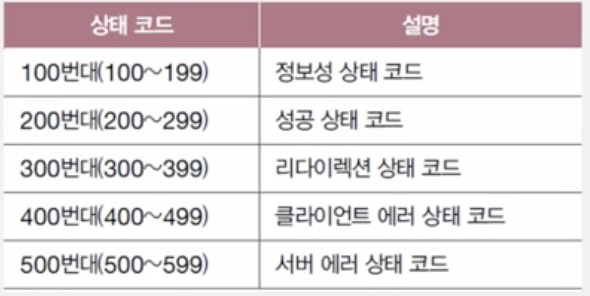

- **백의 자리 수를 기준으로 구분, 200~500이 주로 사용된다.**
- **200번대 : 성공 상태 코드**
    - 요청이 성공했음을 의미
    
    | 상태 코드 | 이유 구문 | 설명 |
    | --- | --- | --- |
    | 200 | OK | 요청이 성공했음 |
    | 201 | Created | 요청이 성공했으며, 새로운 자원이 생성되었음 |
    | 202 | Accepted | 요청을 잘 받았으나, 아직 요청한 작업을 끝내지 않았음(주로 작업 시간이 길어서) |
    | 204 | No Content | 요청이 성공했지만, 메시지 본문으로 표시할 데이터가 없음 |
- **300번대 : 리다이렉션 상태 코드**
    - **리다이렉션?**
        - 요청을 완수하기 위해 추가적인 조치가 필요한 상태
        - **클라이언트가 요청한 자원이 다른 곳에 있을 때, 클라이언트의 요청을 다른 곳으로 이동시키는 것**
            
            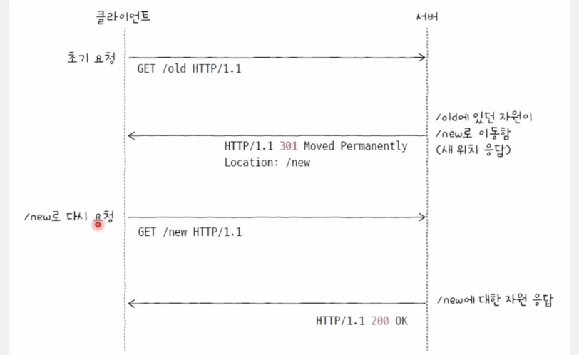
            
        - 리다이렉션 종류
            - 영구적인 리다이렉션
                - 자원이 완전히 새로운 곳으로 이동하여 경로가 영구적으로 재지정
                - 이 경우 기존의 URL에 요청 메시지를 보내면 항상 새로운 URL로 리다이렉트
                    
                    
                    | 상태 코드 | 이유 구문 | 설명 |
                    | --- | --- | --- |
                    | 301 | Moved Permanently | 영구적 리다이렉션; 재요청 메서드 변경될 수 있음 |
                    | 308 | Permanent Redirect | 영구적 리다이렉션; 재요청 메서드 변경되지 않음 |
                - 클라가 GET 요청을 보내고 301이나 308을 받고, 응답 메시지의 Location 헤더에 명시된 경로로 재요청을 보낼 때는 당연히 GET 요청으로 다시 보낸다.
                - 근데 GET이 아닌 요청(POST)을 했을 때
                    
                    **→ 301 응답을 받으면?**
                    
                    - 클라가 보내는 두 번째 요청 메서드는 GET요청으로 바뀔 ‘**수도**’ 있음
                        
                        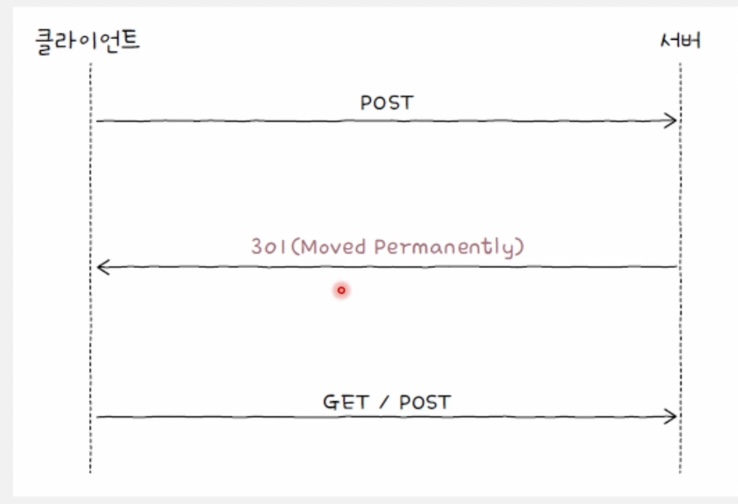
                        
                    
                    **→ 308 응답을 받으면?**
                    
                    - 두 번째 요청에서도 메서드는 변하지 않음
                    - 첫 번째 요청에서 POST메서드를 사용했다면, 두 번째 요청에서도 POST메서드를 유지
                        
                        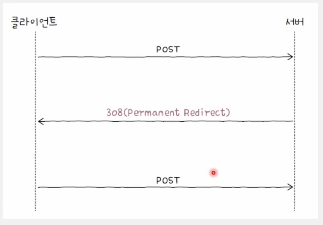
                        
            - 일시적인 리다이렉션
                - 자원의 위치가 임시로 변경되었거나 임시로 사용할 URL이 필요한 경우에 주로 사용
                    - 어떤 URL에 대해 일시적인 리다이렉션 관련 상태 코드를 응답받았다면 여전히 요청을 보낸 URL은 기억
                
                | 상태 코드 | 이유 구문 | 설명 |
                | --- | --- | --- |
                | 302 | Found | 일시적 리다이렉션; 재요청 메서드 변경될 수 있음 |
                | 303 | See Other | 일시적 리다이렉션; 재요청 메서드 GET으로 변경 |
                | 307 | Temporary Redirect | 일시적 리다이렉션; 재요청 메서드 변경되지 않음 |
    - 304번 코드 : Not Modified
        - 캐시와 관련된 매우 중요한 상태 코드(다음 절에 학습)
- **400번대 : 클라이언트 에러 상태 코드**
    - 클라이언트에 의한 에러가 있음을 알려주는 상태코드
    
    | 상태 코드 | 이유 구문 | 설명 |
    | --- | --- | --- |
    | 400 | Bad Request | 클라의 요청이 잘못되었음
    (서버가 아예 못알아듣는 요청) |
    | 401 | Unauthorized | 요청한 자원에 대한 유효한 인증이 없음
    (로그인) **인증** |
    | 403 | Forbidden | 요청이 서버에 의해 거부됨
    (로그인 했어도 접근 권한이 없을 경우) **인가** |
    | 404 | Not Found | 요청받은 자원을 찾을 수 없음
    - 자원이 존재하지 않음
    - 존재하지만 공개하지 않는 자원에대해 404를 응답하는 경우도 있음 |
    | 405 | Method Not Allowed | 요청한 메서드를 지원하지 않음 |
- **500번대 : 서버 에러 상태 코드**
    - 클라가 올바르게 요청을 보냈을지라도 발생할 수 있는 서버 에러에 대한 상태 코드
    
    | 상태 코드 | 이유 구문 | 설명 |
    | --- | --- | --- |
    | 500 | Internal Server Error | 요청을 처리할 수 없음
    **(서버 내 에러를 통칭 - 보안 상 이유)** |
    | 502 | Bad Gateway | 중간 서버의 통신 오류
    (티켓팅 과부하) |
    | 503 | Service Unavailable | 현재는 요청을 처리할 수 없으나 추후 가능할 수도 있음 |

<aside>

**HTTP 주요 버전**

1. **HTTP/1.1**
    - **지속 연결 공식 지원**
    - 특정 요청에 대한 응답이 수신되기 전에 다음 요청을 보낼 수 있는 **파이프라이닝 기능**
    - **콘텐츠 협상 기능** 등 다양한 편의 기능 및 헤더 추가
    - **메시지 형태가 텍스트(평문)**
    - 오늘날까지 널리 사용되는 버전
2. **HTTP/2.0**
    - 송수신 효율을 위해 헤더 압축 전송
    - 메시지 형태가 바이너리
    - 클라가 요청하지 않았더라도 필요할 것으로 예상되는 자원을 미리 전송해주는 **서버 푸시 기능**
    - HTTP/1.1의 고질적 문제인 HOL블로킹 문제 완화
        - HOL블로킹 : 같은 큐에 대기하며 순차적으로 처리되는 여러 패킷이 있을 때, 첫 번째 패킷의 지연으로 인해 나머지 패킷들의 처리도 모두 지연디는 문제
        - ⇒ 멀티플렉싱 기법
            - 여러 스트림을 이용해 병렬적으로 메시지를 주고 받는 기술
            - 요청과 응답을 주고 받는 단위는 하나의 스트림에서 이루어지고, 이러한 스트림을 여러 개 활용
3. **HTTP/3.0**
    - TCP를 기반으로 동작하는 앞선 버전들과 달리 **UDP를 기반으로 동작**
    - UDP를 기반으로 구현된 **QUIC 프로토콜** 기반 동작
    - 속도 측면에서 큰 개선, 현재 빠르게 성장하는 프로토콜

</aside>

### 05-3 HTTP 헤더와 HTTP 기반 기술

- 필드 라인 공부할 차례~

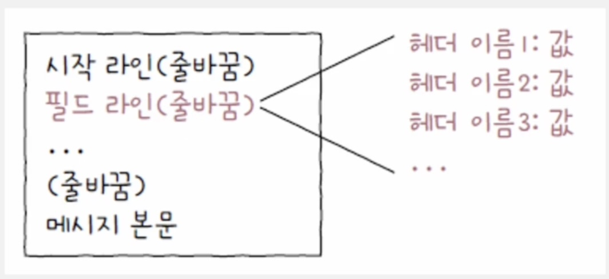

- 필드라인에는 HTTP 헤더들이 명시된다.
- HTTP 헤더는 필드 이름과 필드 값이 콜론(:)을 기준으로 구분되어 있다.
- 중요 헤더 중에는 특별한 사전 지식이 필요하지 않은 헤더, 사전 지식이 필요한 헤더(캐시, 쿠키, 콘텐츠 협상 관련)가 있다.

### HTTP 헤더

> 사전 지식 없이 이해할 수 있는 헤더들
> 
- 요청 시 주로 사용되는 헤더
    1. **Host**
        - **요청을 보낼 호스트를 나타내는 헤더**
        - 주로 도메인 네임 명시
        
        ```
        GET /hypertext/WWW/TheProject.html HTTP/1.1
        **Host: info.cern.ch**
        ```
        
    2. **User-Agent**
        - **웹 브라우저와 같이 HTTP 요청을 시작하는 클라이언트 측의 프로그램**
        
        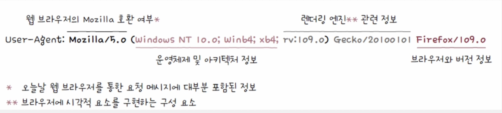
        
    3. **Referer**
        
        ```
        Referer: https://en.wikipedia.org/
        ```
        
        - **클라이언트가 요청을 보낼 때 머무르고 있던 URL**
        - 클라이언트의 유입 경로를 파악해 볼 수 있다.
    4. **Authorization**
        
        ```
        Authorization:<type> <credentials>
        ```
        
        - **클라이언트의 인증 정보를 담는 헤더**
        - 인증 타입과 인증을 위한 정보(credentials)가 명시됨
        - **가장 기본적인 HTTP인증 타입은 Basic**이다.
            - username:password와 같이 아이디와 비번을 :으로 합치고 **Base64 인코딩**한 값을 인증 정보로 담는다.
            
            ```
            **Authorization: Basic bQWlvaoi23nlk**
            ```
            
- 응답 시 주로 사용되는 헤더
    1. **Server**
        - 요청을 처리하는 **서버 측의 소프트웨어와 관련된 정보**
            - Unix 운영체제에서 동작하는 아파치 HTTP서버
                
                ```
                Server: Apache/2.4.1(Unix)
                ```
                
    2. **Allow**
        - **클라이언트에게 허용된 HTTP메서드 목록을 알려주기 위해 사용**
        - 요청한 메서드를 지원하지 않는 상태코드 **405**(Mehtod Not Allowed)를 응답하는 메시지에서 **Allow가 함께 사용된다.**
            
            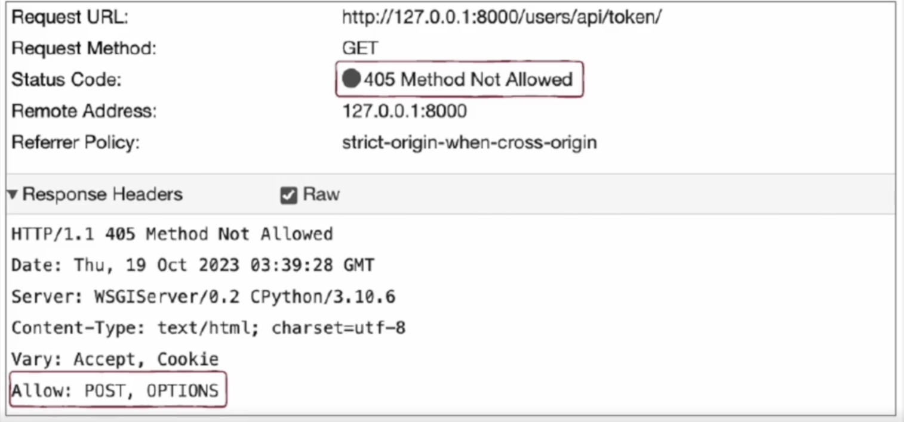
            
    3. **Retry-After**
        - 현재 요청을 처리할 수 없으나 추후 가능할 수 있음을 의미하는 **503코드**와 함께 사용되는 헤더
        - **자원을 사용할 수 있는 날짜 혹은 시각을 의미한다**.
        
        ```
        Retry-After : Fri, 23 Aug 2024 09:00:00 GMT
        Retry-After : 120 (120초 후)
        ```
        
    4. **Location**
        - **클라이언트에게 자원의 위치를 알려주는 헤더**
        - **POST로 자원을 새로 생성했을 때**, 리다이렉션이 발생했을 때
    5. **WWW-Authenticate**
        - 요청한 자원에 대한 **유효한 인증이 없을 때 응답하는 401 코드**와 함께 사용되는 헤더
        - **자원에 접근하기 위한 인증 방식을 설명하는 헤더**
            
            ```
            WWW-Authenticate: Basic
            ```
            
        - Authorization과 WWW-Authenticate 헤더를 통해 인증되지 않은 클라이언트가 HTTP(Basic)인증을 수행하는 과정
            
            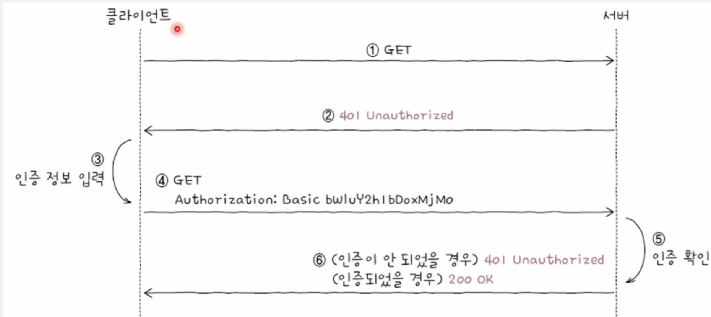
            
- 요청과 응답 모두에서 활용되는 헤더
    1. Date
        - 메시지가 생성된 날짜와 시각에 관련된 정보를 담은 헤더
    2. Connection
        - 클라이언트의 요청과 응답 간의 연결 방식을 설정하는 헤더
        - 대표적으로 사용되는 값은 keep-alive, close
            - keep-alive
                - 상대방에게 지속 연결을 희망함
            - close
                - 연결을 종료하고 싶을 때
    3. Content-Length
        - 본문의 바이트 단위 크기(길이)
    4. Content-Type, Content-Length, Content-Encoding
        - 메시지 본문의 표현 방식을 설명하는 헤더들
        - 표현 헤더의 일종이다.
        1. Content-Type
            - 메시지 본문에서 사용된 미디어 타입
            
            ```
            Content-Type: text/html; charset=UTF-8
            ```
            
        2. Content-Length
            - 메시지 본문에 사용된 자연어
            - 첫 번째 서브 태그 - 두 번째 서브 태그 형식
            - `en-US` , `ko-KR`
        3. Content-Encoding
            - 메시지 본문을 압축하거나 변환한 방식이 명시됨
            - HTTP를 통해 송수신되는 데이터는 전송 속도를 개선하기 위해 종종 압축이나 변환이 되는데,
            - 이 때 사용된 방식이 Content-Encoding 필드에 명시된다.
            
            ```
            Content-Encoding: deflate, gzip, compress
            ```
### 캐시

> **정보의 사본을 임시로 저장하는 기술**
> 
- 캐시하면 동일한 요청에 대해 캐시된 데이터를 활용할 수 있어 **불필요한 대역폭 낭비를 줄이고, 더 빠르게 데이터에 접근할 수 있다.**
- **웹 브라우저에 저장된 개인 전용 캐시(private cache)**와, 클라이언트와 서버 사이에 위치한 중간 서버에 저장되는 **공용 캐시**가 있다.
- 캐시 신선도
    
    > 캐시된 사본 데이터가 얼마나 최신 원본 데이터와 유사한지
    > 
    - 캐시 신선도를 검사하는 법? → **캐시 데이터에 유효기간을 설정**
        - `Expires` , `Cache-Control` 태그 사용
            
            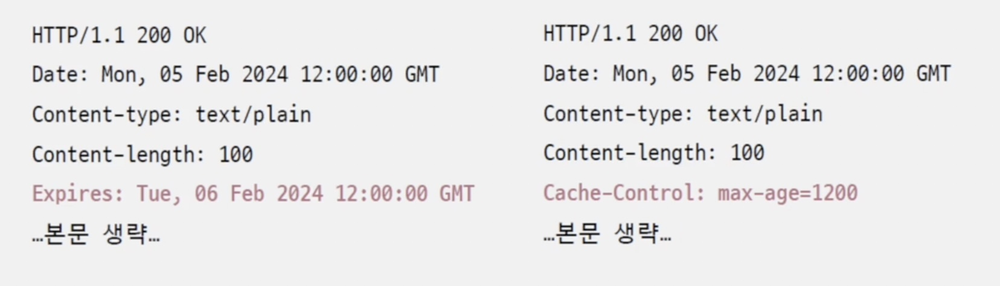
            
            - `Expires` (날짜 지정), `Cache-Control` (1200초)
    - **캐시된 데이터의 유효기간이 만료되었을 때**
        - 원본 자원의 변경이 없고 캐시 데이터가 아직도 최신이라면 굳이 서버로부터 같은 자원을 응답 받을 필요가 없다.
        - 따라서 캐시의 유효 기간이 만료되었다면 클라이언트는 캐시된 자원이 여전히 신선한지 재검사한다.
        - 검사 방법에 두 가지가 있다.
            - 1. **날짜**를 기반으로 서버에게 물어봄
                - `If-Modified-Since` 헤더에 날짜 명시
                - 서버는 이 헤더에 명시된 날짜를 기준으로
                    - **자원이 변경되었다면** `200`코드와 함께 새로운 자원 반환
                    - **자원이 변경되지 않았다면** 메시지 본문 없는 `304`코드 반환
                        - Last-Modified 헤더로 자원이 마지막으로 수정된 시점도 알려줄 수 있다.
                    - **자원이 삭제되었다면** `404` 반환
            - 2. **엔티티 태그**를 기반으로 서버에게 물어봄
                
                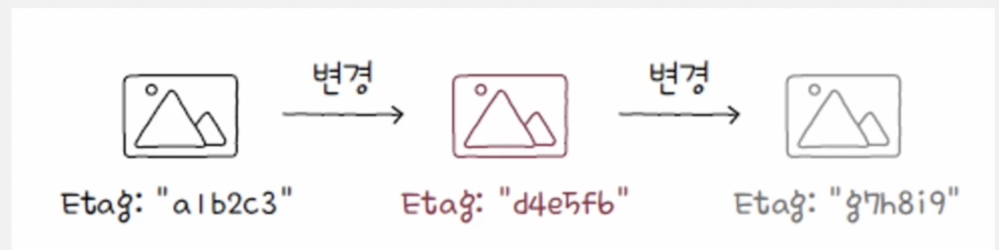
                
                - 엔티티 태그(Etag)는 자원의 버전을 식별하기 위한 정보
                - 버전 : 유의미한 변경 사항
                - `If-None-Match`: “Etag” 로 서버에 물어봄
                    
                    ```
                    GET /index.html HTTP/1.1
                    Host: www.ex.com
                    **If-None-Match: "abc"**
                    ```
                    
                    - Etag값이 abc인 [www.ex.com/index.html이라는](http://www.ex.com/index.html이라는) 자원이 있니? 이 자원이 변경되었다면 그때만 새 자원으로 응답해줘
                    - 서버 입장 : 변경되었다면 200, 아니면 304, 삭제면 404
### 쿠키

- HTTP는 스테이트리스 프로토콜. 클라이언트의 상태를 유지하지 않음
- **쿠키란** **서버에서 생성**되어 **클라이언트에 저장**되는 데이터로, **상태를 유지하지 않는 HTTP의 특성을 보완하기 위한 수단**

<aside>

**❗️ 세션 인증**

HTTP가 스테이트리스라면, 로그인 인증은 어떻게 하는 걸까?

- **쿠키를 통해 전달되는 대표적인 정보로 세션 아이디가 있다.**
1. 클라가 서버에게 아이디, 비번 등 인증 정보 전송
2. 인증 정보가 올바르면 서버는 세션아이디를 생성해 클라에게 전송
3. 서버는 세션 아이디를 DB에 저장
4. 클라는 추후 요청을 보낼 때 세션 아이디를 포함하여 전송
5. 서버는 쿠키 속 세션 아이디와 저장된 세션 아이디를 비교해 클라를 식별

**→ 요청을 보낼 때마다 번거로운 인증 과정을 거칠 필요가 없다.** 

</aside>

- **응답 메시지의 Set-Cookie 헤더**와 **요청 메시지의 Cookie 헤더**를 통해 전달된다.
- **응답 메시지**
    - 서버 → 클라
    
    ```
    Set-Cookie: 이름-값
    Set-Cookie: 이름-값; 속성1
    Set-Cookie: 이름-값; 속성1; 속성2
    ```
    
    - 속성값들 종류
        
        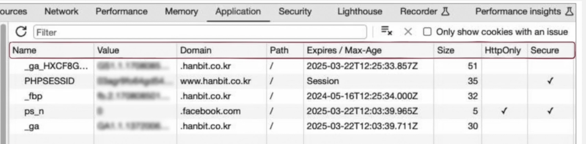
        
        - **domain**
            - naver에게 받은 쿠키를 google에게 전송하면 안되듯이, 사용 가능한 도메인이 정해져 있다.
        - **path**
            
            ```
            Set-Cookie: name=Hosung **path=/lectures**
            ```
            
            - 같은 도메인이라도 경로별로 구분하여 쿠키 사용
        - **Expires, Max-Age**
            
            ```
            Set-Cookie: sessionID=abc; **Max-age=223523423**
            ```
            
            - Expires : 만료일시
            - Max-age : 초단위 유효기간
            - 이 값을 지나면 해당 쿠키는 삭제되어 전달되지 않는다.
            - 서버쪽에서 쿠키를 삭제하려면 이 값을 0으로 하면 됨
        - **Secure, HttpOnly**
            - 쿠키의 대표적인 한계는 보안
            - **Secure** : HTTPS 프로토콜에서만 쿠키를 전송되도록 하는 속성
            - **HttpOnly** : HTTP 송수신을 통해서만 쿠키를 이용하도록 제한하는 속성. 쿠키는 JavaScript로도 조작이 가능하기 때문이다.
- **요청 메시지**
    - 클라 → 서버
    
    ```
    Cookie: 이름=값; 이름=값;
    ```
    
    - 서버에 전달할 쿠키의 이름과 값을 나타내는 헤더

<aside>

**❗️ 웹 스토리지**

- **클라가 저장하고** 클라의 상태를 추측할 수 있는 키-값 형태의 정보
    - **서버가 생성하고 클라가 저장하는 쿠키와 다름**
- 웹 스토리지는 웹 브라우저 내에 저장, 일반적으로 쿠키보다 더 큰 데이터 저장 가능
- **쿠키는 서버로 자동 전송되지만, 웹 스토리지의 정보는 서버로 자동 전송되지 않는다.**
- 종류
    - **로컬 스토리지** - 별도로 삭제하지 않는 한 영구적으로 저장이 가능한 정보
    - **세션 스토리지** - 세션이 유지되는 동안(브라우저가 열려 있는 동안) 유지되는 정보
</aside>