# 7-1 안정성을 위한 기술

- **가용성** : 웹서비스의 안정성을 수치로 표현한 것
    - 전체 사용 시간 중에서 **정상적인 사용 시간**
        
        
        
        - 업타임 - 정상적인 사용 시간
        - 다운타임 - 정상적인 사용이 불가능한 시간
    - **고가용성**(**HA**. High Availability) : 가용성이 높음
        - 모든 웹서비스 업체들의 **대단히 중요한 목표**
        
        
        
        - 항상, 1초도 안 쉬고 잘 돌아가야하는 서비스에서는 파이브 나인스도 치명적
    - **가용성을 높이는 법?**
        
        ⇒ 다운 타임을 낮추면 된다.
        
        - 서비스는 왜 다운될까?
            - 과도한 트래픽
            - 예기치못한 SW상의 오류
            - 하드웨어 장애
            - 보안 공격, 자연재해 등
        - 원인을 모두 원천 차단하기는 힘들다.
        - 따라서 핵심은, **문제가 발생하더라도 계속 기능할 수 있도록 설계하는 것**
            - 이를 **결함 감내**라한다.
- 이중화
    
    : 결함을 감내하여 가용성을 높이기 위한 가장 기본적인 방법으로, **예비(백업)을 마련하는 방법**
    
    - 무엇을 이중화?
        - **문제가 발생할 경우 시스템 전체가 중단될 수 있는 대상**
        - 이를 단일 장애점, **SPOF**(Single Point Of Failure)라고 한다.
            - ex) 서버 컴퓨터, NIC, 스위치, DB, 웹서버프로그램 등
    - 이중화 구성
        1. 액티브/스탠바이
            - 한 시스템은 가동하고, 다른 시스템은 백업 용도로 두는 이중화 구성 방식
            - 장점 : 안전하다
            - 단점 : 성능상 큰 변화는 없다.
        2. 액티브/액티브
            - 두 시스템 모두 가동 상태로 두는 구성 방식
            - 장점 : 부하분산을 할수있다. 성능상 이점이 있다.
            - 단점 : 한 시스템에 문제가 생기면 다른 시스템에 부하가 급증한다.
    - 다중화
        - 시스템을 세 개 이상으로 구성
    - 이중화/다중화 사례
        - **티밍(윈도우)과 본딩(리눅스)**
            - 여러 개의 NIC를 이중화/다중화하여 마치 더 뛰어난 성능을 보유한 하나의 인터페이스처럼 보이게 하는 기술
- 로드 밸런싱
    
    (고가용성을 요구하는 호스트는 일반적으로 클라가 아닌 서버, 서버 중심으로 얘기)
    
    - 서버를 이중화/다중화해도 문제는 남아있다. 바로 트래픽을 분산해야 의미가 있다는 것
    - 한 서버에 트래픽이 몰리면
        - 높은 부하로 CPU 발열 심해짐
        - 메모리 공간 부족
        - 제한된 대역폭과 병목 현상으로 응답이 느려지거나 누락될 수 있음
    
    ---
    
    - 해결 ⇒ 로드 밸런싱(load balancing)
        - load : 부하
        - balancing : 균형 유지
        - 로드 밸런서에 의해 수행된다.
            - L4스위치(전송계층)
            - L7스위치(응용계층)
            - 로드밸런싱 기능을 제공하는 소프트웨어
                - Nginx, HAProxy, Envoy
            
            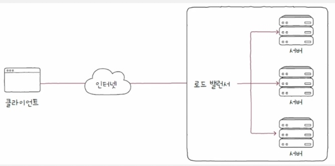
            
        
        <aside>
        
        서버의 상태를 검사하는 헬스 체크
        
        - health check
            
            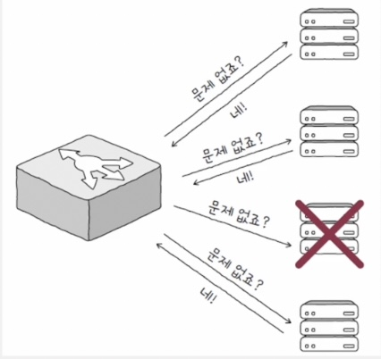
            
            - 서버들의 건강 상태를 주기적으로 모니터링하고 체크
            - 주로 로드 밸런서에 의해 이루어짐
            - HTTP, ICMP 등 다양한 프로토콜 활용
        - 헬스 체크 외에 서버 간의 메시지를 주기적으로 주고받아 상태를 검사하는 **하트비트**라는 방식도 있다.
        </aside>
        
    - 로드 밸런싱 알고리즘
        
        : 로드 밸런서가 부하를 분산시키기 위해 선택하는 방법
        
        1. 라운드 로빈 알고리즘
            
            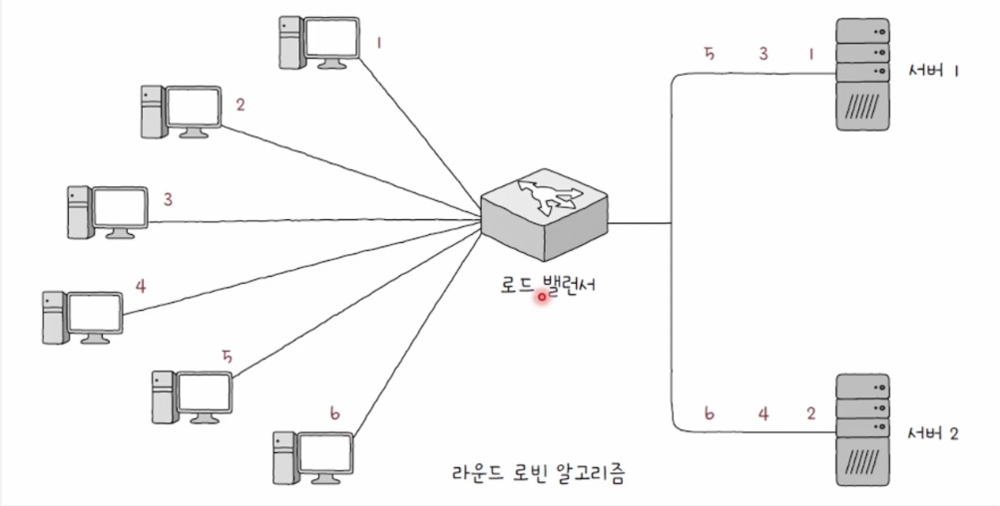
            
            - 단순히 돌아가며 부하를 전달하는 방식
        2. 최소 연결 알고리즘
            - 연결이 적은 서버부터 우선적으로 전달하는 방식
        3. 기타
            - 무작위
            - 해시(hash) 자료구조 이용
            - 응답 시간이 가장 짧은 서버 선택
        - 가중치 라운드 로빈 알고리즘, 가중치 최소 연결 알고리즘
            
            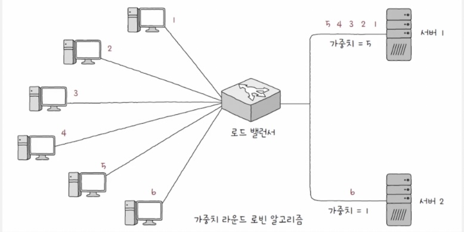
            
            - 1,2번 알고리즘은 서버마다 가중치를 부여할 수 있다.
            - 가중치가 높은 서버가 더 많이 선택되어 더 많은 부하를 받도록 하는 것
            - 서버 간 성능이 다른 경우 주로 사용된다.
## 포워드 프록시와 리버스 프록시

- (HTTP)클라이언트는 서버와 단일하게 딱 붙어있지 않음
    - 실제로는 사이에 수많은 서버가 존재할 수 있고,
    - 서버는 다중화된 경우가 많다.

- 오리진서버
    - 클라이언트가 최종적으로 메시지를 주고받는 대상
    - 자원을 생성하고 클라에게 권한 있는 응답을 보낼 수 있는 HTTP서버
    - 고가용성을 위해 다중화된 경우가 많다.
- 중간서버
    - 인바운드(inbound) 메시지 : 오리진 서버를 향하는 메시지
    - 아웃바운드(outbound) 메시지 : 클라이언트를 향하는 메시지
- 대표적인 HTTP 중간서버
    - 프록시(proxy, 포워드 프록시)
    - 게이트웨이(gateway, 리버스 프록시)

### 프록시(proxy)

- **클라이언트가 선택한** 메시지 전달 대리자
    - 프록시를 언제 어떻게 사용할지는 클라이언트가 선택하기 때문
- 특징
    - 오리진 서버보다 클라이언트와 더 가까이 위치
    - **캐싱, 클라이언트 암호화, 접근 제한 등**

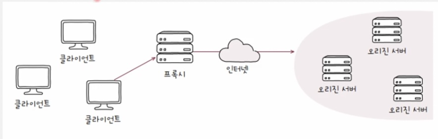

### 게이트웨이(gateway)

- 일반적 의미 : 네트워크 간의 통신을 가능케 하는 입구 역할을 하는 HW/SW
- HTTP 중간 서버 맥락에서의 의미
    - **아웃바운드 연결에 대해 오리진 서버 역할을 수행**하는 중개자
    - 수신된 요청 메시지를 다른 인바운드 서버들에 전달하는 중개자
- 특징
    - 클라이언트가 보기에 오리진 서버와 같이 보임
    - 클라이언트 요청을 오리진 서버에 전달하기 위해 오리진 서버들에 더 가까이 위치
    - **캐싱, 로드 밸런싱 수행**

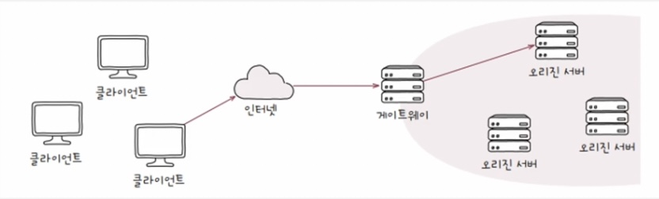

# 7-2 안전성을 위한 기술

### 암호와 인증서

- 먼 컴퓨터와 통신할 때 평문으로 메시지를 주고받으면 안된다. 암호화가 필요하다.
- 암호화
    - 원문 데이터를 알아볼 수 없는 형태로 변경하는 것
- 복호화
    - 암호화된 데이터를 원문 데이터로 되돌리는 과정
- 암호화 알고리즘
    - 데이터를 알아보기 어렵게 바꾸는 어떤 수학적 연산
- 암호화 복호화는 비단 안전한 데이터 송수신 뿐만 아니라 인증서 기반의 검증도 가능하게 한다.

### 대칭 키 암호화, 공개 키 암호화

- 대칭 키 암호화
    
    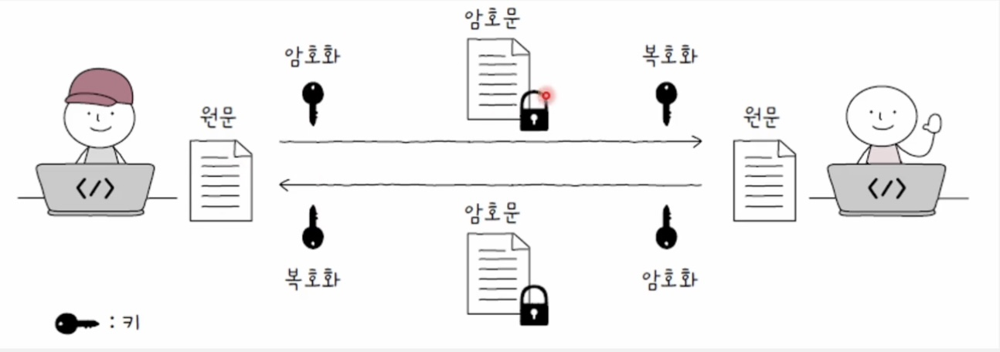
    
    - 암호화 하는 키와 복호화 하는 키가 같음
    - 장점
        - 작은 부하로 암호화 복호화가 빠르다.
    - 단점
        - 키를 안전하게 전송하기 어렵다.(키 안전하게 전송할 수 있으면 키 말고 그냥 원문 데이터를 안전하게 보내면 되는거 아녀)
- 공개 키 암호화(비대칭 키 암호화)
    
    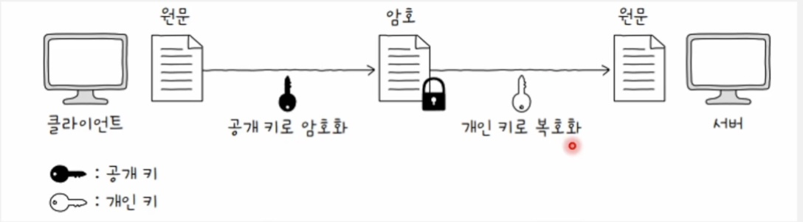
    
    - 암호화에 사용되는 키와 복호화에 사용되는 키가 다름
    - 한 쌍의 키(공개 키, 개인 키)를 사용 : 한 키로 암호화, 다른 키로 복호화
    - 공개 키(public key)를 알아도 개인 키(private key) 유추 불가능. 역도 마찬가지
    - 공개 키는 암호화만 하고 개인 키를 유추할 수 없기 때문에 누구에게나 공개해도 무방하다.
    - 다시 받은 쪽에서 답장 메시지를 보낼때(B→A. 사실 A→B의 과정과 동일하다.)
        - A는 자신의 공개키를 B에게 전달
        - B는 A의 공개 키로 메시지를 암호화한 뒤 A에게 전송
        - A는 개인 키로 암호를 복호화해서 B의 메시지 확인
    - 장점
        - 키를 안전하게 공유할 수 있다
    - 단점
        - 암호화 및 복호화에 시간과 부하가 상대적으로 많이 든다.
### 인증서와 디지털 서명

> 앞서 본 암호화 기술을 기반으로 수행할 수 있는 인증, 디지털 서명
> 
- 인증서
    - 무엇인가를 증명하기 위한 문서
    - 네트워크(인터넷)에서의 인증서 = 일반적으로 ‘공개 키 인증서’

- 공개 키 인증서
    - ‘이 공개 키가 유효합니다.’ 인증하는 전자 문서
    - 공개 키와 공개 키의 유효성을 입증하기 위한 전자 문서
    
    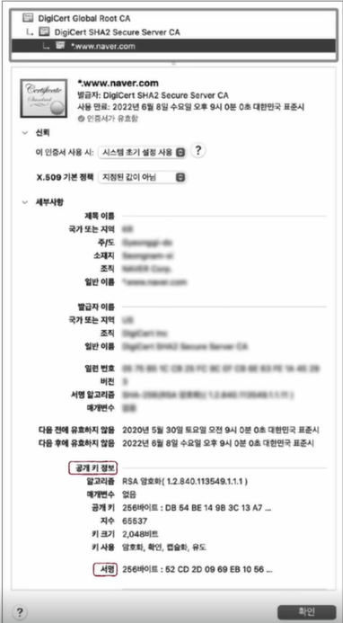
    
    - 인증기관인 **CA**가 발급해줌
        - 통신 주체가 인증서를 가지고 있는건 의미가 없음(어케 믿어)
        - 인증서의 발급, 검증, 저장과 같은 역할을 수행할 수 있는 공인기관
        - 대표적인 인증 기관 - IdenTrust, DigiCert, GlobalSign 등
    - 서명 값(signature)
        
        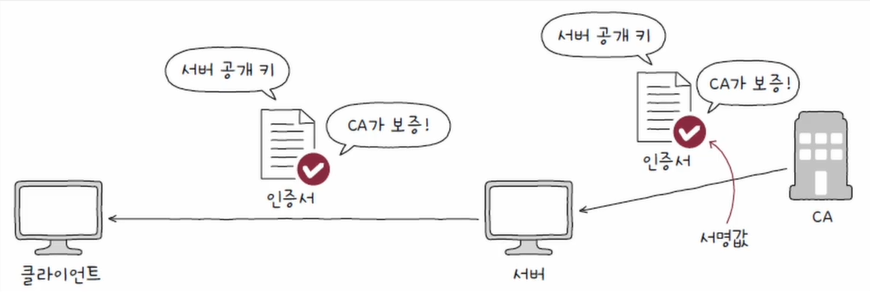
        
        - 인증 기관의 인증 정보
        - 이 공개 키 인증서는 진짜임을 보증하는 것
        - 클라이언트는 CA가 발급한 인증서의 서명 값을 바탕으로 인증서 검증
        - 서명 값 생성의 원리
            
            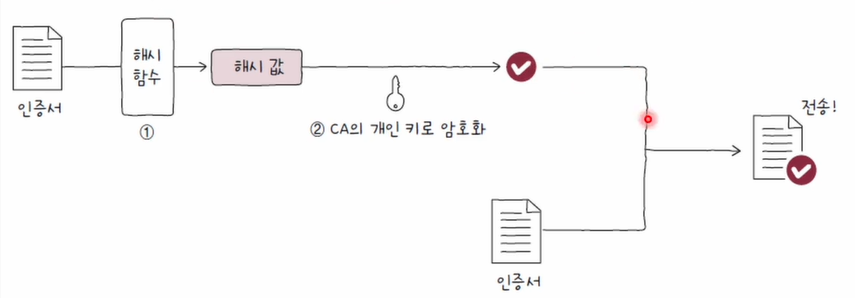
            
            1. 인증서 내용에 대한 해시 값을
            2. CA의 개인 키로 암호화하는 방식으로 생성
                - CA는 이렇게 얻어낸 정보를 서명 값으로 삼아 클라이언트에게 인증서와 함께 전송
            
            ⇒ CA가 뿌린 공개키로 복호화가 됐다는건, CA가 개인키로 암호화한 데이터니까 CA가 인증한 인증서가 맞구나!를 알 수 있음
            
            - 1의 결과인 인증서 내용에 대한 해시 값을 fingerprint라고도 함
            
            <aside>
            💡
            
            해시 값?
            
            - 해시 함수를 적용시킨 결괏값
                - 해시 함수란
                    - 임의의 길이의 데이터를 고정된 길이의 데이터로 변환하는 함수
                    - MD5, SHA-1, SHA-2(SHA-256, SHA-384, SHA-512)등
                    - 입력값에 민감 : 입력 데이터가 조금만 달라져도 완전히 다른 결과가 나옴
            - 데이터 변조 여부 검사에 사용
                1. ‘보낼 데이터’ 와 ‘데이터에 대한 해시 값’을 함께 전송
                2. 수신자가 전달 받은 데이터에 대한 해시 값을 직접 계산
                3. 계산 결과를 전달 받은 해시 값과 비교
                4. 같은 값이 도출된다면 ⇒ 데이터 전송 도중 변조되거나 소실되지 않았다고 판단
            </aside>
            
    - 인증서 검증 과정
        
        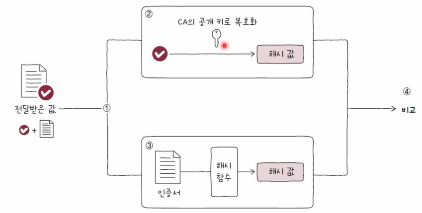
        
        1. 서명 값과 인증서 분리
        2. 서명 값을 CA의 공개 키로 복호화하여 인증서 내용에 대한 해시 값을 얻음 
        3. 인증서 데이터에 대한 해시 값을 직접 계산
        4. 이를 복호화한 값과 비교
        
        → 만일 값이 일치한다면? 전달 받은 인증서는 확실히 CA의 개인 키로 만들어졌다고 보장
        
        ### 디지털 서명
        
        - 개인 키로 암호화된 메시지를 공개 키로 복호화함으로써 신원을 증명하는 절차

    ### HTTPS : SSL/TLS

- 지금까지 배운 대칭 키 / 공개 키 암호화, 그리고 공개 키 인증서를 기반으로 동작하는 프로토콜로 SSL과 TLS가 있다.
    - TLS는 SSL을 계승한 프로토콜이다.
- 이 SSL/TLS를 대표적으로 사용하는 프로토콜은 **HTTPS**(HTTP over TLS)이다.
    
    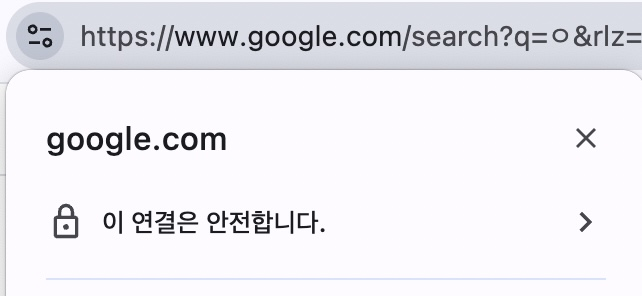
    

### HTTP 동작 과정(TLS 1.3 기반)

1. TCP 3-way 핸드셰이크
    1. SYN / SYN+ACK / ACK 세그먼트
2. **TLS 핸드셰이크**
3. 암호화된 메시지 송수신

### TLS 핸드셰이크

- 핵심
    1. 암호화 통신을 위한 키를 교환한다.
    2. 인증서 송수신과 검증이 이루어진다.
- 과정
    
    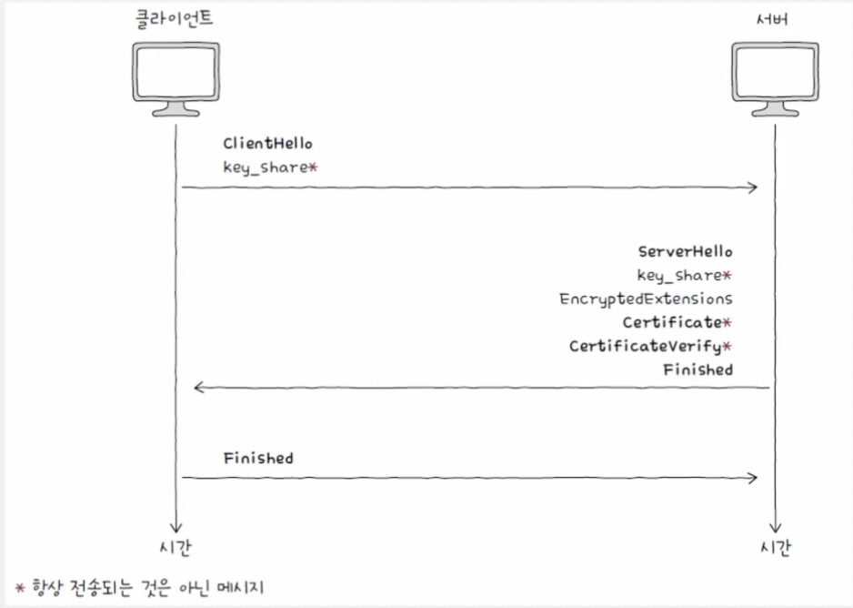
    
    - **클라이언트의** `ClientHello` 메시지
        - 암호화된 통신을 위해 서로 맞춰봐야 할 정보들을 제시하는 메시지
            - TLS 버전, 사용 가능한 암호화 방식, 해시 함수 등
            - **암호 스위트** : 사용 가능한 암호화 방식과 해시 함수를 담은 정보
                
                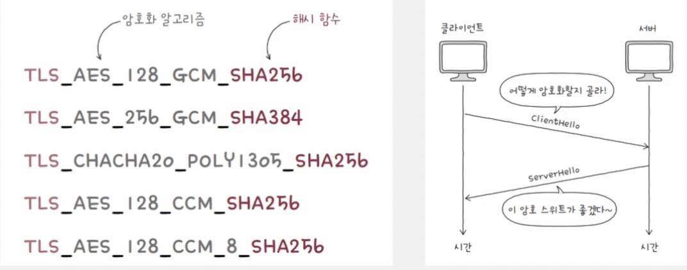
                
    - **서버의** `ServerHello` 메시지
        - ClientHello에서 제시된 정보들을 선택하는 메시지
            - TLS 버전, 암호 스위트 등
        
        ⇒ 암호화된 통신을 위해 사전 협의해야 할 정보들이 결정되었다.
        
        ⇒ 이 정보를 토대로 서버와 클라는 암호화에 사용할 키를 만들어낼 수 있다.
        
        → TLS의 핵심 1. 암호화 통신을 위한 키를 교환
        
    - **서버의** `Certificate`, `CertificateVerify` 메시지
        - 인증서와 검증을 위한 디지털 서명
    - **서버와** **클라이언트의** `Finished` 메시지
    - 이후 얻어낸 키를 기반으로 암호화된 메시지(Application Data)를 주고받는다!

<aside>

7-2 핵심 포인트

- 대칭 키 암호화 방식은 암호화와 복호화 시 같은 암호 키를 쓰는 암호화 방식
- 공개 키 암호화 방식은 암호화와 복호화 시 서로 다른 키를 쓰는 암호화 방식. 한 키로 암호화했다면 다른 키로 복호화할 수 있다.
- 공개 키 인증서는 공개 키와 공개 키의 유효성을 입증하기 위한 전자문서. CA라는 인증서 발급 기관을 통해 인증서를 검증할 수 있다.
- 개인 키로 암호화된 메시지를 공개 키로 복호화함으로써 신원을 증명하는 절차를 디지털 서명이라 부른다.
- SSL과 TLS는 인증과 암호화를 가능케하는 프로토콜이다. SSL/TLS를 사용하는 가장 대표적인 프로토콜은 HTTPS다.
- TLS 핸드셰이크를 통해 암호화에 사용할 키와 인증서를 주고받을 수 있다.
</aside>