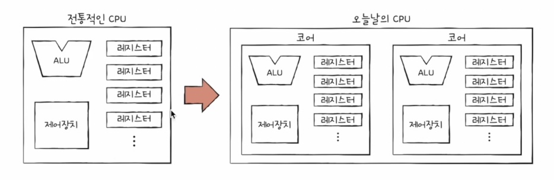
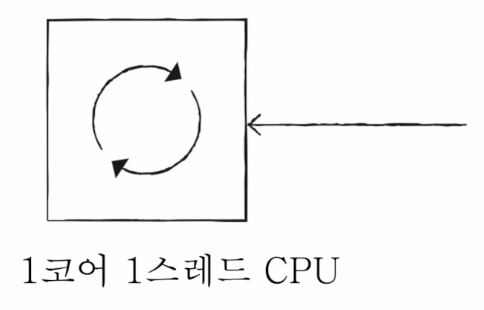
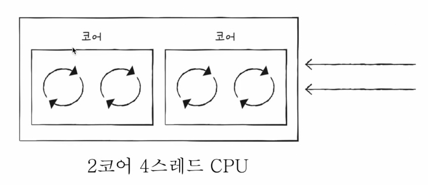
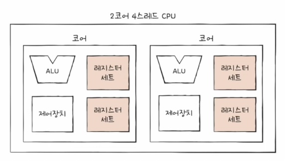
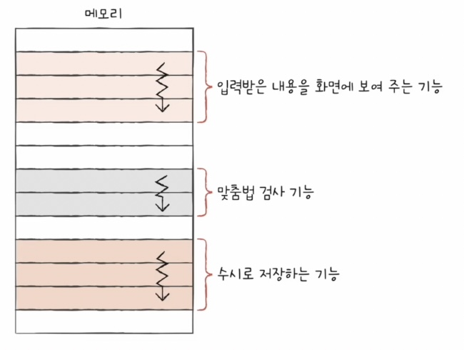
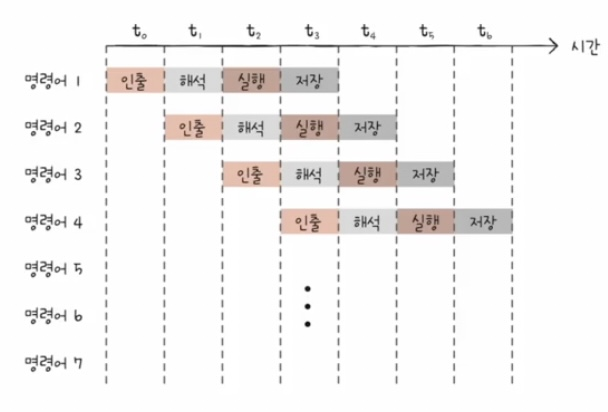
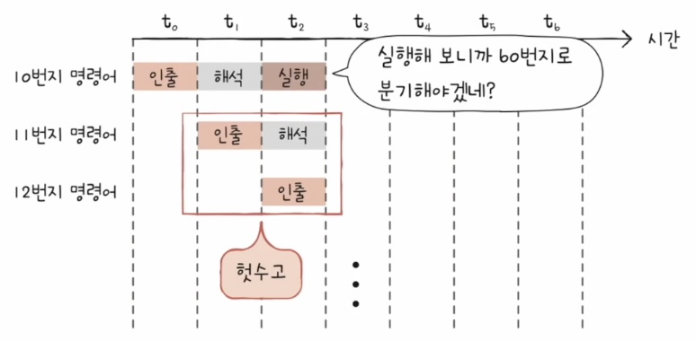

### 빠른 CPU를 위한 설계 기법

### 클럭 속도 높이기

- 컴퓨터 부품들은 클럭 신호에 맞춰 일사불란하게 움직인다.
- CPU는 명령어 사이클이라는 흐름에 맞춰 명령어를 실행한다.

**⇒ 클럭 속도가 빠르면 CPU가 빠르다.**

(클럭 속도는 CPU 속도 단위로 간주되기도 한다.)

- 클럭속도
    - 헤르츠 Hz 단위로 측정
    - 1초에 100번 클럭이 반복되면 CPU 클럭 속도는 100Hz
    - 실제 CPU는 2.5GHz ~ 4.9GHz (평소 25억번 반복, 고성능을 요할 땐 최대 49억번 반복 가능)
- **단, 클럭 속도를 무작정 높이면 발열 문제가 심각해진다.**

### 코어 수 늘리기

- 전통적으로 명령어를 실행하는 부품, 즉 CPU는 하나만 존재했다.
- 그러나 오늘날 CPU에는, 명령어를 실행하는 부품이 여러 개 존재한다.
- 우리가 지금까지 CPU의 정의로 알고 있던 ‘명령어를 실행하는 부품’은 오늘날 **코어**라는 용어로 사용된다.

- 코어를 여러 개 포함하는 CPU를 멀티코어CPU 또는 멀티코어 프로세서라고 부른다.
    - 프로세서 명칭 : 싱글코어, 듀얼코어, 옥타코어 …

<aside>
❓

코어를 늘리면 속도도 그만큼 빨라지는가 ? 

**NO**

조별과제를 생각하면, 인원이 많다고 일이 빨라지지 않는다. **처리할 명령어를 얼마나 적절하게 분배하느냐가 중요**

</aside>

### 스레드 수 늘리기

## 스레드란?

: CPU에서 사용되는 하드웨어적 스레드, 프로그램에서 사용되는 소프트웨어적 스레드가 있다.

<aside>
❓

Quiz : 아래 문장을 설명하세요

- 1코어 1스레드 CPU가 여러 스레드로 만들어진 프로그램을 실행할 수 있다.
</aside>

### 하드웨어적 스레드

- 하나의 코어가 동시에 처리하는 명령어 단위
    
    
    

(하이퍼스레딩 : 인텔의 멀티스레드 기술)

- 하나의 명령어를 실행하기 위해 꼭 필요한 레지스터들을 편의상 ‘레지스터 세트’라고 표기
    - 프로그램 카운터가 두 개 있어야 한번에 두 명령어를 처리할 수 있겠죠?
- 하드웨어 스레드를 논리 프로세서라고도 한다.

<aside>
👌

정리

- 코어
    - 명령어를 실행할 수 있는 하드웨어 부품 (오늘날의 CPU)
- 스레드
    - 명령어를 실행하는 단위
- 멀티코어 프로세서
    - 명령어를 실행할 수 있는 하드웨어 부품이 CPU안에 두 개 이상 있는 CPU
- 멀티스레드 프로세서
    - 하나의 코어로 여러 개의 명령어를 동시에 실행할 수 있는 CPU

</aside>

### 소프트웨어적 스레드

- 하나의 프로그램에서 독립적으로 실행되는 단위
    - 워드프로그램 예시
    
    
    
- 프로그래밍 언어를 이용해 만들 수 있다

### 명령어 병렬 처리 기법

### 명령어 파이프라이닝

- 동시에 여러 개의 명령어를 겹쳐 실행하는 기법
    
    
    
- 파이프라인 위험
    
    : 특정 상황에서는 성능 향상에 실패하는 경우도 있는데, 이러한 상황을 파이프라인 위험이라고 한다.
    
    - 데이터 위험
        - 명령어간 데이터 의존성에 의해 발생
    - 제어 위험
        - 분기(Jump)등으로 인한 **프로그램 카운터의 갑작스러운 변화**에 의해 발생
            
            
            
            - 대안 : **분기 예측**
                - 프로그램이 어디로 분기할지 미리 예측한 후 그 주소를 인출하는 기술
    - 구조적 위험(자원 위험)
        - 명령어들을 겹쳐 실행하는 과정에서 서로 다른 명령어가 동시에 ALU, 레지스터 같은 CPU 부품을 사용하려고 할 때 발생.

### 슈퍼스칼라

: 여러 개의 명령어 파이프라인을 두는 기법(멀티스레드와 유사한 개념)

- 슈퍼스칼라 구조로 명령어 처리가 가능한 CPU를 슈퍼스칼라 프로세서라고도 부른다.
- 여러 파이프라인을 두는 만큼 파이프라인 위험도 증가하므로 주의 필요

### 비순차적 명령어 처리(합법적인 새치기)

- 앞서 파이프라인 위험에서 데이터 의존성에 의해 발생하는 데이터 위험에 대해 살펴보았다.
- 그렇게 하면 파이프라인이 멈춰 CPU성능이 떨어진다.
- **비순차적 명령어 처리 기법은,** 명령어를 순차적으로만 실행하지 않고 **순서를 바꿔 실행해도 무방한 명령어를 먼저 실행하여**
- **명령어 파이프라인이 멈추는 것을 방지하는 기법**을 말한다.

### CISC와 RISC

### ISA (명령어 집합 구조)

- CPU가 이해할 수 있는 명령어들의 모음
    - 세상엔 수많은 CPU제조사가 있고, CPU마다 규격이 다르다.
    - 명령어의 기본 구조와 작동 원리는 크게 다르지 않지만, 명령어의 세세한 생김새, 연산, 주소 지정 방식은 CPU마다 다르다.
        - 애플은 ARM ISA, 인텔은 x86-64 ISA 를 이해한다.
    - ISA는 CPU의 언어인 셈
    - ISA가 다르면 나비 효과로 제어장치의 명령어 해석 방식, 사용되는 레지스터의 종류와 개수 등 많은 것이 달라진다.

### CISC

Complex Iinstruction Set Computer

복잡한 명령어 집합을 활용하는 컴퓨터

- 다양하고 강력한 기능의 명령어 집합 활용
- 가변 길이 명령어 활용
- 적은 수의 명령어로도 프로그램을 실행할 수 있다
- 장점 : 메모리 공간을 절약할 수 있다.
- **단점** : 가지각색의 명령어로 인해 명령어 파이프라이닝이 어렵다.

### RISC

Reduced Instruction Set Computer

- CISC의 한계로 등장
    - 빠른 처리를 위해선 명령어 파이프라인을 활용해야하고, 그러려면 명령어 길이와 수행 시간이 짧고 규격화 되어 있어야 함
    - 어차피 자주 쓰이는 명령어만 많이 사용된다. 기본 명령어를 작고 빠르게 만드는 것이 중요
- 고정 길이 명령어 활용
- 하나의 명령어가 1클럭 내외로 실행되는 것을 지향
- 메모리에 직접 접근하는 명령어를 load, store 두 개로 제한할 만큼 메모리 접근을 최소화. 레지스터 적극 활용
- **장점** : 명령어 파이프라이닝 쉬움
- 단점 : 프로그램을 이루는 명령어 수가 많음