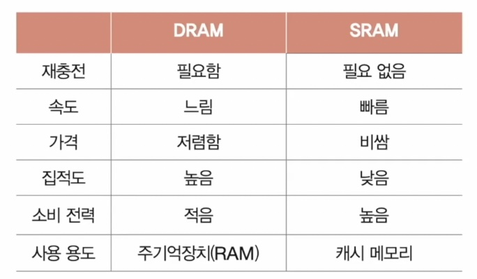
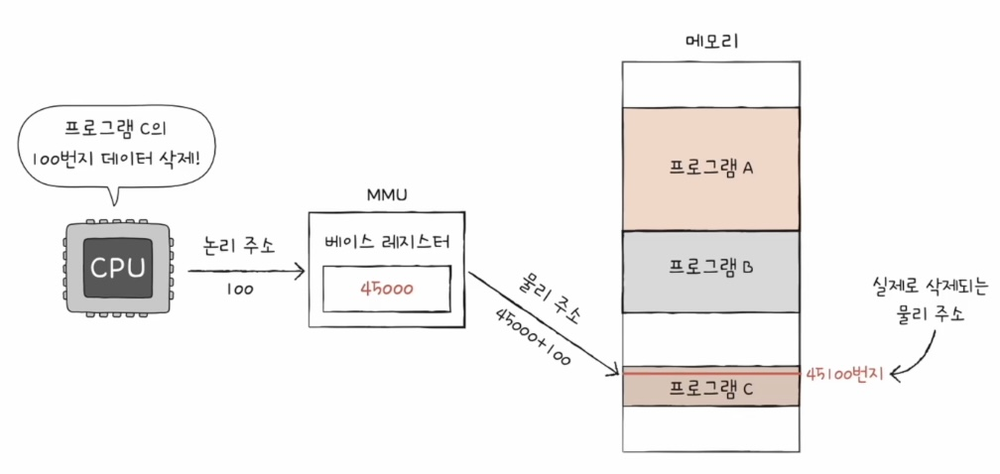
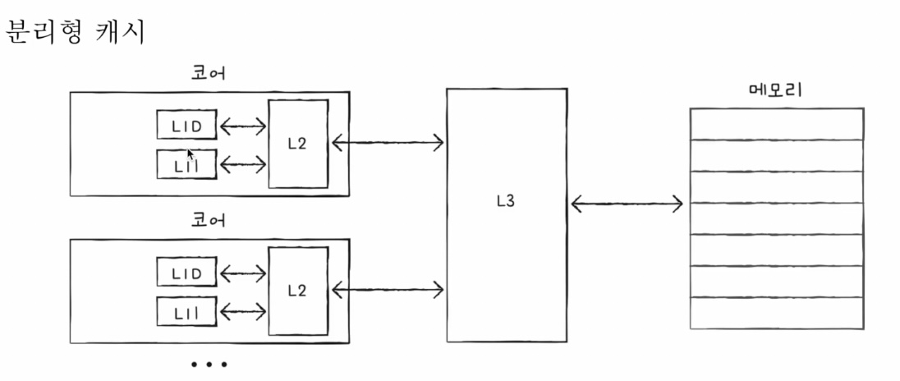
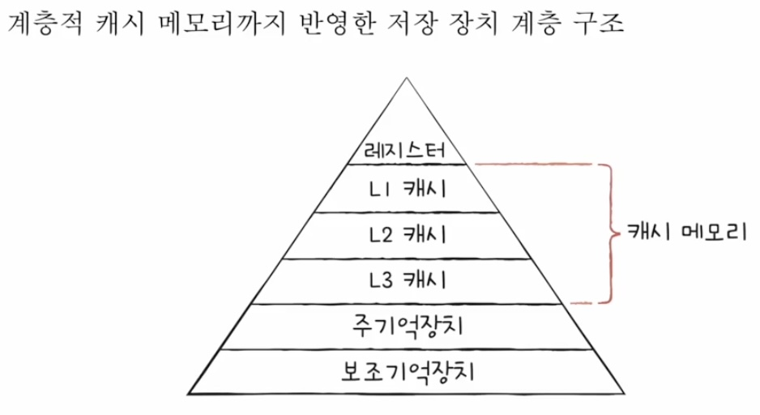

### RAM의 특징과 종류

- RAM의 용량과 성능
    - RAM용량이 크면 보조 기억 장치에서 로드할 수 있는 프로그램이 많다.

### RAM의 종류

- DRAM(Dynamic RAM)
    - **저장된 데이터가 시간이 지나면 사라지는 RAM**
    - 따라서 DRAM은 데이터의 소멸을 막기 위해 일정 주기로 데이터를 재활성화(다시 저장)해야 한다.
    - 소비전력이 비교적 낮고, 저렴하고, 집적도가 높아 대용량 설계가 용이하다.
- SRAM(Static RAM)
    - **저장된 데이터가 시간이 지나도 사라지지 않는 RAM**
    - 소비전력이 비교적 높고, 비싸고, 집적도가 낮다.
    - 대용량으로 만들어질 필요는 없지만 속도가 빨라야하는 저장 장치에 사용된다
        - 캐시메모리

- SDRAM
    - 클럭신호와 동기화된 DRAM
- DDR SDRAM
    - 대역폭을 넓혀 속도를 빠르게 만든 SDRAM
    - SDRAM이 1차선 도로라면 DDR SDRAM은 2차선 도로
        - SDRAM은 한 클럭에 한 번씩 CPU와 데이터를 주고 받는데, DDR SDRAM은 대역폭을 두 배 넓혀 한 클럭 당 두 번씩 CPU와 데이터를 주고 받을 수 있다.
    - DDR2 SDRAM은 DDR SDRAM보다 대역폭이 두 배 넓다
    - DDR3 SDRAM은 DDR2 SDRAM보다 대역폭이 두 배 넓다
    - 현재 DDR5 SDRAM 나왔고 4, 5를 많이 쓴다.

### 메모리의 주소 공간

- 물리 주소
    - 정보가 실제로 저장된 하드웨어상의 주소
- 논리 주소
    - CPU와 실행중인 프로그램이 사용하는 주소
    - 메모리에 적재된 프로그램들은 현재 다른 프로그램들의 물리 주소가 무엇인지 굳이 알 필요가 없다.
        - 새로운 프로그램이 언제든 적재될 수 있고, 실행되지 않는 프로그램은 언제든 메모리에서 사라질 수 있기 때문
    - 따라서 **모든 프로그램은 모두 0번지부터 시작하는 자신만을 위한 주소인 논리주소**를 갖는다.
- 메모리 관리 장치, MMU
    - CPU가 이해하는 주소가 논리 주소이긴 하지만 CPU와 메모리가 상호작용하려면 논리 주소와 물리 주소 간의 변환이 이루어져야한다.
    
    **⇒ MMU는 논리 주소와 물리 주소 간 변환을 수행**한다.
    
    - CPU와 주소 버스 사이에 위치한다.
    - CPU가 발생시킨 논리 주소에 베이스 레지스터 값을 더해 논리 주소를 물리 주소로 변환한다.
        
        
        
        - 베이스 레지스터 : 프로그램의 가장 작은 물리 주소. 즉, 프로그램의 첫 물리 주소
        - 논리 주소 : 프로그램의 시작점으로부터 떨어진 거리
- 한계 레지스터
    - 다른 프로그램의 영역을 침범할 수 있는 명령어는 위험하기 때문에, 논리 주소 범위를 벗어나는 명령어 실행을 방지하는 방법이 필요하다.
    
    **⇒ 한계 레지스터가 그것을 수행**
    
    - 베이스 레지스터가 프로그램의 가장 작은 물리 주소를 저장한다면, 한계 레지스터는 논리 주소의 최대 크기를 저장한다.
        - 만약 접근하고자 하는 논리 주소가 한계 레지스터보다 높다면 인터럽트(트랩)을 발생시켜 실행을 중단한다.
    - 프로그램의 물리 주소 범위  : 베이스 레지스터 값 이상, 베이스 레지스터 + 한계 레지스터 값 미만

### 캐시 메모리

- CPU의 연산속도 >> CPU가 메모리에 접근하는 시간
    - 메모리에 접근하는 시간이 느리면 CPU의 빠른 속도는 쓸모가 없다. 이를 극복하기 위한 저장 장치가 **캐시 메모리**
- 저장 장치 계층 구조
    - CPU에 가까운 저장 장치일수록 빠르고, 용량이 작고, 비싸다.
    - 레지스터 - 캐시메모리 - 메모리 - 보조기억장치 - 클라우드

### 캐시메모리

: 레지스터보다용량이 크고 메모리보다 빠른 SRAM기반의 저장 장치

- 위치
    - CPU와 메모리 사이에 위치
- 비유
    - CPU가 집이고 데이터가 필요한 물건일 때, 메모리가 대형 마트라면, 캐시 메모리는 편의점
- 계층 구조
    - L1, L2, L3
        
        
        
    - CPU와 멀어질수록 숫자 커짐, 용량 업⬆️, 가격과 속도 다운⬇️
        
        
        

### 참조 지역성 원리

- 캐시메모리는 메모리의 어떤 내용을 저장해야하는가?
    - CPU가 쓸 법한 데이터를 저장해야한다.
    - 그래야 메모리 접근 횟수를 줄이고, CPU성능을 높일 수 있다.
    - 참조 지역성 원리에 따라 데이터를 예측하여 저장하고, 캐시 적중률을 높여야한다.
    
    → 캐시 적중률
    
    - 캐시 히트 / (캐시 히트 + 캐시 미스)
- 참조 지역성원리
    1. CPU는 최근 접근한 메모리 공간에 다시 접근하려는 경향이 있다.
        - ex 변수
    2. CPU는 접근한 메모리 공간 근처를 접근하려는 경향이 있다.
        - 공간 지역성