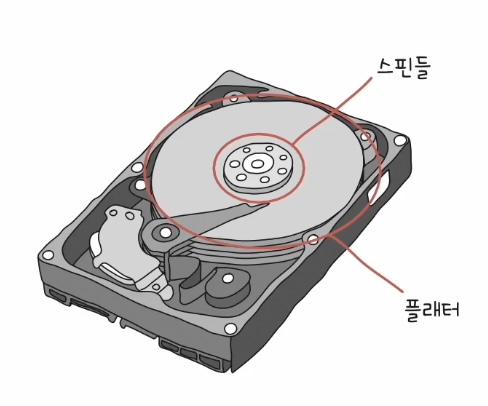
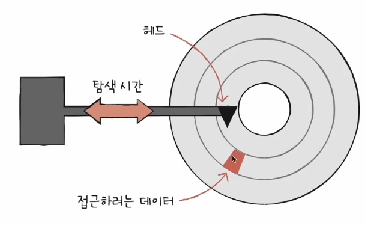
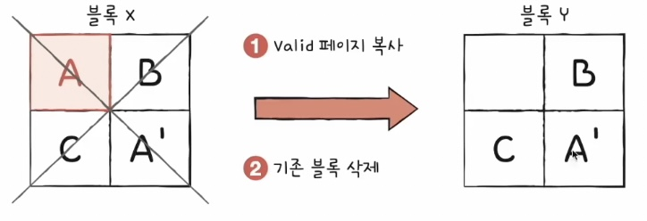
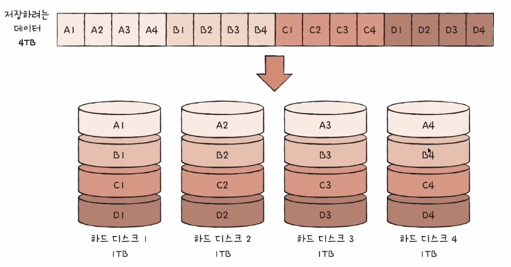
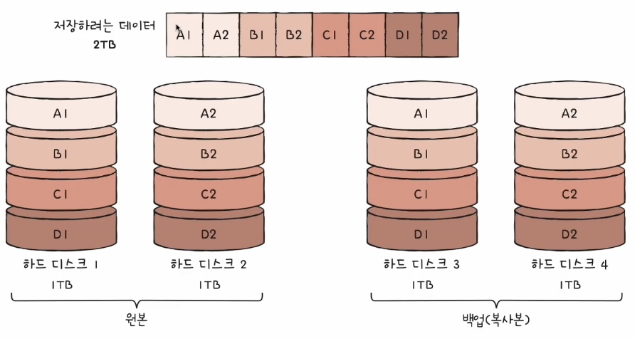
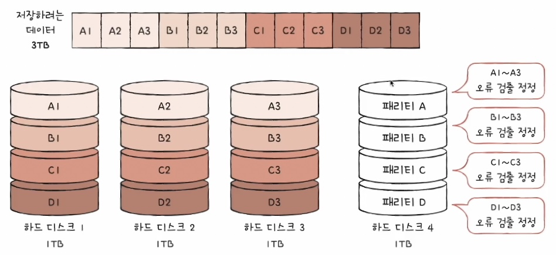
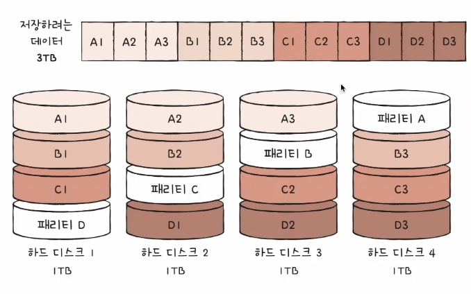
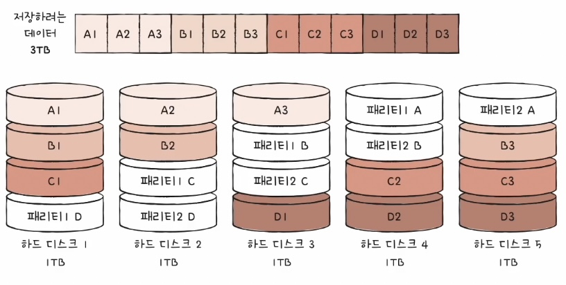

### 07-1 다양한 보조기억장치

- 하드디스크
- 플래시 메모리 - SSD, USB, SD카드

### 하드 디스크

: 자기적(magnetic)인 방식으로 데이터를 저장하는 보조기억장치

### 구성

- 플래터
    - 실질적으로 데이터가 저장되는 곳
    - 자기 물질로 덮여 수많은 N극과 S극을 저장
    - N극과 S극은 0과 1의 역할 수행
- 스핀들
    - 플래터를 회전시키는 구성 요소
    - 스핀들이 플래터를 돌리는 속도 단위 : RPM(분당 회전수)

- 헤드
    - 플래터를 대상으로 데이터를 읽고 쓰는 구성 요소
- 디스크암
    - 원하는 위치로 헤드를 이동시키는 구성 요소
    - 하드디스크는 많은 데이터를 저장해야 해서 여러 겹의 플래터의 양면에 데이터가 저장되어있다.
    - 모든 헤드는 디스크 암에 부착되어 다같이 이동한다.

### 데이터 저장 단위

- 트랙과 섹터 단위로 데이터 저장
- 트랙
    - 플래터를 여러 동심원으로 나누었을 때 하나의 원
- 섹터
    - 트랙을 피자처럼 나눈 그 한 조각
    - 하드 디스크의 가장 작은 전송 단위
    - 하나 이상의 섹터를 묶어 블록이라고도 표현
    - 섹터는 운영체제 파일시스템에서 다시 나옴
- 실린더
    - 여러 겹의 플래터 상에서 같은 트랙이 위치한 곳을 모아 연결한 논리적 단위
    - 연속된 정보는 한 실린더에 기록
        - 디스크 암을 움직이지 않고도 바로 데이터에 접근할 수 있기 때문

### 데이터 접근 과정(시간)

- 탐색 시간
    - 접근하려는 데이터가 저장된 트랙까지 헤드를 이동시키는 시간
        
        
        
- 회전 지연
    - 헤드가 있는 곳으로 플래터 회전 시키는 시간
        
        
        
- 전송 시간
    - 하드디스크와 컴퓨터 간에 데이터를 전송하는 시간
        
        
        

### 플래시 메모리

: 전기적으로 데이터를 읽고 쓸 수 있는 반도체 기반의 저장장치

- 보조기억장치 범주에만 속하지 않고 다양한 곳에서 널리 쓰인다.
    - ROM 등
- NAND 플래시 메모리와 NOR 플래시 메모리가 있다.
    - 대용량 저장 장치로 많이 사용되는 건 NAND
- 읽기/쓰기 단위와 삭제 단위가 다르다.
    - 읽기/쓰기 - 페이지, 삭제 - 블록

### 플래시 메모리의 단위

- **셀**
    - 데이터를 저장하는 가장 작은 단위
    - 하나의 셀에 몇 비트를 저장할 수 있느냐에 따라 종류가 나뉨
        - SLC - 한 셀에 한 비트 (표현 정보 2개)
        - MLC - 한 셀에 두 비트 (표현 정보 4개)
        - TLC - 한 셀에 세 비트 (표현 정보 8개)
        - QLC - 한 셀에 네 비트 (표현 정보 16개)
    - 집은 셀이고 비트는 사람이라고 생각해보면 특징 파악 가능
        - 셀의 비트가 늘어날 수록
        - 값이 싸고, 속도가 느리고, 수명이 짧다.
- **페이지**
    - 셀들이 모여 만들어진 단위
    - 세 개의 상태를 가진다.
        1. Free
            - 어떠한 데이터도 저장하고 있지 않아 새 데이터를 저장할 수 있는 상태
        2. Valid
            - 이미 유효한 데이터를 저장하고 있는 상태
        3. Invalid
            - 쓰레기값이라 부르는 유효하지 않은 데이터를 저장하고 있는 상태
- **블록**
    - 페이지가 모여 만들어진 단위

<aside>
⚠️

플래시 메모리 주요 특징

- 플래시 메모리는 덮어 쓰기가 불가능하다.
- 플래시 메모리에서 읽기와 쓰기는 페이지 단위로 이루어진다.
- 플래시 메모리에서 삭제는 블록 단위로 이루어진다.
</aside>

<aside>
🔑

가비지 컬렉션

어떤 블록에서 한 페이지의 정보를 수정하고 저장하면, 이전 정보를 작성한 페이지가 쓸데없이 공간만 차지하고 있는 상태가 되는데,

가비지 컬렉션은 이를 정리하기 위해

1. 유효한 페이지들만을 새로운 블록으로 복사한뒤
2. 기존의 블록을 삭제하는 기능이다.

</aside>

- 플레인
    - 블록이 모임
- 다이
    - 플레인이 모임

### 07-2 RAID의 정의와 종류

- 내가 구글의 서버관리자라면? 하루에 오억테라바이트(?)가 서버로 쏟아지고, 데이터에는 개인 정보, 결제 정보 같이 절대 잃어버리면 안되는 민감한 정보도 있다.
- 보조기억장치에도 수명이 있어 어떻게든 저장만 하면 된다는 부족한 답.

⇒ 해결책 : RAID

### RAID

: 하드 디스크와 SSD를 사용하는 기술로, 여러 개의 물리적 보조기억장치를 마치 하나의 논리적 보조기억장치처럼 사용하는 기술

- 레벨에 따라 종류가 나뉜다.
    - 0, 1, 2, 5, 6이 많이 쓰인다.
- RAID0
    
    
    
    - 스트라입(Stripe) : 줄무늬처럼 분산되어 저장된 데이터
    - 스트라이핑 : 분산하여 저장하는 것
    - **4TB 저장장치 한 개를 읽고 쓰는 것보다 이렇게 RAID를 이용한 1TB 저장장치 4개를 쓰는것이 이론상 4배 속도가 빠르다.**
    - 저장장치 하나만 고장나도 전체를 못 쓰게 되는 단점이 있다.
- RAID1
    
    
    
    - 복사본을 만드는 방식
    - 미러링이라고도 부른다.
    - 복구가 매우 간단하지만 용량 효율이 매우 떨어지고 비용도 증가
- RAID4
    
    
    
    - RAID1처럼 완전한 복사본이 아닌 패리티 비트를 저장
        - 패리티를 이용해 다른 장치들의 오류를 검출하고, 오류가 있다면 복구
    - 패리티 비트를 저장한 디스크가 매우 바쁘다는 단점(병목 발생)
- RAID5
    
    
    
    - 패리티 정보를 분산하여 저장하는 방식
- RAID6
    
    
    
    - 두 종류의 패리티(오류 검출 및 복구 수단)
    - RAID 5보다 안전하지만 느림