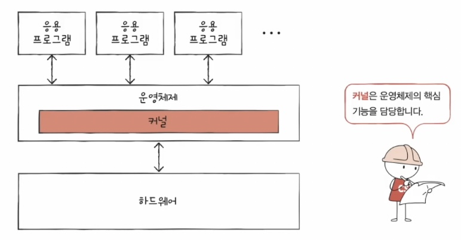
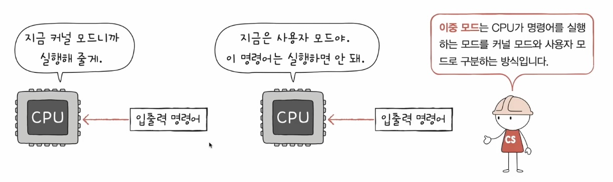
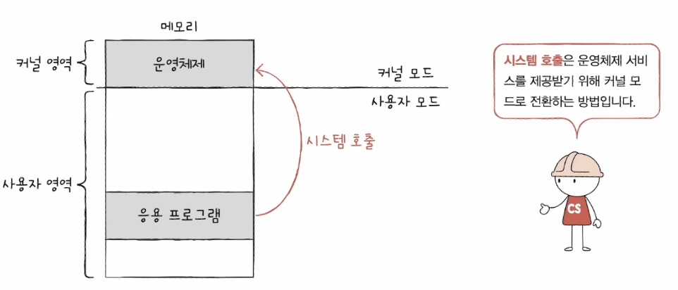
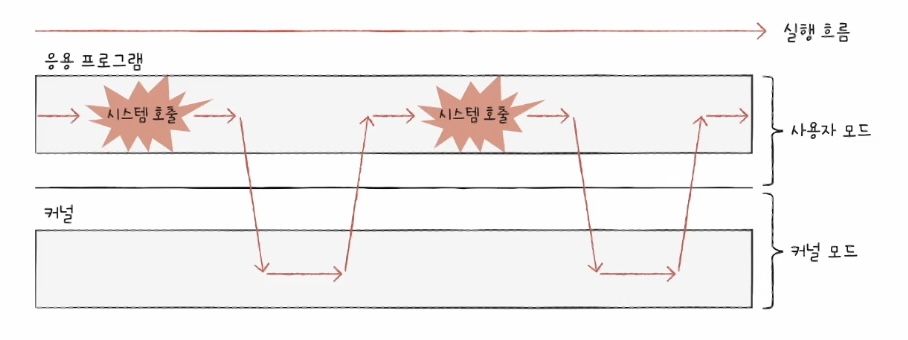

### 09-1 운영체제를 알아야 하는 이유

# 운영체제

### 운영체제 정의

: 실행할 프로그램에 필요한 자원(앞서 배운 컴퓨터 부품들, 네트워크 패킷, 파일 등)을 할당하고, 프로그램이 올바르게 실행되도록 돕는 특별한 프로그램

### 운영체제와 메모리 영역

- 운영체제도 프로그램이기 때문에 메모리에 적재되어야한다.
    - 컴퓨터가 부팅될 때 메모리 내 **커널 영역**이라는 공간에 따로 적재되어 실행된다.
    - 커널 영역 외 나머지 영역, 사용자가 이용하는 응용프로그램이 적재되는 영역은 **사용자 영역**이라고 한다.

### 운영체제가 하는 일

: 응용 프로그램과 하드웨어 사이에서 자원 할당

- 메모리 관리
    - 실행하는 프로그램들을 메모리의 적당한 공간에 적재
    - 더 이상 실행되지 않는 프로그램을 메모리에서 삭제
- CPU 자원 할당
    - 여러 프로그램에 최대한 효율적이고 공정하게 CPU 자원 할당

### 운영체제를 알아야 하는 이유

- 운영체제 덕분에 개발자는 하드웨어를 조작하는 코드를 직접 작성할 필요가 없다.
- 운영체제는 딱딱한 하드웨어와 달리 우리와 대화가 가능하다. 따라서 프로그램을 더 깊이 이해하고 문제 해결의 실마리를 찾을 수 있다.
    - 대다수의 오류메시지 근원은 운영체제다.

### 09-2 운영체제의 큰 그림

> 3가지의 개념을 배울 것. 간단하게 설명할 수 있는지 체크!
> 

### 1. 커널

- 각기 다른 운영체제여도, 수행해야하는 공통 핵심 기능은 대동소이하다.
- 예를 들어 웹은 자원 할당, 프로세스 관리, 파일 관리, 스마트폰 운영체제는 전화, 문자, 인터넷 등
- 이러한 운영체제의 핵심 기능을 담당하는 부분을 **커널**이라고한다.

<aside>

❓커널에 속하지 않는 운영체제의 기능에는 뭐가 있어요?

❗️UI. (CLI와 GUI가 운영체제마다 다르죵)

</aside>

### 2. 시스템 호출과 이중 모드

- 이중모드
    
    
    
    : 플래그 레지스터 속 슈퍼바이저 플래그로 구분
    
    - **커널 모드**
        - 운영체제 서비스를 제공받을 수 있는 실행 모드
    - **시스템 모드**
        - 운영체제 서비스를 제공받을 수 없는 실행 모드
- 시스템 호출
    
    
    
    - 응용 프로그램이 직접 컴퓨터 자원을 접근하고 사용하면 큰일 난다. 불가능.
    - 컴퓨터 자원을 사용하기 위해서는 운영체제의 도움을 받아야한다.
        - ex) 파일 저장, 하드웨어 접근 등
    - 운영체제, 즉 커널 영역의 코드를 실행해야 하는 경우 시스템 호출을 통해 커널 모드로 변경해야한다.
    - 시스템 호출은 일종의 소프트웨어 인터럽트.
        
        
        

### 3. 운영체제 서비스 종류

1. 프로세스 관리
    - 프로세스 : 실행 중인 프로그램
    - CPU는 한 번에 하나의 프로세스만 실행하므로 많은 프로세스를 조금씩 번갈아가며 실행한다.
    - 운영체제는 다양한 프로세스를 관리하고 실행한다.
        - 프로세스 동기화, 교착 상태 차차 학습
2. 자원 접근 및 할당
    - CPU
        - 메모리에는 여러 프로세스가 적재되고, 하나의 CPU는 한 번에 하나의 프로세스만 실행한다
        - 이에 운영체제는 프로세스들에 공정하게 CPU를 할당해야한다.
        - 이를 CPU 스케줄링이라고 한다. 11장에서 학습
    - 메모리
        - 프로세스는 그 크기도, 메모리에 적재되는 주소도 각기 다르다.
        - 운영체제가 프로세스에게 어떻게 메모리를 할당하는지 학습
    - 입출력장치
        - 인터럽트 서비스 루틴은 운영체제가 제공하는 기능으로, 커널 영역에 있다.
3. 파일 시스템 관리
    - 당연해 보이는 파일, 폴더 시스템도 운영체제의 서비스
    - 운영체제가 보조기억장치 속 데이터를 어떻게 파일과 폴더로 관리하는지 차차 알아보자

<aside>

참고 : 가상머신에 새로운 운영체제를 설치했을때, 그것을 위한 하이퍼바이저 모드도 있다.

</aside>