### 10-1 프로세스 개요

### **프로세스** : 실행 중인 프로그램

- 프로그램은 실행되기 전까지 그저 보조기억장치의 데이터 덩어리인데, 메모리에 적재하고 실행하는 순간 프로그램은 프로세스가 된다.
    
    → **“프로세스가 생성되었다”** 고 표현
    

### 프로세스 구분

- **포그라운드 프로세스** : 사용자가 보는 앞에서 실행되는 프로세스
- **백그라운드 프로세스** : 사용자가 보지 못하는 뒤에서 실행되는 프로세스
    - 사용자와 상호작용할 수 있는 백그라운드 프로세스도 있고
    - 사용자와 상호작용하지 않고 묵묵히 정해진 일만 수행하는 백그라운드 프로세스도 있다. → **데몬**(리눅스/유닉스), **서비스**(윈도우)

### 프로세스 제어 블록(PCB)

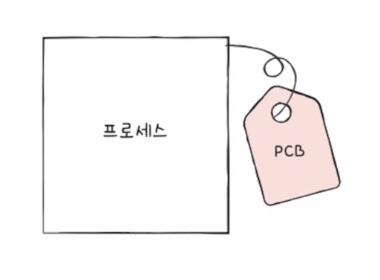

: **프로세스가 생성**되었을 때 **커널영역에 생성되는,** **프로세스의 정보**를 담고 있는 자료구조.

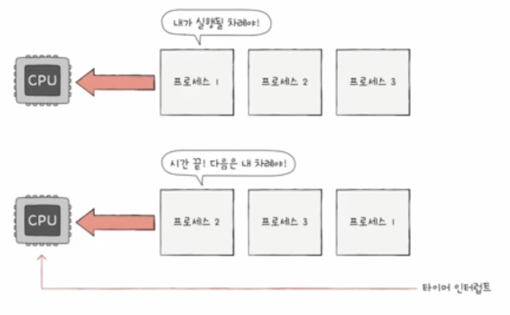

- 운영체제는 빠르게 번갈아 수행되는 프로세스의 실행 순서를 관리해야한다. 이를 위해 PCB를 이용한다.
- **타이머(타임아웃) 인터럽트**
    - 클럭 신호를 발생시키는 장치에 의해 주기적으로 발생하는 하드웨어 인터럽트.
    - 이게 발생하면 프로세스는 자신의 차례를 양보하고 다음 차례까지 기다린다.

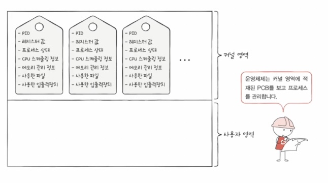

- PCB에 담기는 대표 정보
    - 프로세스 ID
        - 프로세스를 식별하는 고유번호
    - 레지스터 값
        - 이전까지 사용했던 레지스터의 중간값을 복원하기 위해(**실행을 재개하기 위해**), 프로그램 카운터를 비롯한 레지스터 값 저장
        - 프로세스 상태
            - ex) CPU사용을 기다리는 상태, CPU이용중인 상태, 입출력장치 사용을 기다리는 상태 등
        - CPU 스케줄링 정보
            - 프로세스가 언제 어떤 순서로 CPU를 할당받을지에 대한 정보
        - 메모리 관리 정보
            - 프로세스가 적재된 메모리 주소를 알 수 있는 정보들
        - 사용한 파일과 입출력장치 목록
            - 어떤 파일을 열었는지, 어떤 입출력장치가 이 프로세스에 할당되었는지 등

### 문맥 교환

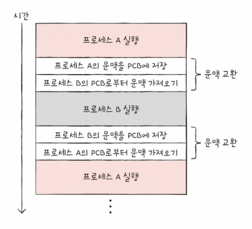

- **문맥** : 하나의 **프로세스 수행을 재개하기 위해 기억해야 할 정보**(중간 정보). PCB에 담기는 프로세스 정보들이라고 봐도 무방
- **문맥 교환** : **기존 프로세스의 문맥을 PCB에 백업**하고, 새로운 프로세스를 실행하기 위해 **문맥을 PCB로부터 복구하여 새로운 프로세스를 실행**하는 것.

### 프로세스의 메모리 영역

> ❓ 프로세스가 생성되면 커널영역에는 PCB가 생성된다. 그렇다면 사용자 영역에는 프로세스가 어떻게 배치될까?
> 

<aside>

❗️매우 중요

- 하나의 프로세스는 사용자 영역에 크게 **코드 영역, 데이터 영역, 힙 영역, 스택 영역**으로 나뉘어 저장된다.
</aside>

### 코드 영역

- 실행할 수 있는 코드, 즉 **기계어로 이루어진 명령어가 저장되는 공간**
- 쓰기 금지. read-only 공간

### 데이터 영역

- **프로그램이 실행되는 동안 유지할 데이터가 저장되는 공간**
    - 이런 데이터로는 전역변수가 있다.
    - 전역변수 : 프로그램 전체에서 접근 가능한 변수. 프로그램이 실행되는 동안 유지됨

### 힙 영역

- **프로그래머가 직접 할당할 수 있는 저장공간**
    - 프로그래밍 과정에서 힙 영역에 메모리 공간을 할당했다면 언젠가 그 공간을 반환해야한다.
    - 그렇지 않으면 메모리 누수(낭비) 발생
    - **가비지 콜렉션** : 자동으로 힙 영역 메모리 공간을 반환하는 기능

### 스택 영역

- **데이터를 일시적으로 저장하는 공간**
- 데이터 영역에 담기는 값과 달리, 잠깐 쓰다가 말 값들이 저장되는 공간
    - 이러한 데이터로 함수 실행이 끝나면 사라지는 **매개변수, 지역변수**가 있다.
- 일시적으로 저장할 데이터는 스택 영역에 PUSH되고, 더 이상 필요하지 않은 데이터는 POP됨으로써 스택 영역에서 사라짐.

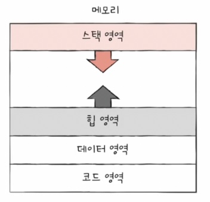

- 코드 영역과 데이터 영역은 그 데이터 크기가 변하지 않으므로 **정적 할당 영역**이라고 부른다.
- 스택 영역과 힙 영역은 실시간으로 크기가 변할 수 있기 때문에 **동적 할당 영역**이라고 부른다.
    - 힙 영역은 낮은 주소에서 높은 주소로,
    - 스택 영역은 높은 주소에서 낮은 주소로 할당되어 주소 겹침을 방지한다.

### 10-2 프로세스 상태와 계층 구조

### 프로세스 상태

- 운영체제(MacOS, Linux, Unix)는 수많은 프로세스를 계층적으로 관리한다.
- PCB에 각 프로세스의 상태가 기록된다.

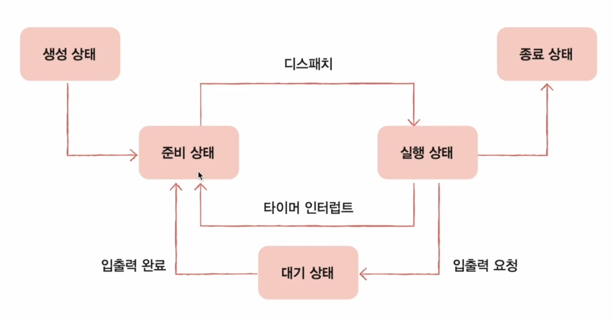

- 프로세스 상태 종류
    - 생성 상태
        - 이제 막 메모리에 적재되어 PCB를 할당 받은 상태
        - 준비가 완료되었다면 준비 상태로
    - 준비 상태
        - 당장이라도 CPU를 할당 받아 실행할 수 있찌만
        - 자신의 차례가 아니기에 기다리는 상태
        - 자신의 차례가 된다면 실행 상태로(=디스패치)
    - 실행 상태
        - CPU를 할당 받아 실행 중인 상태
        - 할당된 시간 모두 사용 시(타이머 인터럽트 발생 시) 준비 상태로
        - 실행 도중 입출력장치를 사용하면 입출력 작업이 끝날 때까지 대기 상태로
    - 대기 상태
        - 프로세스가 실행 도중 입출력장치를 사용하는 경우
            - 정확히 말하면 특정 이벤트가 일어나길 기다릴 때 대기상태가 된다.
        - 입출력 작업은 CPU에 비해 느리기에 이 경우 대기 상태로
        - 입출력 작업이 끝나면(입출력 완료 인터럽트를 받으면) 준비 상태로
    - 종료 상태
        - 프로세스가 종료된 상태
        - PCB, 프로세스의 메모리 영역 정리

### 프로세스 계층 구조

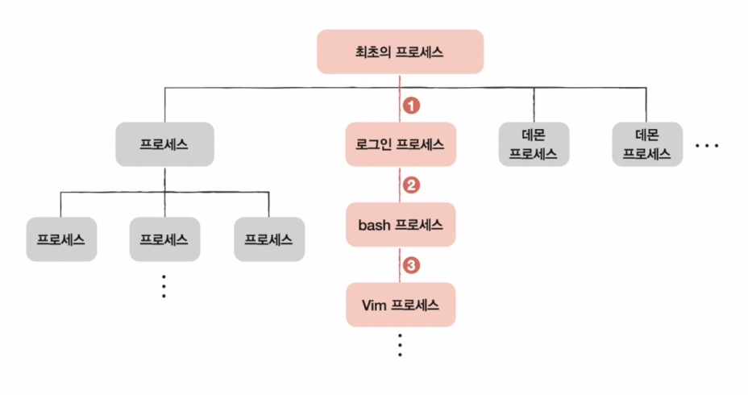

- 프로세스는 실행 도중 시스템 호출을 통해 다른 프로세스를 생성할 수 있다.
- 부모 프로세스가 생성한 자식 프로세스가 또 자식 프로세스를 생성할 수 있다.
- 각 프로세스마다 각기 다른 PID를 가지고,
- 일부 운영체제에서는 자식 프로세스의 PCB에 부모 프로세스의 PID인 PPID가 기록되기도 한다.
- 데몬이나 서비스도 최초 프로세스의 자식 프로세스다.

### 프로세스 생성 기법

> 복제와 옷 갈아입기
> 
- 부모 프로세스는 fork 시스템 호출을 통해 자신의 복사본을 자식 프로세스로 생성
- 자식 프로세스는 exec 시스템 호출을 통해 자신의 메모리 공간을 다른 프로그램으로 교체

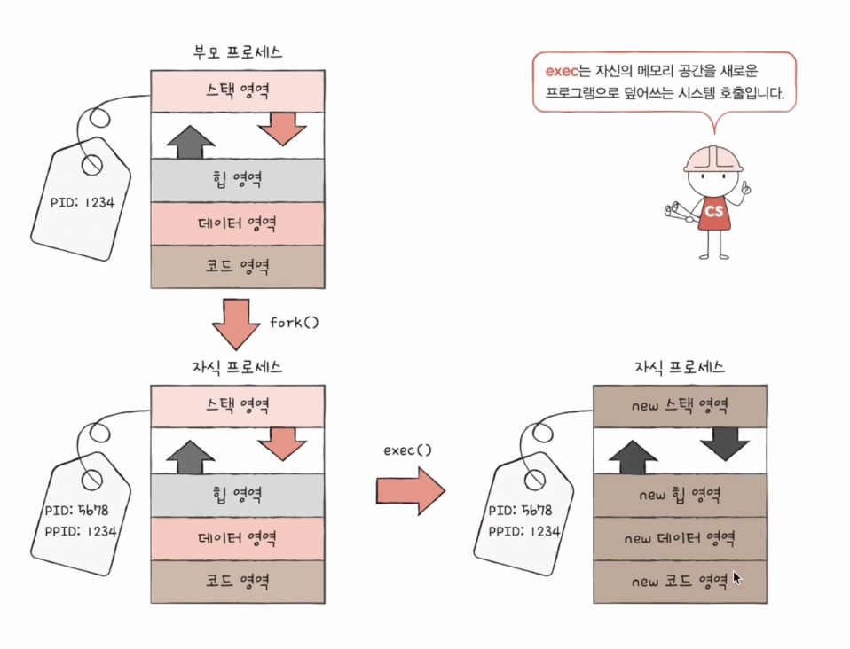

### 10-3 스레드

- **스레드** : 프로세스를 구성하는 실행의 흐름 단위
- 하나의 프로세스에서 여러 스레드로 여러 실행 흐름을 만들 수 있다.
    
    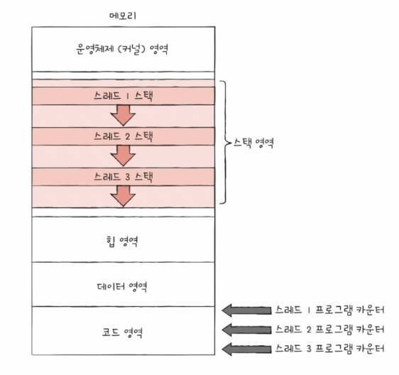
    
    - **ex) 실제 게임에서의 활용 예시**
        
        🎮 **FPS 게임 (예: 배틀그라운드, 콜 오브 듀티)**
        
        - **메인 스레드**: 플레이어 입력 & 게임 상태 관리
        - **렌더링 스레드**: 3D 그래픽 렌더링 (DirectX, Vulkan)
        - **물리 스레드**: 총알 충돌, 캐릭터 움직임
        - **AI 스레드**: 봇 행동 로직
        - **사운드 스레드**: 총소리, 발소리 등 효과음 재생
        - **네트워크 스레드**: 실시간 멀티플레이 동기화

### 멀티 프로세스 vs 멀티 스레드

- **멀티 프로세스**
    - 멀티 프로세스는 각기 다른 PID를 가지고(각기 다른 PCB가 생성), **각기 다른 자원을 쓴다.**
    - 프로세스 간에도 자원을 주고받을 수 있다. : **프로세스 간 통신(IPC)**
        - 서로 공유하는 메모리 영역을 두어 데이터를 주고받을 수 있다. : **공유 메모리**
        - 이 외에도 **소켓**, 파이프 등을 통해 통신 가능
        
        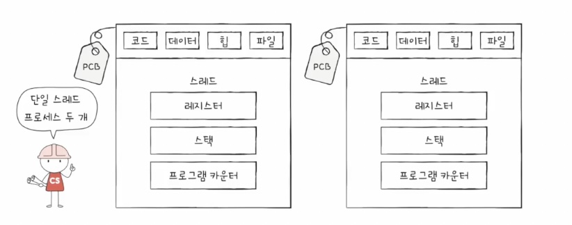
        
- **멀티 스레드**
    - 멀티 스레드는 하나의 프로세스에서 존재.
    - **스레드는 프로세스의 자원을 공유한다.**
        
        → 장점 : 협력과 통신에 유리하다.
        
        → 단점 : 하나의 스레드에서 문제가 났을 때 다른 스레드에도 악영향을 미칠 수 있다.
        
        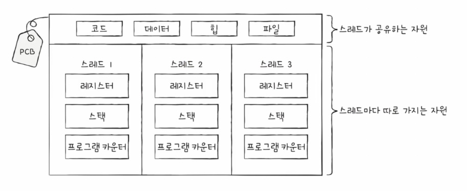
        
- 파이썬과 자바에서 멀티 프로세스, 멀티 스레드
    - 파이썬에서 함수 실행, 자바에서 메서드 실행한다고 멀티 스레드가 되는게 아니다. **그냥 싱글 스레드에서 순차적으로 실행**되는것.
    - 멀티스레드와 멀티프로세스 쓰려면 아래와 같은 방법으로.
        
        
        |  | **Python** | **Java** |
        | --- | --- | --- |
        | **기본 실행 방식** | 싱글 스레드 | 싱글 스레드 |
        | **멀티스레드 실행** | `threading.Thread(target=...)` + `.start()` | `Thread` 상속 또는 `Runnable` 구현 후 `.start()` |
        | **멀티프로세스 실행** | `multiprocessing.Process(target=...)` + `.start()` | `ProcessBuilder` 또는 `Runtime.exec()` |
        | **멀티프로세스 사용 빈도** | 주로 사용 (GIL 때문) | 잘 안 씀 (멀티스레드가 더 일반적) |