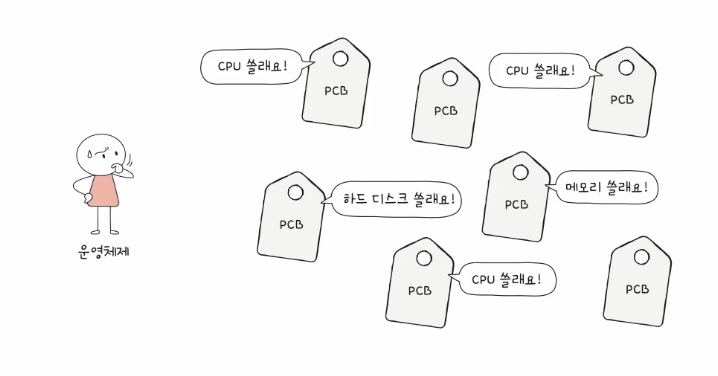
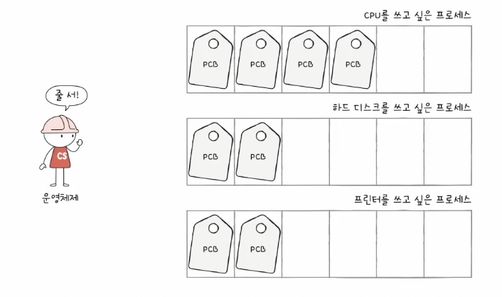
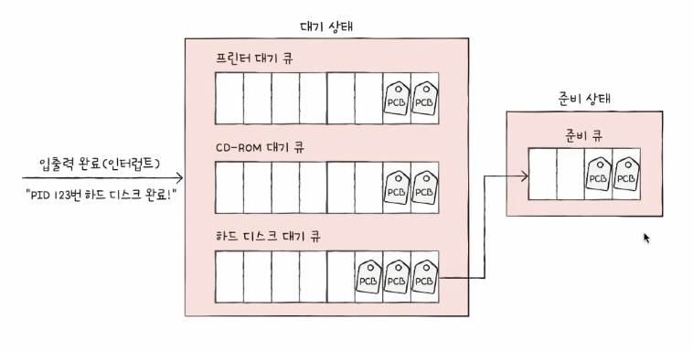
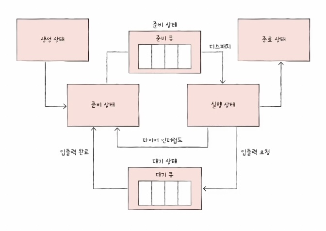
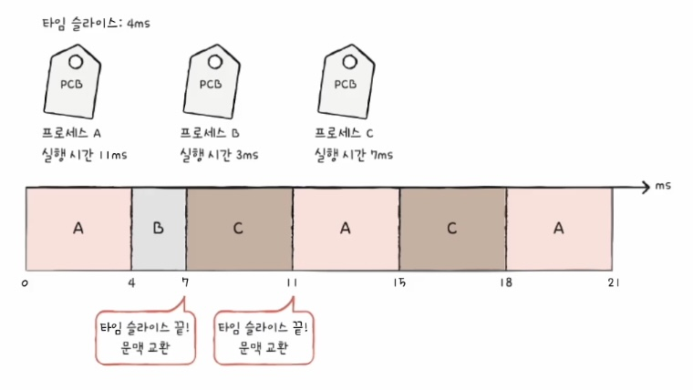
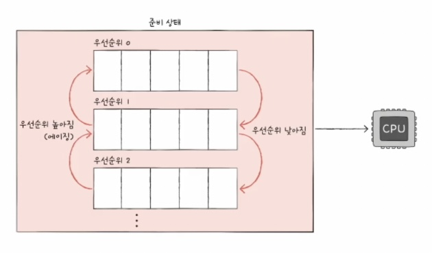

### 11-1 CPU 스케줄링 개요

- 프로세스마다 우선 순위가 있다.
    - 입출력 집중 프로세스 : 입출력 작업이 많은 프로세스
        - 입출력장치 사용은 CPU보다 시간이 많이 걸린다.
        - 입출력 작업이 완료되면 대기 상태로 간다.
    - CPU 집중 프로세스 : CPU 작업이 많은 프로세스
    
    → 입출력 집중 프로세스가 CPU 집중프로세스보다 우선순위가 높다.(입출력 먼저 실행시켜놓고 CPU 작업 빠르게.)
    

### **스케줄링 큐**

- 운영체제가 일일이 프로세스 PCB를 탐색해 CPU를 사용할 다음 프로세스를 찾는 것은 비효율적
    
    
    
    
    

→ 프로세스들을 줄 세운다. 이 줄을 **스케줄링 큐**로 구현하고 관리한다.

- 대표적으로 준비상태의 준비 큐와 대기상태의 대기 큐가 있다.
    - 준비 큐 : CPU 이용 대기 줄
    - 대기 큐 : 입출력장치 이용 대기 줄
        - 같은 장치를 요구한 프로세스들은 같은 큐에서 대기
        
        
        
- 명칭은 큐지만 꼭 FIFO는 아니다.
- 프로세스 상태 다이어그램
    
    
    
- 선점형과 비선점형 스케줄링
    - 선점형 스케줄링
        - 더 급한 프로세스가 언제든 끼어들어 사용할 수 있는 스케줄링 방식
        - 장점 : 어느 한 프로세스의 자원 독점을 막고 골고루 자원 배분할 수 있다
        - 단점 : 문맥 교환 과정에서 오버헤드 발생할 수 있음
    - 비선점형 스케줄링
        - 하나의 프로세스가 자원 사용을 독점할 수 있는 스케줄링
        - 장점 : 문맥 교환에서 발생하는 오버헤드는 선점형보다 적다
        - 단점 : 당장 자원을 사용해야하는 상황에서도 무작정 기다리는 수밖에 없다.

### 11-2 CPU 스케줄링 알고리즘

> 대표적인 7가지
> 
1. **선입 선처리 스케줄링. FCFS 스케줄링**
    - **단순히 준비 큐에 삽입된 순서대로 처리하는 비선점 스케줄링**
    - 단점 : 호위효과(실행 시간이 매우 짧은 어떤 프로세스가, 대기하는 시간이 매우 길어질 수 있음)
2. **최단 작업시간 우선 스케줄링. SJF(Shortest Job First)**
    - CPU 사용시간이 짧은 프로세스 먼저 실행 → 호위효과 방지
    - 일반적으로 비선점형 방식
3. **라운드 로빈 스케줄링. RR(Round Robin)**
    
    
    
    - 선입 선처리 스케줄링 + **타임 슬라이스**
        - 정해진 시간만큼만 CPU 사용(선점형)
        - 타임 슬라이스 시간 내 다 처리 안되면 큐 맨 뒤로 이동
        - 타임 슬라이스 크기가 중요
4. **최소 잔여 시간 우선 스케줄링. SRT(Shortest Remaining Time)**
    - SJF + RR
    - 정해진 시간만큼만 CPU 사용, 그 다음 프로세스는 남은 작업 시간이 가장 적은 것 프로세스가 선택됨
5. 우선순위 스케줄링
    - 우선순위가 높은 프로세스부터 실행되는 스케줄링
        - 우선순위가 같은 프로세스들은 선입 선처리
    - SJT, SRT가 우선순위 스케줄링의 일종
    - **근본적인 문제점 : 기아 현상(starvation)**
        - **우선순위가 낮은 프로세스는 매우 오래 실행이 연기**될 수 있다.
        - 방지하기 위한 기법 : **에이징(aging)**
            - 오랫동안 대기한 프로세스의 우선순위를 점차 높이는 방식
6. **다단계 큐 스케줄링(Multilevel queue)**
    - 우선순위 스케줄링의 발전된 형태
    - 우선순위 별로 준비 큐를 여러 개 사용하는 스케줄링
        - 우선순위가 가장 높은 큐에 있는 프로세스를 먼저 처리
        - 큐별로 타임슬라이스 크기나 스케줄링 알고리즘을 다르게 설정할 수 있다.
    - 단점 : 프로세스가 큐 간의 이동 불가 → 기아 현상
7. **다단계 피드백 큐 스케줄링(Multilevel feedback queue)**
    
    
    
    - 다단계 큐 스케줄링의 단점 보완 **→ 프로세스가 큐 간의 이동이 가능**
    - 타임 슬라이스 동안 실행을 다 못 끝내면(CPU 시간이 길면) 낮은 우선순위로 이동.
        - 자연스럽게 CPU 집중 프로세스의 우선순위는 낮아지고
        - 입출력 집중 프로세스의 우선순위는 높아진다.
    - 어떤 프로세스가 낮은 우선순위 큐에서 너무 오래 기다리면 우선순위를 높인다.
    - **가장 일반적인 CPU 스케줄링 방식**으로 알려져 있다.