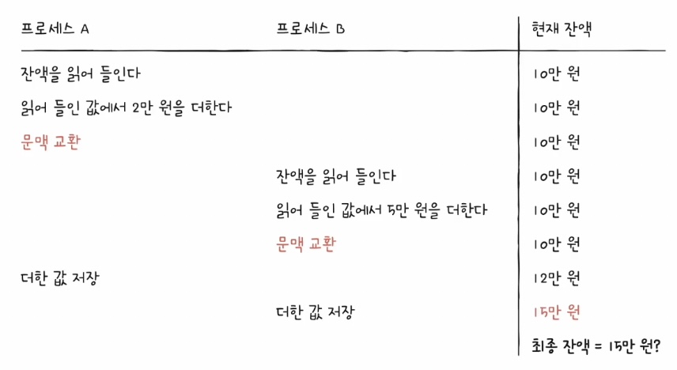
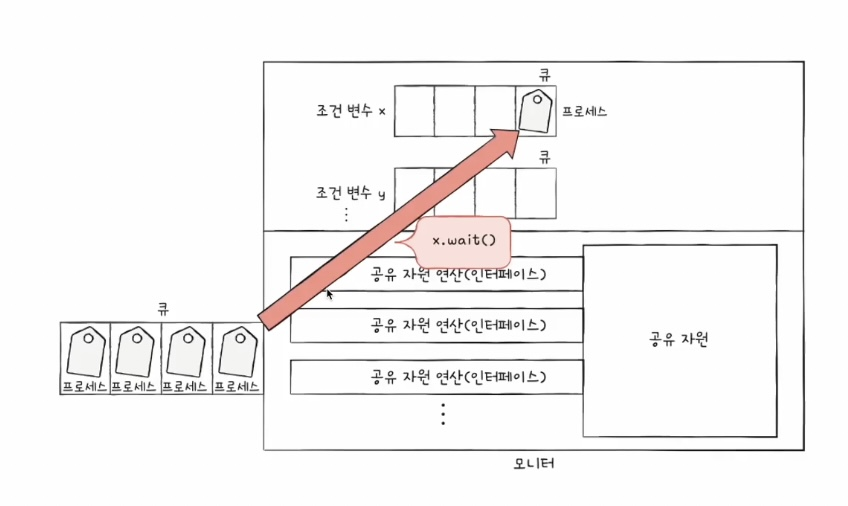

### 12-1 동기화란

- 동시다발적으로 실행되는 프로세스, 스레드들은 공동의 목적을 올바르게 수행해야한다.
- 실행 순서와 자원의 일관성을 보장하기 위해 **동기화**가 되어야한다.

### 동기화 목적 1. 실행 순서 제어

> 프로세스가 올바른 순서대로 실행하게 함
> 
- ex) 텍스트 파일을 읽는 Reader프로세스와, 텍스트 파일을 작성하는 Writer프로세스
    - Writer프로세스가 값을 저장하기도 전에 Reader프로세스가 텍스트 파일을 읽는 것은 올바른 순서가 아니다.

### 동기화 목적 2. 상호 배제

> 특정 자원에 접근할 때 한 개의 프로세스만 접근하게 함
> 
- ex) 계좌 잔액 문제(Bank account problem)
    - **2만원을 추가하는 프로세스 A와 5만원을 추가하는 프로세스 B 두 개를 실행**
    - 상호 배제를 고려하지 않은 잘못된 예 → 엉뚱한 계좌 잔액
        
        
        
    - 상호 배제를 고려한 예 → 올바른 계좌 잔액 17만원
        
        
        
- ex)고전: **생산자와 소비자 문제(Producer & Consumer problem)**
    
    
    
    - 총합 0에서 생산자, 소비자 프로세스를 각각 10만번 실행하면?
        
        
        
    - 결과가 0이 아니라 실행할 때마다 엉뚱한 값이 나오는 이유
        
        → 동기화가 되지 않음
        
        즉, 동시에 접근해서는 안되는 자원(총합)에 동시에 접근해 발생한 문제
        

### 공유 자원과 임계 구역

- **공유 자원** : 여러 프로세스 혹은 스레드가 공유하는 자원
    - 전역 변수, 파일, 입출력장치, 보조기억장치, …
- **임계 구역** : 두 개 이상의 프로세스를 동시에 실행하면 문제가 발생하는 자원에 접근하는 코드 영역
    - 앞선 상호 배제 문제 예시의 ‘총합’변수, ‘잔액’변수 …
    
    
    
- **레이스 컨디션(Race condition)**
    
    : 임계 구역에 두 개 이상의 프로세스가 실행되어 문제가 발생하는 경우
    
    - 레이스 컨디션 발생 → 데이터의 일관성이 깨진다.(생산자 소비자 문제)
    - 레이스 컨디션이 발생하는 근본 이유
        - 사용자 코드는 한줄이지만 컴퓨터는 여러 줄의 저급 언어를 실행
            
            
            
        - 한줄씩의 코드여도 문맥 교환이 일어날 수 있음
            
            
            
- **운영체제가 레이스 컨디션을 방지하는 세 가지 원칙**
    
    > 즉, 상호 배제를 위한 동기화를 위한 세 가지 원칙
    > 
    1. 상호 배제
        
        : 한 프로세스가 임계 구역에 진입했다면 다른 프로세스는 임계 구역에 들어올 수 없다.
        
    2. 진행
        
        : 임계 구역에 어떤 프로세스도 진입하지 않았다면 임계구역에 진입하고자 하는 프로세스는 들어갈 수 있어야 한다.
        
    3. 유한 대기
        
        : 한 프로세스가 임계 구역에 진입하고 싶다면 그 프로세스는 언젠가 임계 구역에 들어올 수 있어야 한다.
        

### 12-2 동기화 기법


### 뮤텍스 락


- 전역 변수 하나, 함수 두개
    - 자물쇠 역할 : 프로세스들이 공유하는 전역변수 lock
    - 임계구역을 잠그는 역할 : acquire함수
    - 임계구역의 잠금을 해제하는 역할 : release함수
- 바쁜 대기(busy wating)
    - 임계구역에 들어가도 되는지 계속 확인하는 것(lock 변수를 무한 확인). cpu 사이클 낭비

### 세마포(카운팅 세마포)

- 여러 스레드가 동시에 접근할 수 있는 공유 자원 개수를 제한하는 기법
    - 뮤텍스 락의 lock변수의 자료형을 boolean(단일)에서 숫자(여러 개)로
- 자원이 모두 사용 중이면 새로운 스레드는 대기해야 함


- 전역 변수 하나, 함수 두개
    - 임계 구역에 진입할 수 있는 프로세스 개수 : 전역변수 S
    - 임계구역에 들어가도 되는지 알려주는 함수 : wait함수
    - 임계구역 앞에서 기다리는 프로세스에 이제 가도 된다고 신호를 주는 함수 : signal함수
- 이 또한 뮤텍스 락처럼 busy wating 발생 : CPU 사이클 낭비
    
    → 보완 : PCB의 대기 상태와 준비 상태 활용
    
    wait()와 signal()이 각각 상황에 맞게 프로세스를 대기 큐에 넣고 다시 준비 큐로 빼준다.
    
- Java 세마포 코드
    
    `java.util.concurrent.Semaphore` 클래스를 사용
    
    ```java
    import java.util.concurrent.Semaphore;
    
    class SharedResource {
        private static final Semaphore semaphore = new Semaphore(2); // 최대 2개의 스레드만 접근 가능
    
        public void accessResource(int threadNumber) {
            try {
                semaphore.acquire(); // 자원 접근 허가 (세마포 감소)
                System.out.println("Thread " + threadNumber + " is using the resource.");
                Thread.sleep(1000); // 자원 사용 중 (예제용)
            } catch (InterruptedException e) {
                e.printStackTrace();
            } finally {
                System.out.println("Thread " + threadNumber + " is releasing the resource.");
                semaphore.release(); // 자원 해제 (세마포 증가)
            }
        }
    }
    
    public class SemaphoreExample {
        public static void main(String[] args) {
            SharedResource resource = new SharedResource();
            for (int i = 1; i <= 5; i++) {
                final int threadNumber = i;
                new Thread(() -> resource.accessResource(threadNumber)).start();
            }
        }
    }
    
    ```
    
- Python 세마포 코드
    
    `threading.Semaphore`를 사용
    
    ```python
    import threading
    import time
    
    semaphore = threading.Semaphore(2)  # 최대 2개 스레드 접근 가능
    
    def access_resource(thread_number):
        with semaphore:  # acquire()와 release()를 자동으로 처리
            print(f"Thread {thread_number} is using the resource.")
            time.sleep(1)
            print(f"Thread {thread_number} is releasing the resource.")
    
    threads = []
    for i in range(5):
        t = threading.Thread(target=access_resource, args=(i,))
        threads.append(t)
        t.start()
    
    for t in threads:
        t.join()
    
    ```
    
- JavaScript 세마포 코드
    
    ```jsx
    class Semaphore {
        constructor(count) {
            this.count = count;
            this.queue = [];
        }
    
        async acquire() {
            if (this.count > 0) {
                this.count--;
                return Promise.resolve();
            }
            return new Promise(resolve => this.queue.push(resolve));
        }
    
        release() {
            if (this.queue.length > 0) {
                const resolve = this.queue.shift();
                resolve();
            } else {
                this.count++;
            }
        }
    }
    
    // 세마포 예제
    const semaphore = new Semaphore(2);
    
    async function accessResource(threadNumber) {
        await semaphore.acquire();
        console.log(`Thread ${threadNumber} is using the resource.`);
        await new Promise(resolve => setTimeout(resolve, 1000));  // 1초 대기
        console.log(`Thread ${threadNumber} is releasing the resource.`);
        semaphore.release();
    }
    
    // 5개의 비동기 작업 실행
    for (let i = 1; i <= 5; i++) {
        accessResource(i);
    }
    
    ```
    
- 실행 순서 동기화도 가능
    
    
    

### 모니터

- 세마포는 프로그래머의 실수가 있을 수 있고 치명적일 수 있음


- 공유 자원과 공유 자원에 접근하기 위한 인터페이스(통로)를 묶어 관리
- `synchronized`(Java), `Lock`(Python), `Mutex`(JavaScript) 등을 사용
- 상호 배제를 위한 동기화
    - 프로세스는 반드시 인터페이스를 통해서만 공유 자원에 접근
        - 공유자원에 접근하고자 하는 프로세스를 큐에 삽입
        - 큐에 삽입된 순서대로 한 번에 하나의 프로세스만 공유 자원 이용
- 실행 순서 제어를 위한 동기화
    - 특정 조건을 바탕으로 프로세스를 실행하고 일시 중단하기 위해 **조건 변수** 사용
        
        
        
        - 특정 프로세스가 아직 실행될 조건이 되지 않았을 땐 `조건변수.wait()`를 통해 실행 중단
            
            
            
        - 특정 프로세스가 실행될 조건이 충족되었을 땐 `조건변수.signal()`로 재개
        
        
        
    
    <aside>
    
    Quiz. 조건변수 x,y 가 있다. 스레드 A는 x.wait(), 스레드 B는 y.wait()를 호출했다. 스레드 C가 y.signal()을 호출했을때 실행이 재개되는 스레드는?
    
    정답 : B
    
    </aside>
    
    - Java
        
        ```java
        class SharedCounter {
            private int count = 0;
        
            public synchronized void increment() { // 한 번에 하나의 스레드만 실행 가능
                count++;
                System.out.println("Count: " + count);
            }
        }
        
        public class MonitorExample {
            public static void main(String[] args) {
                SharedCounter counter = new SharedCounter();
                for (int i = 1; i <= 5; i++) {
                    new Thread(counter::increment).start();
                }
            }
        }
        
        ```
        
    - Python
        
        ```python
        import threading
        
        lock = threading.Lock()
        count = 0
        
        def increment():
            global count
            with lock:  # Lock을 획득한 스레드만 실행 가능
                count += 1
                print(f"Count: {count}")
        
        threads = []
        for i in range(5):
            t = threading.Thread(target=increment)
            threads.append(t)
            t.start()
        
        for t in threads:
            t.join()
        
        ```
        
    - JS
        
        ```jsx
        class Mutex {
            constructor() {
                this.locked = false;
                this.queue = [];
            }
        
            async lock() {
                if (this.locked) {
                    return new Promise(resolve => this.queue.push(resolve));
                }
                this.locked = true;
            }
        
            unlock() {
                if (this.queue.length > 0) {
                    const resolve = this.queue.shift();
                    resolve();
                } else {
                    this.locked = false;
                }
            }
        }
        
        const mutex = new Mutex();
        let count = 0;
        
        async function increment() {
            await mutex.lock();
            count++;
            console.log(`Count: ${count}`);
            await new Promise(resolve => setTimeout(resolve, 100)); // Simulate work
            mutex.unlock();
        }
        
        for (let i = 0; i < 5; i++) {
            increment();
        }
        
        ```