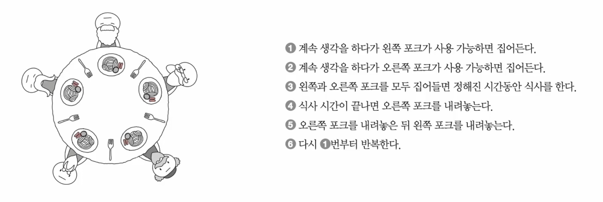
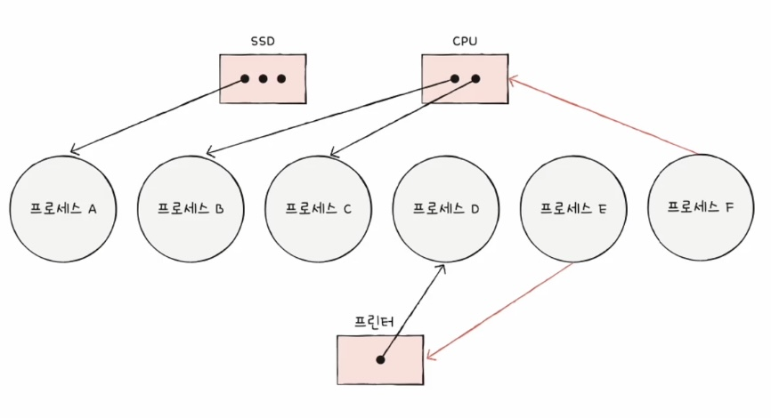
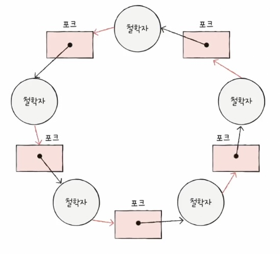

### 13-1 교착 상태

: 일어나지 않을 사건을 기다리며 무한히 대기하는 현상, **어떤 프로세스도 더 이상 진행할 수 없는 상태**

- 식사하는 철학자 문제
    
    
    
    - 모두 왼쪽 포크를 들고 있어 아무도 오른쪽 포크를 들지 못한다.
    - **아무도 식사를 할 수 없다. ⇒ 교착 상태**
    - **포크 ⇒ 자원**
    - **철학자의 식사 ⇒ 프로세스 실행**

### 교착 상태 표현 방법 : 자원 할당 그래프

- **자원은** **사각형**으로, **프로세스는 원**으로 표현
- **자원 개수**는 **사각형 안의 점 개수**로 표현
- 프로세스가 자원을 할당받아 사용 중 ⇒ 자원에서 프로세스로 향하는 화살표
- 프로세스가 어떤 자원을 대기 ⇒ 프로세스에서 자원으로 향하는 화살표

> **교착 상태가 일어난 상황의 자원 할당 그래프는 원의 형태를 띈다.**
> 

### 교착 상태 발생 조건

- 아래 네 가지 조건을 모두 충족하면 **교착 상태가 발생할 수 있다.(100퍼 아님)**
1. 상호 배제 
    
    : 한 프로세스가 사용중인 자원을 다른 프로세스가 사용할 수 없는 상태
    
2. 점유와 대기
    
    : 자원을 할당 받은 상태에서 다른 자원을 할당 받기를 기다리는 상태 (왼쪽 포크를 든 상태로 오른쪽 포크를 기다림)
    
3. 비선점
    
    : 어떤 프로세스도 다른 프로세스가 사용 중인 자원을 강제로 빼앗지 못하는 상태 (포크를 빼앗는 무자비한 철학자가 없음)
    
4. 원형 대기
    
    : 프로세스들이 원의 형태로 자원을 기다리는 상태
    

### 13-2 교착 상태 해결 방법

1. **예방** 
    - 교착 상태 발생 필요 조건 네 가지 중 하나를 충족하지 못하게 하는 방법
        - 필요 조건 네 가지 : 상호 배제, 점유와 대기, 비선점, 원형 대기
    - 각각 교착 상태가 발생하지 않음을 보장할 수는 있지만 여러 부작용이 따른다.
2. **회피** 
    - 교착 상태가 발생하지 않을 정도로만 자원을 할당하는 방식
    - **교착상태를 한정된 자원을 무분별하게 할당해 발생하는 문제로 간주**
    - 안전 상태
        - 교착 상태가 발생하지 않고 모든 프로세스가 정상적으로 자원을 할당받고 종료될 수 있는 상태
        - 반대말↔ : 불안전 상태
        - 안전 순서열이 존재하는 상태
    - **안전 순서열**
        - 교착 상태 없이 안전하게 프로세스들에게 자원을 할당할 수 있는 순서
3. **회복** 
    - 교착 상태 발생을 인정하고 사후에 조치하는 방식
    1. 선점을 통한 회복
        
        : 교착 상태가 해결될 때까지 한 프로세스씩 자원 몰아주기
        
    2. 프로세스 강제 종료를 통한 회복
        
        : 단순하고 확실한 방법이지만 작업 내역을 잃을 수 있다.
        
4. 무시
    - 교착 상태는 드물게 발생하니까 그냥 무시하기.
    - 효율을 추구하는 입장에서는 이 방식이 적합할 때도 있다.