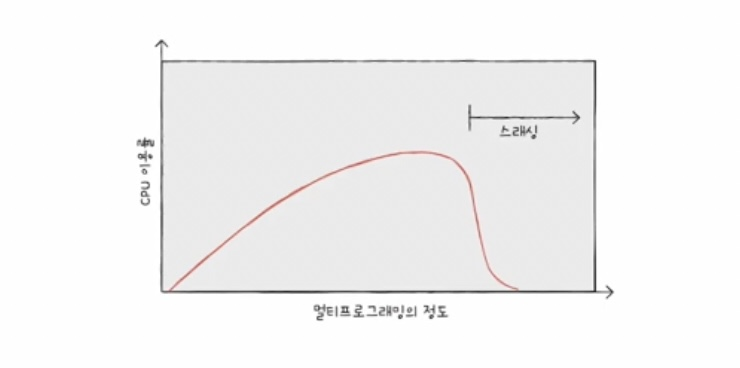

### 14-1 연속 메모리 할당

- 프로세스에 연속적으로 이어진 메모리 공간을 할당하는 방식
    
    
    
- **스와핑**
    - 프로세스들이 요구하는 메모리 공간의 크기가 실제 메모리 크기보다 클 때 사용하는 기술
    
    
    
    - 사용되지 않는 프로세스들을 보조기억장치 일부 영역(스왑 영역)으로 쫓아내고 **[스왑 아웃]**
    - 그렇게 생긴 빈 공간에 새 프로세스를 적재 **[스왑 인]**
- 연속 메모리 할당
    - 메모리에 빈공간이 여러 개 있을 때 프로세스를 할당하는 방식
        1. 최초 적합 : 가장 처음 발견된 할당 가능 공간에 할당
        2. 최적 적합 : 할당할 수 있는 가장 작은 빈 공간에 할당
        3. 최악 적합 : 할당할 수 있는 가장 큰 빈 공간에 할당
    
    ⇒ 모두 외부 단편화라는 문제가 발생한다.
    
    - **외부 단편화**
        - 프로세스들이 실행되고 종료되길 반복하며 메모리 사이 사이에 빈 공간이 발생하여
        - 프로세스를 할당하기 어려울 만큼 작은 메모리 공간들로 인해 메모리가 낭비되는 현상
        
        
        
    - 외부 단편화 해결-1 : **메모리 압축**(메모리 조각 모음)
        
        
        
        - 여기저기 흩어진 빈 공간을 하나로 모으는 방식
        - **자원이 다른 일을 못하고 오버헤드 발생 가능성도 있다.**
    - **외부 단편화 해결-2 : 가상 메모리 기법, 페이징**
        - 현대 운영체제는 다 이 방식을 쓴다고 보면 된다. 다음 강의에 계속

### 14-2 페이징을 통한 가상 메모리 관리

- 연속 메모리 할당의 두 가지 문제점
    1. 외부 단편화
    2. 물리 메모리보다 큰 프로세스 실행 불가

---

- 외부 단편화의 근본 문제
    
    : 각기 다른 크기의 프로세스가 메모리에 할당되었기 때문.
    
    **→ 프로세스를 균일한 크기로 쪼개면? 외부 단편화 발생하지 않음**
    
    **→ 균일한 크기로 자른 것을 메모리에 불연속적으로 할당할 수 있다면? 물리 메모리보다 큰 프로세스 실행 가능**
    

---

### 가상 메모리

: 실행하고자 하는 프로그램을 일부만 메모리에 적재하여 실제 물리 메모리 크기보다 더 큰 프로세스를 실행할 수 있게 하는 기술

### **페이징**

- 프로세스의 **논리 주소 공간을 페이지**라는 일정 단위로 자르고,
- 메모리의 **물리 주소 공간을 프레임**이라는 페이지와 동일하게 자른 뒤
- 페이지를 프레임에 할당하는 가상 메모리 관리 기법

---

- 페이징에서 스와핑
    - 프로세스 단위의 스왑 인/아웃 이 아닌 페이지 단위의 스왑 인/아웃
    - 프로세스를 실행하기 위해 모든 페이지가 적재될 필요 없다
    - ⇒ 물리 메모리보다 큰 프로세스 실행 가능
- 페이지 테이블
    - 페이지가 어느 프레임에 적재되어 있는지 CPU가 일일이 알기 어렵다.
    - 특히 불연속적으로 배치되어 있다면 **CPU입장에서 다음에 실행할 명령어 위치를 찾기 어려워짐**
    
    **⇒ 페이지 테이블**
    
    
    
    - 실제 메모리 내의 주소인 물리 주소에 불연속적으로 배치되더라도
    - CPU가 바라보는 주소인 논리 주소에는 연속적으로 배치하는 방법
    - **페이지 번호와 프레임 번호를 짝지어주는 이정표**
    - 프로세스마다 페이지 테이블이 있음.

<aside>

- 내부 단편화
    - 프로세스 크기가 항상 페이지의 배수일 수는 없음
    - 예를들어 페이지 크기가 10, 프로세스 크기가 108 일때 마지막 페이지는 2라는 메모리 공간이 남음
    - 메모리가 낭비되는것은 맞지만, 외부 단편화에 비하면 미미함
</aside>

- **PTBR**
    - 프로세스마다 페이지 테이블이 있고, 각 페이지 테이블은 CPU내 프로세스 테이블 베이스 레지스터(PTBR)가 가리킨다.
    - 그런데 페이지 테이블이 메모리에 있으면 **CPU의 메모리 접근 시간이 두배로 늘어난다.**
        - 페이지 테이블 참조 한번, 페이지 참조 한번
    
    ⇒ TLB
    
- **TLB**
    
    : CPU 곁에 페이지 테이블의 캐시 메모리
    
    - 페이지 테이블의 일부를 가져와 저장한다.
    - CPU가 접근하려는 논리 주소가 TLB에 있다면? **TLB 히트**
        - 메모리 접근 한 번
    - CPU가 접근하려는 논리 주소가 TLB에 없다면? **TLB 미스**
        - 메모리 접근 두 번
- 페이징 시스템에서의 논리 주소 구조
    - 페이지 번호와 변위
        
        
        
    - [페이지 번호, 변위] 논리주소는 페이지 테이블을 통해
    - [프레임 번호, 변위]로 변환된다.
        
        
        
    - 페이지와 프레임의 크기는 같으므로 변위는 같다.
- 페이지 테이블 엔트리
    
    : 페이지 테이블에서 각 행
    
    - 페이지 번호
    - 프레임 번호
    - 유효 비트
        - 현재 해당 페이지에 접근 가능한지 여부
        - 즉 메모리에 적재됐는지 안됐는지
        - 메모리에 적재되지 않은 페이지(유효비트 0)에 접근하려고 하면 페이지 폴트(페이지 결함, 부재) 인터럽트 발생
        - 페이지 폴트
            1. CPU는 기존 작업 내역 백업
            2. 페이지 폴트 처리 루틴 실행
                - 원하는 페이지를 메모리로 가져온 뒤 유효비트 1로 변경
            3. 페이지 폴트 처리하면 CPU는 이제 접근 가능
    - 보호 비트
        - 페이지 보호 기능을 위해 존재하는 비트
        - r(읽기), w(쓰기), x(실행) 권한
        - 101, 111, 100 등
    - 참조 비트
        - CPU가 이 페이지에 접근한 적이 있는지 여부
    - 수정 비트(dirty bit)
        - CPU가 이 페이지에 데이터를 쓴 적이 있는지 여부
        - 수정 비트 존재 이유
            - 수정된 페이지는 스왑 아웃될 때 보조기억장치에도 쓰기 작업을 거쳐야 한다.

<aside>

**☝️ 쓰기 시 복사**

- 부모 프로세스가 자식 프로세스를 만들기 위해 fork()하면 프로세스가 통째로 복제되고 적재되는데, 이는 시간 지연+메모리 낭비 문제가 있다.
- 쓰기 시 복사는 fork()했을때 페이지 테이블만 만들고, 어떤 쓰기 작업이 없다면 그냥 그 상태를 유지한다. (자식 프로세스는 부모 프로세스와 동일한 프레임을 가리킴)
- 부모 / 자식 중 하나라도 쓰기 작업을 수행할 때 그 달라지는 페이지 부분만 복사해서 메모리에 적재하는 기술이다.
    
    
    

**☝️ 계층적 페이징**

- 페이지 테이블 크기는 생각보다 크다.
- 모든 페이지 테이블 엔트리를 메모리에 두는 것은 큰 낭비

⇒ 페이지 테이블을 페이징 하여 여러 단계의 페이지를 두는 방식

- 페이지 테이블을 여러 페이지로 쪼개고 이 페이지를 가리키는 페이지 테이블(Outer 페이지 테이블)을 두는 방식
- 모든 페이지 테이블을 항상 메모리에 둘 필요 없이 Outer페이지 테이블만 둔다.
- 페이지 폴트가 발생했을때 메모리 접근 횟수가 많아지기 때문에 여러 페이지 계층을 두는게 좋은 것만은 아니다.

</aside>

### 14-3 페이지 교체와 프레임 할당

> 운영체제가 프로세스들에 적절한 프레임과 페이지를 할당하고, 불필요한 페이지를 선별하여 보조기억장치로 내보내는 법
> 

### 요구 페이징

: 프로세스를 메모리에 적재할 때 처음부터 모든 페이지를 적재하지 않고 **필요한 페이지만을 메모리에 적재하는 기법**

- 기본 양상
    1. CPU가 특정 페이지에 접근하는 명령어 실행
    2. 유효비트가 1일 경우 CPU는 페이지가 적재된 프레임에 접근
    3. 유효비트가 0일 경우 페이지 폴트 발생
    4. 페이지 폴트 처리 루틴 후 유효비트 1로 설정
    5. 다시 1번
- **순수 요구 페이징**
    - 아무런 페이지도 메모리에 적재하지 않고 무작정 실행
    - **프로세스의 명령어를 실행하는 순간부터 페이지 폴트 발생**
    - 갈수록 폴트 발생 빈도 떨어짐
    
- 요구 페이징 시스템이 안정적으로 동작하려면
- 페이지 교체(페이지 교체 알고리즘)와 프레임 할당을 해결해야한다.

### 페이지 교체 알고리즘

- 좋은 페이지 교체 알고리즘?
    - **페이지 폴트 횟수가 적은 알고리즘**
    - 알아내는 법 : 페이지 참조열로 페이지 폴트 횟수 계산
        - 페이지 참조열 : CPU가 참조하는 페이지들 중 연속된 페이지를 생략한 페이지열
- FIFO 페이지 교체 알고리즘
    - 메모리에 가장 먼저 올라온 페이지부터 내쫓는 방식
    - 구현은 간단하나, 초기 적재 후 실행 내내 사용되는 페이지도 있을 것이기 때문에 좋지 않음
- 2차 기회 페이지 교체 알고리즘
    - FIFO와 비슷하지만 보완점 있음
    - 만약 가장 오래된 페이지가 페이지 아웃 되려고 할때, 그 페이지의 참조비트가 1이라면 바로 아웃시키지 않고 참조비트를 0으로 만듦(다시 기회 한 번 더)
    - 참조비트 0이면 아웃
- 최적 페이지 교체 알고리즘
    - 가장 낮은 페이지 폴트율을 보장하는 페이지 교체 알고리즘
    - 그러나 앞으로 사용되지 않을 페이지를 예측하는것은 불가능하므로 실제 구현이 어렵다.
    - 다른 페이지 교체 알고리즘 성능을 평가하기 위한 하한선으로 간주
- **LRU 페이지 교체 알고리즘**
    - **가장 오랫동안 사용되지 않은 페이지를 교체하는 알고리즘**
- LFU 페이지 교체 알고리즘
    - 가장 적게 사용된 페이지를 교체하는 알고리즘

### 스래싱과 프레임 할당

> 페이지폴트에 있어 페이지 교체 알고리즘보다 근본적인 문제는 **프로세스가 사용가능한 프레임 수가 적은 것이다.**
> 

- 스래싱
    - 프로세스가 실제 실행되는 시간보다 페이징에 더 많은 시간을 소요해 성능이 저해되는 문제
    
    
    
    - 멀티프로그래밍의 정도 : 메모리에 동시에 실행되는 프로세스의 개수
    
- 스래싱이 발생하는 근본 원인
    - 각 프로세스가 필요로 하는 최소한의 프레임 수가 보장되지 않았기 때문
        - ex) 프로세스A를 무리 없이 실행하기 위해 10개의 프레임이 필요한데, 5개의 프레임만 이용할 수 있다면 페이지 폴트가 자주 발생하고, 스래싱 발생위험이 높아진다.
    
    **⇒ 운영체제는 각 프로세사가 무리 없이 실행하기 위한 최소한의 프레임 수를 파악하고 할당할 수 있어야 한다.**
    

- 프레임 할당 방식
    - 정적 할당 방식
        - 균등 할당 : 모든 프로세스에 균등하게 프레임을 할당하는 방식
        - 비례 할당 : 프로세스의 크기에 비례하게 프레임을 나눠주는 방식
    - **동적 할당 방식** (프로세스가 실제로 얼마나 많은 프레임이 필요할지는 결국 실행해 봐야 아는 경우가 많다.)
        - **작업 집합 모델**
            - **작업 집합의 크기만큼만 프레임을 할당하는 방식**
            - **작업 집합** : 실행중인 프로세스가 일정 시간 동안 참조한 페이지의 집합
                
                <aside>
                
                작업 집합 구하기
                
                
                작업 집합 3개 ⇒ 3개의 프레임 할당
                
                
                작업 집합 5개 ⇒ 5개의 프레임 할당
                
                </aside>
                
        - **페이지 폴트 빈도**
            - 페이지 폴트율이 높으면 그 프로세스는 적은 프레임을 갖고 있고,
            - 페이지 폴트율이 낮으면 그 프로세스는 많은 프레임을 갖고있다는 가정에서 출발
            - **페이지 폴트율에 상한선과 하한선을 정하고 이 범위 안에서만 프레임을 할당하는 방식**
            
            