### 15-1 파일과 디렉터리

> 우리가 당연하게 사용해 온 파일과 디렉터리는 모두 운영체제 내부 파일 시스템이 관리한다.
> 

### 파일

: 보조기억장치에 저장된 **관련 정보의 집합, 관련 있는 정보를 모은 논리적 단위**

- 운영체제는 파일의 **확장자**를 통해 **파일의 유형**을 파악할 수 있다.
- 파일의 **속성(메타데이터)**에는 파일과 관련된 다양한 부가 정보가 있다.

### 디렉터리

: 파일을 일목요연하게 관리하기 위한 특별한 파일

- 윈도우 운영체제는 디렉터리를 **폴더**라고 부른다.
- 여러 계층을 가진 (서브디렉터리가 있는) 구조를 **트리 구조 디렉터리**라고 한다.
    
    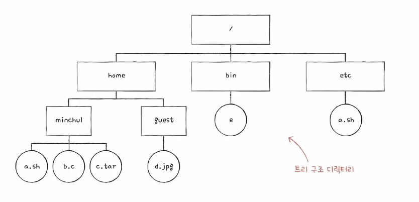
    
- **루트 디렉터리** : 최상위 디렉터리
    - 슬래시 `/` 로 표현한다.
- **경로**
    - 디렉터리를 이용해 위치를 특정 짓는 정보
    - **절대 경로** : 루트 디렉터리부터 시작하는 경로
        - **`/` 으로 시작**
    - **상대 경로** : 현재 디렉터리부터 시작하는 경로
        - **`/` 없이 디렉터리명부터 명시**
        - `./` 은 현재 디렉터리, `../` 부모 디렉터리
- 디렉터리 엔트리
    - 파일이 파일 관련 정보를 담고 있다면, 디렉터리는 디렉터리에 담긴 대상과 관련된 정보를 표 형태로 담고 있다.
    - **디렉터리는 보조기억장치에 테이블 형태의 정보로 저장된다.**
    - 각 엔트리(행)에 담기는 정보는 파일 시스템마다 차이가 있는데, 공통적으로 디렉터리에 포함된 **대상**과 **그 대상의 위치를 유추할수 있는 정보**를 담는다.

### 15-2 파일 시스템

- 파일 시스템은 파일과 디렉터리를 보조기억장치에 일목요연하게 저장하고 접근할 수 있게 하는 운영체제 내부 프로그램이다.
- 파일 시스템에는 다양한 종류가 있고, 하나의 컴퓨터에서 여러 파일 시스템을 사용할 수 있다.

### 파티셔닝과 포매팅

- 막 공장에서 생성되어 한 번도 사용된 적 없는 새 보조기억장치에는 곧바로 파일을 생성하거나 저장할 수 없다.
    
    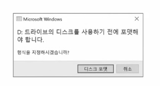
    

**⇒ 파티셔닝과 포매팅 작업을 선행해야한다.**

- **파티셔닝**
    - 저장 장치의 논리적인 영역을 구획하는 작업
    - 파티셔닝으로 나누어진 영역 하나하나를 파티션이라고 한다.
    
    
    
    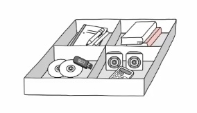
    
- **포매팅**
    - 저장 장치 내용을 완전 삭제하는 것으로 아는건 잘못된 상식
    - **파일 시스템을 설정하여 어떤 방식으로 파일을 저장하고 관리할 것인지 결정하고, 새로운 데이터를 쓸 준비를 하는 작업**
    - 어떤 파일 시스템을 사용할지 이때 결정된다.
        - USB 포매팅 예시
            
            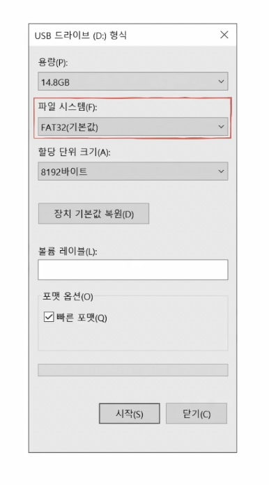
            
    - 파티션마다 다른 파일 시스템 설정 가능

---

- 파티셔닝과 포매팅은 동시에 진행되는 경우가 많고,
- 이미 포매팅까지 완료해 보조기억장치를 판매하는 경우가 많다.
- 하지만 저장장치 관리 및 운영체제 설치 과정에서 자주 접하게 될 것

**⇒ 포매팅까지 완료하여 파일 시스템을 설정했다면 이제 파일과 디렉터리를 생성할 수 있다.**

### 파일 할당 방법

- 운영체제는 파일과 디렉터리를 **블록 단위로 읽고 쓴다**.
    - **파일은 하나 이상의 블록에 걸쳐 저장된다.**
    - 하드디스크의 가장 작은 저장단위는 섹터이지만 크기가 너무 작고 개수가 너무 많다.

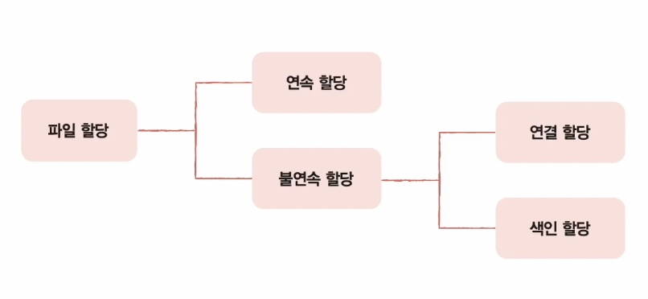

- 파일을 보조기억장치에 할당하는 두 가지 방법 : 연속 할당, 불연속 할당
    - 연속 할당
        
        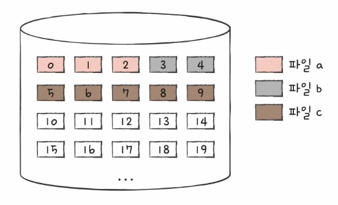
        
        - 보조기억장치 내 연속적인 블록에 파일을 할당하는 방식
        - 디렉터리 엔트리에 파일 이름, 첫 번째 블록 주소, 블록 단위의 길이를 명시하면된다.
        - **외부 단편화를 야기한다는 치명적인 문제가 있다.**
    - 불연속 할당
        - 연결 할당
            
            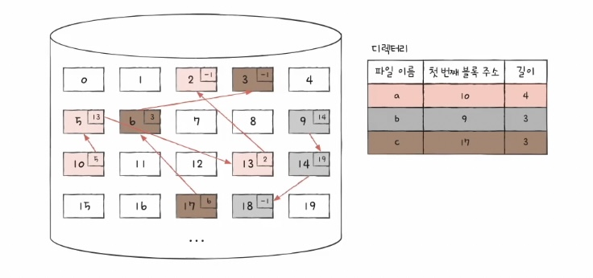
            
            - 각 블록 일부에 다음 블록의 주소를 저장해 각 블록이 다음 블록을 가리키는 형태로 할당하는 방식
            - 연결 리스트 형식으로 관리한다.
            - 단점
                1. 반드시 첫 번째 블록부터 하나씩 차례대로 읽어야 해서 파일 내 임의의 위치에 접근하는 임의 접근 속도가 매우 느리다.
                    - 특히 영화같은 대용량 파일에서 끔찍
                2. 하드웨어 고장이나 오류 발생 시 해당 블록 이후 블록은 접근할 수 없다.
                    - 블록 하나라도 고장나면 다음 블록을 찾아갈 수 없음(하드디스크는 굉장히 예민한 장치)
            
            ⇒ 연결할당을 보완한 **FAT 파일 시스템** 
            
        - 색인 할당
            
            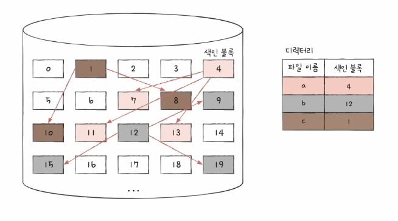
            
            - 파일의 모든 블록 주소를 색인 블록이라는 하나의 블록에 모아 관리하는 방식
            - 임의 접근 속도가 빠르다.(i번째 데이터 블록에 접근하는 방식)
            - 디렉터리 엔트리에 파일 이름과 더불어 **색인 블록 주소**를 명시한다.
            
            ⇒ 색인 할당을 기반으로 만든 **유닉스 파일 시스템**

    ### 파일 시스템

### FAT 파일 시스템

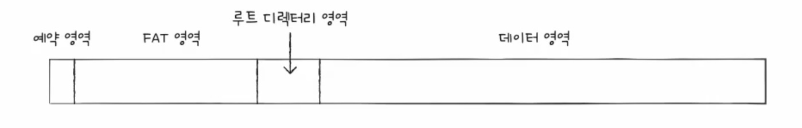

- FAT를 이용하는 연결 할당 기반의 파일 시스템
- **FAT** : 파일 할당 테이블
    - **각 블록에 포함된 다음 블록의 주소들을 한데 모은 테이블**
- USB, SD카드 같은 저용량 저장 장치용 파일 시스템으로 많이 이용됨
- FAT는 **파티션 시작 부분**에 있지만 실행 도중 FAT가 메모리에 캐시될 수 있다. → 연결 할당 방식보다 **임의 접근에도 유리해진다.**
- FAT파일 시스템의 디렉터리 엔트리에는 **파일 이름, 파일의 첫 번째 블록 주소**와 더불의 **파일 속성**과 관련한 다양한 정보들이 있다.

### 유닉스 파일 시스템

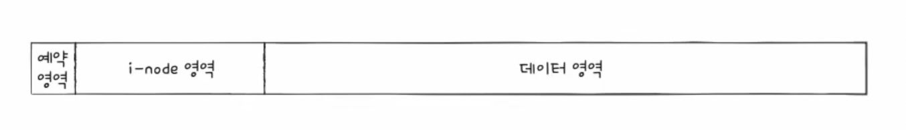

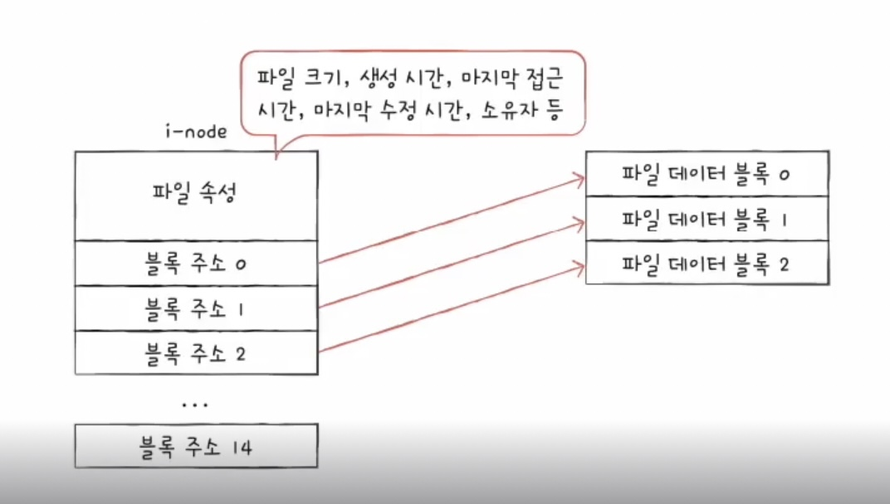

- i-node를 이용하는 색인 할당 기반의 파일 시스템
- i-nodex(index-node) : 유닉스 파일 시스템에서 색인 블록
    - 파일 속성 정보와 15개의 블록 주소가 저장될 수 있다.
    - 데이터 블록을 15개 이상 차지하는 파일은 어떻게 저장?
        
        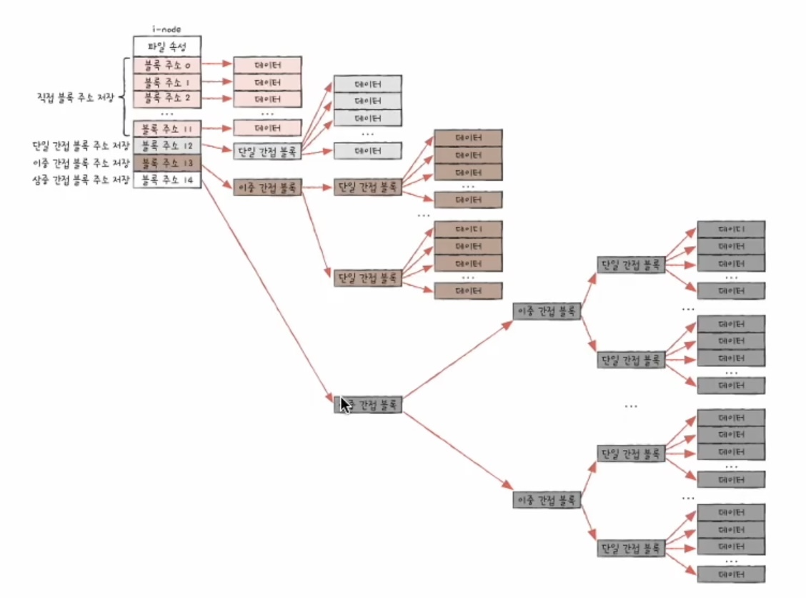
        
        1. 블록 주소 중 12개는 직접 블록 주소를 저장
        2. 12개의 블록 주소로(1번 내용) 충분하지 않다면 13번째 주소에 단일 간접 블록 주소 저장
        3. 13개의 블록 주소로 충분하지 않다면 14번째 블록 주소 이용. 14번째 블록주소는 이중 간접 블록 주소를 저장한다.
        4. 마지막으로 i-node의 15번째 블록 주소를 이용한다. 여기는 삼중 간접 블록 주소를 저장한다.
- 추가로 윈도우에서 사용되는 **NT 파일 시스템(NTFS),**
- 리눅스에서 사용되는 **ext 파일 시스템**등이 있다.
- 위에 내용 이해하면 다 이해할 수 있다.

<aside>

**저널링 파일 시스템**

- 갑자기 전원이 나가거나 치명적 오류로 인해 컴퓨터가 강제로 종료되어버린 상황(시스템 크래시)
- 파일 시스템을 변경하는 도중 시스템 크래시가 발생하면 파일 시스템이 훼손될 수 있다.
    
    **⇒ 저널링 파일 시스템**
    

**저널링 기법 : 작업 로그를 통해 시스템 크래시가 발생했을 때 빠르게 복구하기 위한 방법**

- 저널링 기법을 사용하는 파일 시스템에서 파일 시스템을 변경하는 작업 순서
    1. 작업 직전 파티션의 로그 영역에 수행하는 작업(변경 사항)에 대한 로그를 남긴다.
    2. 로그를 남긴 후 작업을 수행한다.
    3. 작업이 끝났다면 로그를 삭제한다.
- 시스템 크래시 후 다시 부팅할 대 로그만 검사해도 된다.
- 현재 대부분의 파일 시스템은 저널링 기능을 지원한다.
</aside>

<aside>

**마운트**

- 한 저장 장치의 파일 시스템에서 다른 저장 장치의 파일 시스템에 접근할 수 있도록 파일 시스템을 편입시키는 작업
- 유닉스, 리눅스에서 다양한 저장장치를 컴퓨터에 연결할 때 mount 명령어로 빈번하게 마운트한다.
</aside>